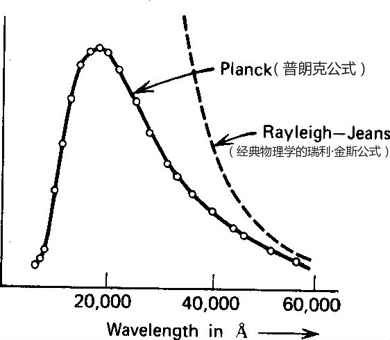

## 第一章 两朵乌云：经典物理的终结，量子力学的开端

十九世纪末到二十世纪初，世界各国普遍都在闹革命，用李鸿章的话来说叫“三千年未有之大变局”。这句话也适用于物理学的革命。这场革命是经典物理学和现代物理学的分界线。

牛顿和伽利略这些早先的物理学家都做出过非常漂亮的工作，但是他们的手段非常有限，对世界的观察比较被动。他们仰望星空可以，做实验就都很粗糙，无非是弄个滑块啊斜面啊之类，没有什么科技感。

而十九世纪末的欧洲，因为工业革命成功，是一个蒸汽朋克的时代。物理学家有了比较精密的仪器，有了人造光源，特别是可以玩电了，这才像个做实验的样子。当时的数学工具也非常发达，微分方程、统计方法、包括非欧几何都已经很成熟了。

不过这时候的物理学还是牛顿的延续，还是经典物理学 —— 但是是很厉害的经典物理学。当时麦克斯韦的电动力学已经深入人心，人们已经知道分子和原子的存在，连热力学都是明明白白的。物理理论自带一种美感，而且公式和实验结果特别吻合，经典物理学是非常精确的科学。

而物理学家看待世界的情绪，已经不再是好奇和敬畏了，而是统治：世间各种自然现象，现在我们的理论都能解释。

比如说“光”。古人研究光只能靠生活常识和简单的思辨。人们早就知道视觉是因为光进入眼睛，而不是眼睛会发射光。人们知道光走直线，光可以互相交叉，光还能有能量，因为阳光照在身上暖洋洋的。牛顿还知道太阳光不是单纯的白色，可以分解成不同的颜色。可是光到底是什么东西呢？光的颜色是怎么来的呢？

麦克斯韦的电动力学出来以后，物理学家立即就知道了光就是电磁波，不同的颜色其实就是不同的波长和频率 [1]。无线电波、红外线、可见光、紫外线、X射线、γ射线……它们都是同一种东西，唯一的区别就是频率不一样。

（注意光的频率和波长的关系是 波长 x 频率 = 光速，所以我们说颜色就等于说频率，说频率就等于说波长。）

你看你会了这个知识，是不是有一种江山尽在掌握的感觉呢？

我们这一讲的主人公马克斯·普朗克在1875年上大学的时候，他的老师劝他不要学物理 —— 因为物理学已经很成熟了，盛宴已过，没有多少留给你研究的空间了。

科幻小说作家阿西莫夫有句名言，说科学史上最激动人心的话不是什么“尤里卡” —— 也就是“我发现了” —— 而是“这有点怪啊（that’s funny）”。

1900年元旦这天，热力学之父、开尔文男爵威廉·汤姆森在一个演讲中说：“在已经基本建成的物理学大厦中，后辈物理学家只要做一些零碎的修补工作就行了……但是，在物理学晴朗的天空的远处，还有两朵小小的令人不安的乌云”。

也就是，这有点怪。

这两朵乌云都和光有关。一个是光速为什么在各个方向都不变， 我们知道这导致爱因斯坦发现了狭义相对论。另一个，是关于黑体辐射。

中国大学课本总爱把“黑体”描写成特别抽象的东西，其实黑体很简单。所谓黑体，就是它不反射别的光，它发出的都是它自身的光。太阳、烧红的烙铁、黑暗中的人体，这些东西都可以近似为黑体。黑体发出的光是由它的热量导致的，也就是热辐射。

物理学家发现，黑体热辐射的光谱，跟它具体是个什么东西没有关系，完全由温度决定。一块烙铁也好一块砖头也好，你看一眼它发光的颜色就知道他的温度是多少。发红光那就是温度还不算太高，蓝光就意味着温度很高。严格说来黑体辐射不会只发单一颜色的光，你看见是红色只不过是红色光的强度最高。给定一个温度，实验物理学家能够非常精确地告诉你黑体辐射光的颜色 —— 也就是频率 —— 的分布曲线，比如像下面这张图。

")

那请问，曲线为什么是这样的呢？

理论物理学家都是非常自负的，说你这个曲线这么标准，我一定能给你推导出来。当时热力学、统计物理已经非常发达了，物理学家可以精确地描写一堆气体的热运动，而黑体无非就是一块发热的固体呗？物理学家假设，黑体的光是来自其中的电子振动产生的电磁波，那我用统计力学一算便知。

谁也没想到，物理学在这里失败了。没有一个理论能解释黑体的发光曲线，特别是在高频率 —— 也就是紫外线以外 —— 的地方，有的理论认为黑体发出的能量应该是无限大的，这显然不可能，人们把这个理论难题称为“紫外灾难”。

这是经典物理学的终结，也是量子力学的开端。

1900年的某一个下午，普朗克在自己家里和一位实验物理学家讨论了黑体辐射。实验物理学家把这个事儿给他讲明白就走了，晚上普朗克自己继续琢磨。普朗克换了一个思路。

他想，我能不能先不管物理，能不能直接在数学上凑一个公式描写这条曲线呢？当晚普朗克有如神助，竟然真的凑出来了一个公式。他立即写明信片把公式告知了那个实验物理学家，并且在12天后当众宣读了论文。这真的是一个非常完美的公式。

可是从物理上来说，这个公式怎么解释呢？普朗克苦苦思索了几个月，最后发现只要满足一个物理假设，就可以推导出来这个公式。

这个假设是电子振动产生无线电波的能量不能是连续的，而应该是一份一份的，就好像上台阶一样你每次必须走一整步，而不能走半步。普朗克规定每一份辐射能量的最小单位是由光的频率决定的：

其中 f 是频率，h 是一个常数，我们现在称之为“普朗克常数”，h = 6.626×10^(−34) 焦耳·秒。

有了这个假设，高频率辐射光的一份能量就很大了，那么根据热力学，它出现的概率就比较低，所以高能辐射就没有那么多，这就避免了紫外灾难。

普朗克凭借这个假设和那个公式拿到了1918年的诺贝尔物理学奖。但是普朗克并不知道那“一份一份的”能量，意味着什么。

第一个把天机说破的还得是我佛爱因斯坦。这就引出了另一个实验，叫“光电效应”。

物理学家在实验中无意发现，如果你把一束光照射在金属板上，有时候金属板会往外发射电子。表面上看这是容易理解的，光毕竟是电磁波，电磁波的能量转化成电子的动能，电子就跑了。

但奇怪的是，电子如何往外跑，和光的*强度*没有关系，只和光的颜色，也就是频率有关系。这就好比说，红色的光，不管多亮也不能让电子跑出来；你要用绿光，哪怕光线很弱电子也能跑；要是蓝光，电子不但能跑，而且跑出来的速度还很快。

这个现象无法用经典物理学解释。麦克斯韦的理论中电磁波的能量只跟强度有关，和频率没关系。电子为什么不能逐渐地从光波中积累能量，攒够了就跑呢？

1905年是“爱因斯坦奇迹年”，这一年爱因斯坦发表了六篇论文，其中一篇叫《关于光的产生和转变的一个启发性观点》，说的就是光电效应。爱因斯坦说，电子之所以非得遇到高频率的光才能跑，这是因为光是一份一份的。普朗克不是说了吗？光的一份能量 E = hf，频率越高能量越大，所以高频率的光的一份能量才足够大，才能打动电子。

请注意，相对于普朗克的假设来说，爱因斯坦提出了一个思维概念上的跃迁。普朗克说的一份一份是黑体中电子受热振动的能量，而爱因斯坦说这跟光是不是从黑体中来的没关系 —— 只要是光，能量就是一份一份的。

爱因斯坦提出了“光量子”。

爱因斯坦说光不是连续的一片波，而是由一个一个的光子组成的，每个光子的能量就是它的频率乘以普朗克常数。

爱因斯坦用这一个公式解释了光电效应，计算结果非常吻合。这篇论文给爱因斯坦带来了诺贝尔物理奖，这也是他一生之中得到的唯一一个诺贝尔奖。

普朗克和爱因斯坦的解题思路，叫做“量子化”。量子化从此就是现代物理学的一大主题，物理学家们把什么东西都想给量子化，有人认为连引力、甚至连空间都是量子的。

什么是“量子”呢？比如你家有个4K高清电视，离远了看，你觉得电视画面非常柔顺。但是离近了看，你会发现屏幕上其实都是一个一个的光点，画面并不是连续的。量子化，就是分辨率是有限的，是不连续的，是一个一个的，是像整数一样可数的。这个世界有可能完全是量子的。

我们平时为什么感觉不到世界是量子的呢？因为普朗克常数 h 是一个非常、非常小的数字，等于说分辨率太高了。

黑体辐射和光电效应都是经典物理学解释不了的现象，普朗克先用凑数的方法给了个数学模型，爱因斯坦赋予了这个模型物理上的意义，物理学家就算正式发现了光子。我们今天听起来这挺自然，好像是物理学家们是在亲切友好的气氛下达成共识，但当时的情况可并非如此。

爱因斯坦关于光电效应的想法是受到了普朗克的启发，那篇论文的编辑和审稿人又恰好都是普朗克，而且普朗克也让论文发表了，那你说普朗克是不是应该非常赞赏爱因斯坦的说法呢？

并没有。普朗克本人在此后很多年里，都无法接受光子这个概念。光量子不符合经典物理学，麦克斯韦方程解不出一份一份的能量。普朗克在很多年里都在寻找用经典物理学解释电子震动的方法，他失败了。

普朗克有一句名言说，“新科学事实之所以胜出，并不是因为反对者都被说服了，而是因为反对者最终都死了……然后熟悉这个事实的新一代人长大了。”可能你以前就听到过这句话，以为普朗克是那个传播新思想的人 —— 其实他不是。

那么爱因斯坦提出了光子的概念，他肯定是新思想的拥护者吧？其实也不是。爱因斯坦终其一生，都反对量子力学。

什么是革命呢，得是这个思想是如此之离经叛道，以至于连革命者本人都反对它，那才是真革命啊。

不过话说回来，反对光子的人其实很有道理。有太强的证据表明光是一种波了。如果光是粒子，又怎么解释光的波动性呢？咱们后面再说。

> 多年以后的爱因斯坦和普朗克。图片来自 https://www.lindahall.org/max-planck/
