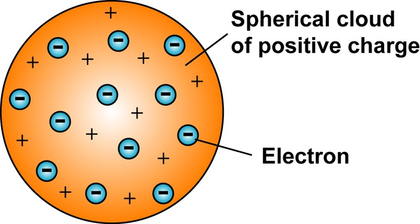
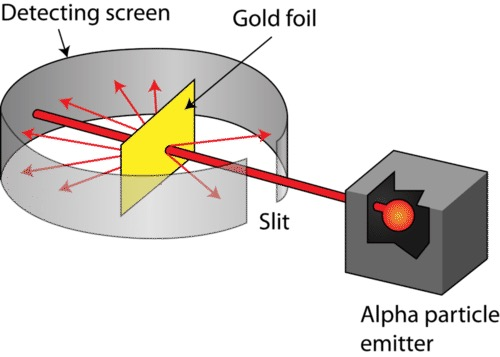
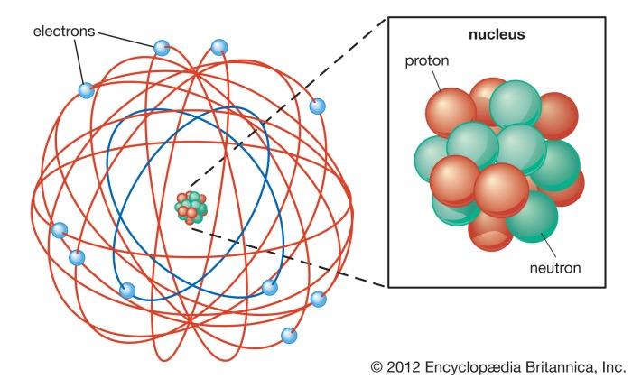
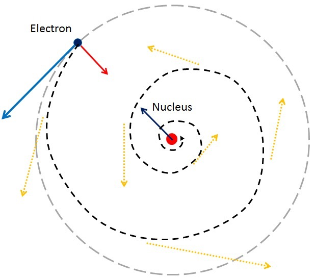
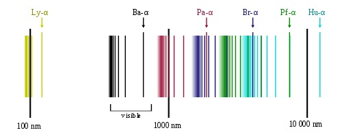

## 第二章 物质无限可分？原子中的“幽灵”

咱们先来思考这么一个问题：物质是不是无限可分的？

从数学直觉上来讲，物质应该是无限可分的。既然一个大东西能被分割成小东西，那小东西肯定也能被分割成更小的东西。《庄子》不是有一句话吗？“一尺之棰，日取其半，万世不竭。”你想必也听说过，物质是分子组成的，分子是原子组成的，原子是质子、中子和电子组成的，质子和中子又是由夸克组成的。那么接下来连小学生都会问的问题就是，夸克和电子，又是什么东西组成的呢？

答案是它们不是由别的东西组成的。现代物理学的标准模型认为夸克和电子是“基本粒子”，它们不可再分。我可以非常负责任地告诉你，物质并不是无限可分的。

物理学认为电子和夸克都是一些“数学结构” [1]，不可再分，也不必再分。这个思想其实也容易理解，我给你打个比方。比如一本书，你可以把它分成章节；章节可以分成句子；句子可以分成单词；单词可以分成字母 — 那请问，像a、b、c这样的字母，像“你、我、他”这样的汉字，还可以再分吗？再分就没有意义了。字母和单个汉字已经是最底层的符号单位，它们代表的是抽象的概念，无需再分 [2]。

一直到二十世纪都还有一些哲学家 —— 我就不说是谁了 —— 认为物质是无限可分的。他们想错了。

所以哲学家是靠不住的，真实世界比庄子的直觉更有意思！而物理学家的见识可不是拍脑袋想出来的，他们的探索步步惊心。物质该怎么分，正是量子力学的开端。

十九世纪末的科学家已经明确知道物质是原子组成的了，而且还把原子给分了类。门捷列夫弄好了元素周期表，知道每种原子的化学性质。经典物理学很美好，人们并不急于知道原子还能不能继续往下分。

这时候，大自然主动给了物理学家两个提示。

首先是 1896 年前后，居里夫人等人发现铀原子能自发地往外发射某种射线。居里夫人把这个现象命名为“放射性”，并且正确地推测出，放射性不是因为原子和原子之间的化学反应，而是原子自身的某种活动。科学家据此怀疑，原子内部应该还有结构。

1897年，约瑟夫·汤姆孙（Sir Joseph John Thomson）发现阴极射线中有一种“微粒”，在外加的电磁场中会发生偏转。汤姆孙意识到这种微粒带负电，并且把它命名为“电子”。这是人们第一次明确知道原子之中还有别的东西，汤姆孙因此得到1904年的诺贝尔物理奖。

原子是电中性的。那既然电子带负电，原子中必定还有带正电的物质。汤姆孙设想了一个模型，现在称之为“梅子布丁模型”，也可以叫“葡萄干布丁模型”。想象有一个松软的、球状的大蛋糕，其中点缀着一些葡萄干 ——

> 图片来自 https://askeyphysics.org/2015/01/25/119-12315-con-of-mom/plum-pudding-model-thomson/

那些葡萄干就是带负电的电子，而蛋糕本身带正电，和葡萄干达成平衡。原子一受热，电子们就会在蛋糕上震动起来，形成电磁波，这也就是辐射发光。

这个模型听起来挺合理，但是是错的。

给汤姆孙模型致命一击的，是他的学生欧内斯特·卢瑟福（Ernest Rutherford）。卢瑟福最早也是研究放射性，而且比居里夫人更有洞见。

卢瑟福合理推断出，所谓放射性衰变，其实就是一种原子从自己的内部分裂，变成了另外一种原子。有的人不接受这个理论，说原子怎么还能变呢，那你这不等于是炼金术吗？其实这个指责也没什么，我们知道化学这个学科，最早就是起源于炼金术……结果卢瑟福因此获得了 1908 年的诺贝尔……化学奖。

卢瑟福对此是不以为荣，反以为耻。他有一句名言说“所有的科学可以分为两类，一类是物理学，剩下的都是收集邮票。” [3] 我理解他的意思是物理学研究的是世界最本源的规律，需要灵感、洞见和创造性的理论，对比之下其他学科都只不过是老老实实地记录观测结果而已 —— 我是光荣的物理学家，而你们给我个化学奖?

不过卢瑟福在放射性方面的研究给他提供了一把神兵利器。某些放射性物质衰变时会发射一种高能量的射线，卢瑟福称之为“阿尔法粒子”，并且正确地推测出阿尔法粒子其实就是把氦原子拿掉两个电子后剩下的离子。卢瑟福可以大量制造阿尔法粒子，他能把阿尔法粒子当子弹用。

物理学家要想探测某个东西的内部结构，标准的打法是对它进行轰炸。现在动不动就耗资数百亿美元的、据说能代表一个国家的综合国力的加速器和对撞机，都是干这种事儿的。

卢瑟福在 1911 年做这个实验，只花了英国皇家科学院 70 英镑 [4]。他的做法是让两个学生拿阿尔法粒子轰炸金箔。金箔是薄薄的一层金纸，阿尔法粒子是高能量的子弹，你说子弹打在纸上会有什么样的效果？卢瑟福在实验室周围放了一圈屏幕，记录子弹的反弹情况。

> 图片来自https://www.ck12.org/chemistry/gold-foil-experiment/lesson/Rutherfords-Atomic-Model-MS-PS/

这两个学生中有一个叫盖格，后来因为发明了著名的“盖格计数器”而成了物理学史上的名人。盖格有个长处，他能在黑暗中待上几个小时，一心一意做记录。

实验发现，绝大多数阿尔法粒子直接就从金箔中穿过去了；有少量阿尔法粒子发生了偏转；还有极少量的阿尔法粒子，居然被金箔给反弹回来了。卢瑟福感到很震惊，纸怎么能把子弹反弹回来呢？唯一的可能性，就是这张纸中散布着一些非常硬的东西。

卢瑟福断定那个硬东西是原子核。大部分子弹穿过，少量偏转，极少量反弹，这说明原子内部根本不是什么葡萄干布丁结构，而是一个极其空旷的空间。这个空间的大小是由外层的电子决定的，而原子几乎全部的重量，都集中在中间很小的那个带正电的原子核上。只有碰巧靠近原子核飞过的时候，同样带正电的阿尔法粒子才能被偏转，因为正电和正电互相排斥；只有正好撞向原子核的阿尔法粒子才会被反弹回来。

卢瑟福做了一番计算，认为原子核的尺度大约在10^(-14)米，只占到整个原子万分之一的大小，这些数据在今天看来也算准确。卢瑟福轰炸了很多种物质，发现不同原子的原子核的电荷数和重量都不一样，并且据此发现了质子和中子的存在。

卢瑟福这个原子模型比汤姆孙那个葡萄干布丁模型好多了，但是它有两个问题。

第一个问题是，电子带负电，原子核带正电，而正负电相互吸引，那为什么电子不会掉入到原子核去呢？卢瑟福说这是因为电子在绕着原子核做圆周运动，就好像行星绕着太阳转一样，离心力平衡了吸引力。

但这个解释是错的。电子做圆周运动，等于是不断地改变速度的方向，而麦克斯韦电动力学告诉我们，带电物体的变速运动一定会产生辐射，从而损失能量。计算表明电子应该一边转圈、一边辐射、一边掉落，在10^(-12)秒之内就会掉入原子核！

> 图片来自 https://profmattstrassler.com/articles-and-posts/particle-physics-basics/the-structure-of-matter/atoms-building-blocks-of-molecules/atoms-their-inner-workings/

可真实的原子为啥是稳定的呢？

第二个问题是，原子的确会对外辐射，而且不受干扰也能辐射 —— 但是原子辐射的光谱很独特，不是连续的。比如下面这个是氢原子的辐射光谱，它由一些好像有规律、又好像没规律的线组成 ——

> 图片来自维基百科

当时有个中学老师叫巴尔默，还真找到了氢原子辐射光谱的一个规律。他发现其中一些辐射光的波长 λ 的倒数，正好正比于 (1/4 - 1/n^2)，其中 n=3, 4, 5……，也就是

但这个公式纯粹是凑数凑出来的，没人知道这意味着什么。我们需要一位物理学家来赋予它意义。

1912年，量子力学未来的掌门人，尼尔斯·玻尔（Niels Henrik David Bohr）博士毕业了。他先加入了汤姆孙的研究组，但是因为批评汤姆孙的模型而受到打压，又转投了卢瑟福。在卢瑟福的实验室里，玻尔意识到以自己的动手能力，做实验是真不行，但是做理论可以。

玻尔看着巴尔默凑出来的公式，想起普朗克和爱因斯坦“量子化”这个动作，决定把原子中电子的轨道给来个量子化。玻尔提出四个假设 ——

第一，电子平时按照特定的轨道运动，每个轨道有自己的能级，能级和“轨道量子数” n 的平方成反比。

第二，电子在同一个轨道中运动的时候，并不向外辐射能量。为什么不辐射能量我们暂时不知道。

第三，只有当电子在两个不同能级之间“跃迁”的时候，它才会辐射能量。辐射的能量正好是两个能级的能量差，同时又等于普朗克常数乘以光的频率。

第四，电子轨道有个角动量，角动量也要量子化，怎么理解这一点咱们后面再说。

> 波尔模型的简化示意图，图片来自维基百科

考虑到 λf = c，玻尔这个模型完全解释了巴尔默的谱线公式，而且还能计算所有的谱线 ——

> 图片来自 https://chemistryonline.guru/atomic-structure-numerical-part-2/

这是一个无比成功的模型。光电效应不是说外来一个高能量的光子能把电子打飞吗？需要多大能量呢？正好是那个电子所在能级的能量。玻尔模型还能明明白白地告诉你原子中如果有多个电子，它们应该怎么排列，玻尔等于是解释了整个化学！玻尔据此得到 1922 年诺贝尔物理奖。

咱们再类比一下，玻尔的解题思路和普朗克、爱因斯坦非常相似。都是先有实验结果，再凑数，再来个量子化。那你说爱因斯坦是不是应该非常喜欢玻尔这个理论呢？并没有。

玻尔的论文是1913年发表的，爱因斯坦的评价是你这个思路我真想过，但是我真没敢发表，因为这太怪异了。

为什么轨道只有固定的那么几条？为什么电子在轨道中就不会辐射能量了？玻尔无法回答。还有，跃迁到底是怎么回事？一个高能级的电子，为什么会自动地、突然地跃迁到低能级去？它受到什么刺激了吗？它有自由意志吗？它跃迁的路线又是怎么走的呢？这一切都非常诡异。

物理学家有一种强烈的感觉，量子世界必定有一套自己独特的规则，是经典物理学所不包括的。

到目前为止，都是实验结果“倒逼”物理学改革。物理学家都是不得不接受一个事实，然后手忙脚乱地对付出来一个模型，很被动。

这个局面不会持续太久，理论物理学家马上就要主动出击了。

顺便说一句，卢瑟福总共培养了包括玻尔在内十一个诺贝尔奖得主，其中八个是物理奖，三个是化学奖，可谓是空前绝后的一代宗师……但遗憾的是，他仍然只有一个化学奖。

> 卢瑟福（左）、玻尔和女士们在一起
