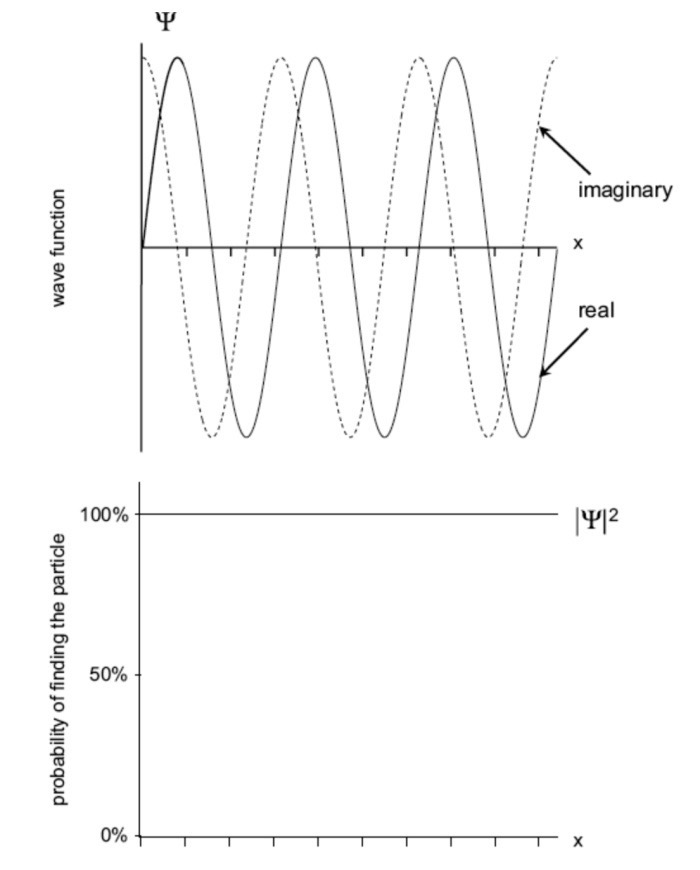
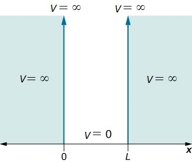
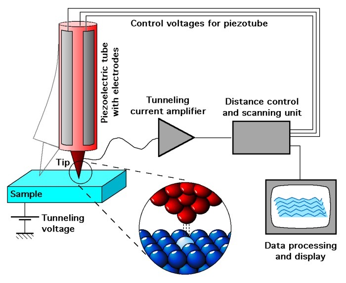
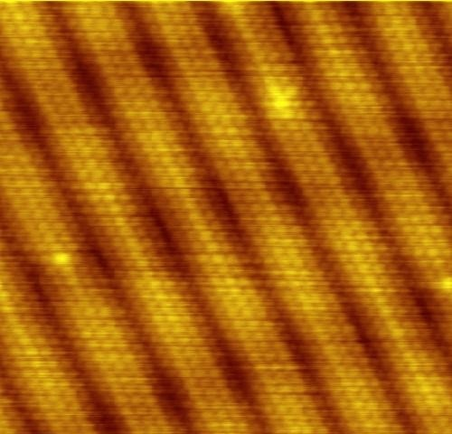
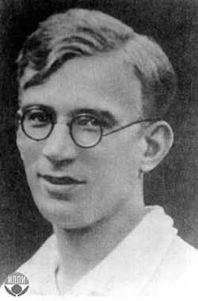

## 第六章 波函数中的概率，把不可能变为可能：量子隧穿

有的人说数学是物理学家的工具，是描写大自然的语言，我觉得这么说还不足以体现数学的厉害。你越了解物理，就越觉得数学不仅仅是大自然的语言，而且是大自然的法则。

如果数学禁止一件事发生，这件事就绝对不会发生。那如果数学允许一件事发生，这件事会发生吗？从逻辑上来说它应该可能发生也可能不发生。但是如果你相信一种更强硬的哲学，你也许可以说，只要数学允许一件事发生，这件事就一定会发生。

这一讲我们来见识一下数学的威力。薛定谔方程可以完美地解释氢原子的能级，但是好的理论必须不但解释一些已知的现象，还要能预言未知的现象。最厉害的物理理论甚至会预言一些你绝对想不到的东西。你觉得那有点太离奇了，你不敢相信，但是你一去验证，发现居然是真的。

我们要做一件所有严肃学习量子力学的人，在学了薛定谔方程之后，都必须做的事情。那就是用这个方程来求几个简单的解。我会忽略所有数学细节 [1]，你只要安心体会微观世界的妙处就行。

我们把问题简化，假设空间是一维的，只有 x 这一个方向。

咱们首先考虑一个最简单的情况，自由粒子。没有任何东西会影响这个粒子，所以薛定谔方程中的势能 V = 0。这个方程的解可以拥有任何能量。给定一个能量，波函数的形状是一个所谓“平面波”。下面这张图 [2] 中表现了波函数 Ψ 的实部、虚部和绝对值的平方 ——

> 图片来自 M. Humphrey et al., Idiot’s Guides - Quantum Physics.

你要看波函数本身，它是一个标准的波动。它的波长由粒子的能量决定，再考虑到能量跟动量的关系，这个波正好满足德布罗意那个“物质波”公式。自由的粒子，是一个自由的波。

波函数本身是个波动，可是波函数的绝对值的平方，却是一个常数。它在 x 空间中每一点都是一样的。上一讲我们说了，波函数绝对值的平方代表粒子在这个区域被发现的概率。所以这就意味着，这个自由粒子，出现在空间各个位置的可能性都是一样大的。

这也符合海森堡不确定性原理，因为你给定了能量就给定了动量，而既然动量没有不确定性，位置的不确定性就必须是无穷大。这也就是说，在量子世界里，绝对自由的粒子，同时身处世界所有的地方。它是一片无处不在的云，你在哪里都有可能遇到它。

你体会一下这个意境，什么叫自由。

当然绝对的自由是没有的，人生充满限制。我们再考虑一个绝对限制的情况。势能 V 在一个区域内部仍然是零，但是在区域外部是无穷大，就好像用一个盒子把粒子给装起来了。像下面图中这样 ——

> 图片来自chem.libretexts.org

这时候方程在区域内的解仍然是平面波，在区域外无解，波函数在边界上的取值必须是 0。有意思的是，能级出现了。

数学上要求，虽然只有这么简单的限制，这个粒子的能量就不能是任意的。它只能从一些固定的能级中选取，E1, E2, E3……这样从小到大排列。这就是为什么氢原子是有能级的！特别是，其中最小的能级 E1 ≠ 0。为什么呢？因为不确定性原理！现在粒子位置的不确定性变成有限大了，那么它就必然有一个动量的不确定性 —— 它就不能一动不动。

量子力学不允许受限制的东西一动不动。这就是为什么哪怕是在无比接近绝对零度的情况下，粒子们也会动一动。

现在考虑一个最实际的情况。假设一个原本自由的粒子，被右边的一面墙给挡住了。墙的势能 V 比粒子的能量 E 高，所以墙对粒子形成了限制。

在经典的世界中，粒子永远都不可能穿越这面墙。否则穿墙的时候粒子的 动能 = E - V < 0，这算怎么回事儿呢？

但是在量子世界中，薛定谔方程的解却是下面这个样子的 ——

> 图片来自 Wikiwand

波函数在墙的左边是个正常的平面波，在经过墙的时候是一个快速衰减的波 — 但是它没有衰减到 0！它在墙的右边，仍然有一个绝对值变小了很多的平面波。粒子可以穿墙。

当然，因为右边波的绝对值平方会比左边小很多，你在右边发现粒子的概率肯定比在左边小很多 —— 也就是说穿墙的概率并不是很大……但是！穿墙是可能的。

量子力学允许粒子穿过势能比它自身能量大的墙。这就相当于说，一个东西可以突破比它自己的能力大的限制。

这怎么可以呢？

咱们把以往的经过再捋一遍。薛定谔方程只是薛定谔在“情欲大爆发”期间灵感来了，写下的波函数方程。薛定谔运气好，这个方程恰好能解出氢原子的能级。但是当时连薛定谔本人都不知道波函数是什么东西，后来还是玻恩提出一个猜测，说波函数绝对值的平方代表概率。

你这么看的话，数学只是物理学家用的一个工具，甚至可以说是一个玩具。真实世界没有任何理由必须听从你这个方程的，对吧？

那么现在这个方程得出了一个违背常识的解，你应该怎么办呢？中学老师一定会告诉你舍掉那个解。

1927年，也就是薛定谔的论文刚刚发表不到一年，就有好几个物理学家解薛定谔方程得到了这个穿墙的解。我们可以称之为“量子隧道效应（Quantum tunnelling）”，也叫“量子隧穿”。当时人们并不知道这有什么意义。

1928 年，24岁的美籍俄裔物理学家乔治·伽莫夫（George Gamow），说不应该舍弃这个解。

因为量子隧穿对应的物理现象是真的。

伽莫夫说，这个量子隧穿，能解释为什么原子核会衰变。我们知道原子核是质子和中子紧密结合在一起的一个核，那既然有一种力量让它们结合得这么紧密，为什么有的原子核有时候又能突然分裂呢？质子和中子怎么突然就克服了那个结合的力量呢？

> 一次阿尔法衰变：大原子核通过释放出一个阿尔法粒子（包括两个质子和两个中子），变成一个小一点的原子核。图片来自tasmeemme.com

质子中子的动能比结合力的势能小，但是它们也能跑出来，这不就是量子隧穿吗？伽莫夫的计算结果正好符合衰变概率。马克思·玻恩一听说伽莫夫的工作，立即意识到量子隧穿应该是个普遍现象。

结果物理学家放眼一看，它在自然界简直比比皆是。

比如说核聚变，是两个比较小的原子核聚在一起，合成一个大的原子核，同时释放大量能量。太阳之所以发光发热，就是因为里面在发生核聚变反应。

但是我们知道原子核都是带正电的，正电和正电互相排斥，那这两个原子核要想克服这个排斥的电势能，本来是必须要以非常高的动能发生碰撞才行……正是因为量子隧穿，核聚变才能在温度不算太高、动能不算太强的情况下发生 —— 而按核聚变的标准，太阳的温度就不算太高。

换句话说，我们能享受太阳的光和热，多亏了有量子隧穿。

在生物学中，植物能发生光合作用，细胞能够呼吸，DNA能够自我修复，都和量子隧穿有关。

量子隧穿最著名的一个应用是 1981 年发明的“扫描隧道显微镜”。这种仪器能测量出原子尺度的结构。它的原理是用一根探针去接近一个金属表面，探针和金属表面之间有一个非常非常小的空隙，这个空隙就相当于一个墙。金属表面的电子本来是无法克服空隙和探针接触的，但是由于隧穿效应，电子有时候就到达探针，探针就探测到了电流。

> 扫描隧道显微镜原理，图片来自维基百科

量子隧穿对墙的宽度非常非常敏感，金属表面原子的高低排列哪怕一点点的起伏都能体现在电子穿墙的概率上，而这就意味着扫描隧道显微镜能看到原子的图像 ——

> 扫描隧道显微镜眼中的黄金表面，一排排原子清晰可见。图片来自维基百科

可是我们应该怎么理解量子隧穿呢？

既然 E < V，粒子为什么还能穿墙呢，难道说能量守恒定律在穿墙那一刻失效了吗？

你有两种选择。一个选择是认为量子力学可以违反能量守恒。对物理学家来说这非常别扭，我们非常非常相信能量守恒。

另一个选择是，你还可以换个角度来理解这件事。我们知道能量和时间之间有一个不确定性原理，随着时间的推移，量子世界里系统的能量可以有一个小小的涨落，ΔE。而 E + ΔE，可以大于 V。只要尝试的次数足够多，不确定性总会有一次让能量正好够用，从而穿墙。

你选择哪种理解都可以，要点是量子隧穿是个真实的现象。

说到这里我们可以畅想一下，如果粒子可以穿墙，那人是不是也可以呢？薛定谔方程可没说只适用于微观粒子，人无非就是质量大一点呗？

你把人的质量带入薛定谔方程求解，理论上也有一个不为零的概率，人可以穿墙而过。但是那个概率实在是太小太小了。让一个人不停地试验，每秒钟撞一次墙，他试验到宇宙年龄那么长的时间也不会有一次成功。

不过这个假想的推导带给我们一个启发。也许真实世界中很多所谓的“不可能”，其实都是概率极其小的意思。你要这么看的话，我们其实是生活在一个概率的世界中，每天都在“拥抱不确定性”。在理论上，只要数学允许，这个世界真的就像那句励志口号说的那样，“一切皆有可能” —— 只不过有些可能性实在太小了而已。

> 伽莫夫

伽莫夫在 1956 年加入科罗拉多大学，并且在那里一直工作到 1968 年去世。科罗拉多大学物理系以伽莫夫的名字命名了一个办公楼，我在这个楼里工作过很多年，这也是我和量子英雄最近的距离。
