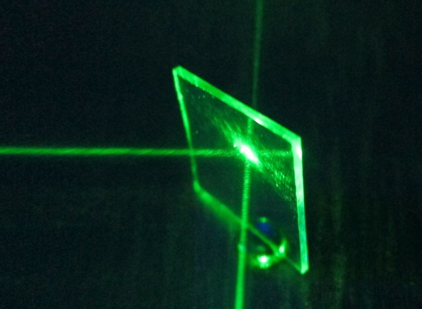
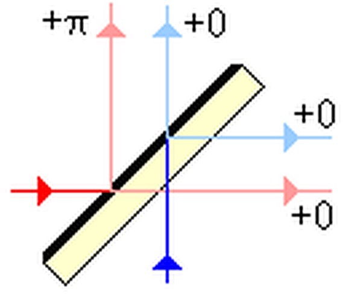
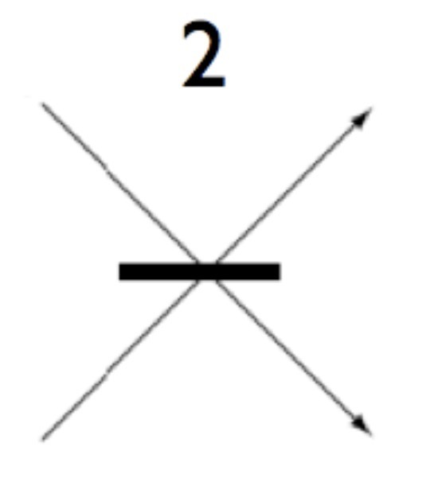
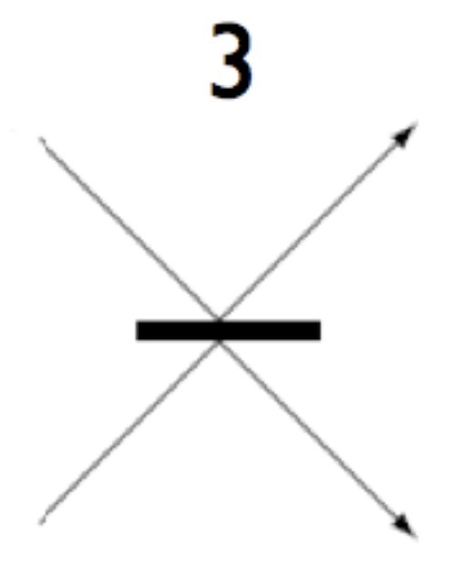
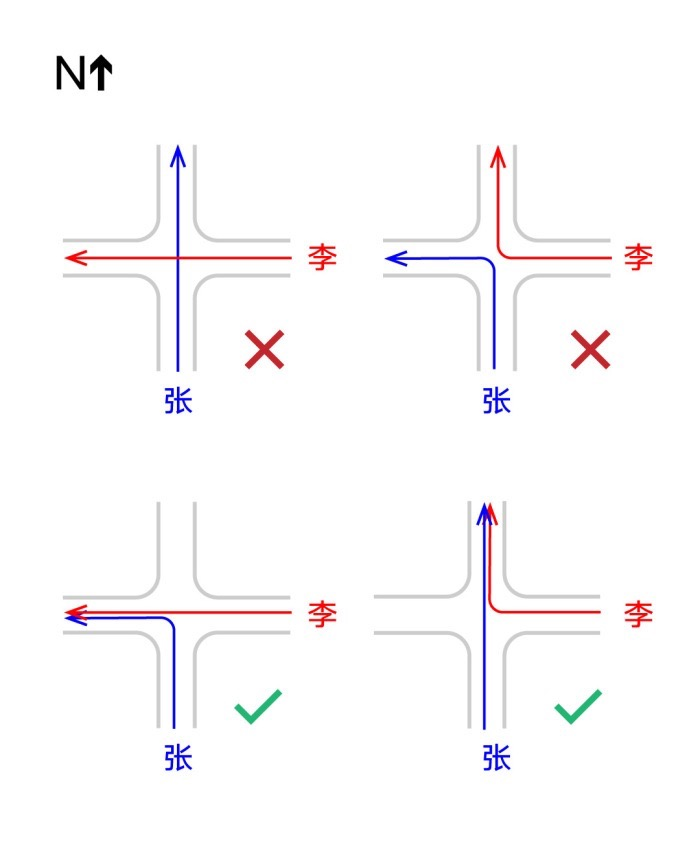

## 第九章 全同粒子的怪异行为：费曼规则

你说在我们日常生活中，有没有两个完全相同的东西呢？应该是没有。

比如说一对双胞胎，哪怕你假设他们的基因完全一样，但他们各自的人生经历、他们的记忆、他们吃的每顿饭都不可能是完全一样的，表现在身体和大脑的神经连接上，这两个人总会存在差异。

再比如说，同一个工厂、同一个批次生产出来的标准化产品，比如说手机，是绝对相同的吗？肯定也不是。如果你用放大镜去看，总能找出零件上的不同磨痕，玻璃上的细微差异。

宏观世界里任何两个东西，哪怕你假设它们真的是看起来完全一样的，我也能找出不一样来。比如说，它们不可能在同一时间占据同一个位置，对吧？你把这两个东西横排摆在我面前，它们总得是一个在左边一个在右边吧？我总可以给它们编上号：左边这个是 1 号，右边这个是 2 号 —— 这就是不一样。

我们精英日课专栏讲过“丑小鸭定理” [1]，说的就是两只天鹅之间的差别，和丑小鸭跟天鹅之间的差别是一样大的，世界上没有完全相同的两个东西。

但是，在微观世界里，两个电子，却是完全相同的。

对物理学家来说电子只是一个点。电子身上没有任何痕迹能让你找到差别的线索。电子没有年龄，你怎么看也看不出来哪个电子更老一些、哪个电子是后出生的。

更神奇的是，你甚至不能给电子编号。

在宏观世界里，比如你给我三个小球，我总能把它们从左到右排列好，在我自己的意念之中给它们编号为A、B、C。只要我一直盯住它们不放，那不管你怎么改变顺序，我也能一直区别谁是谁。所以这三个小球哪怕外表看起来绝对相同，它们在我的眼中也一共有六种排列方式：ABC、ACB、BAC、BCA、CAB、CBA。

但是电子不能这么排。三个电子摆在你面前，只有一种排列方法，AAA。

量子力学中有个概念叫做“全同粒子”，全同的意思是无法区分。电子和电子，质子和质子，一切名称相同的粒子都是全同粒子。全同粒子不仅仅是外观和物理性质一样，而且在根本上、在数学上，都是无法区分的。

这其中就包括，你哪怕在意念之中，也无法给三个电子编号。因为根据不确定性原理，电子没有明确的轨道，你根本就不可能一直盯住它们三个！哪怕是全知全能的上帝也区分不了。

这个知识非常重要。表现在统计物理学上，就是对全同粒子的统计和对普通事物的统计是非常不一样的，有一个宏观的效应。

有了全同粒子的知识，我们就可以欣赏一个精妙实验。

这个实验叫“洪-欧-曼德尔效应（Hong–Ou–Mandel effect）”，是罗切斯特大学的三个物理学家在 1987 做成的 [2]。它对量子计算机很有用，但是我讲这个实验不是因为有用，而是因为有趣。我希望你仔细琢磨一下其中的奥妙，感受感受量子世界。

我们先来介绍一个简单的物理仪器，叫做“分束器（beam splitter）”。它的作用是把一束入射的光分成两束：一束反射，一束透射。只要入射角正好是 45 度，反射和透射就正好各占一半。

> 分束器。图片来自https://www.indiamart.com/proddetail/laser-line-plate-beam-splitters-7112372297.html；本节其余图片都来自维基百科

> 一个真实的分束器

分束器的构造很简单，就是一块厚玻璃的一面镀上银。镀银的这一面就好像镜子一样，只不过是半透明的镜子。如果我们不是用一束光，而是只把一个光子打到分束器上，那可想而知，光子会有50%的可能性反射，50%的可能性透射。

下面是重要的一点：从镀银的这一面反射出来的光子，它会获得一个180°（也就是 π）的相位差，导致它的态函数要改变一次正负号 [3]。但是从分束器另一面反射、或者任何透射的光子，都不会改变相位 [4]。

> 分束器的反射和透射相位变化

这些都是非常基本的性质，所有做光学实验的人都会用到分束器。

好，现在我们的实验是这样的。假设分束器是平放的，下面的一面镀银。有两个光子，一个从分束器的上方45°角入射，另一个从分束器的下方45°角入射。你猜会发生什么？

光子遇到分束器后有两个选择，反射或者透射，可能性各占50%。所以两个光子的行为一共有四种可能性 ——

1）上面的光子反射，下面的光子透射：

2）上下两个光子都透射：

3）上下两个光子都反射：

4）上面的光子透射，下面的光子反射：

没问题吧？

好，现在根据量子力学，这件事儿总的态函数应该写成这四种情况的叠加态。但是考虑到分束器是下面镀银，下面的光子反射的时候会带来一个相位差，也就是一个负号，所以总态函数是

Ψ = 第一种情况 + 第二种情况 - 第三种情况 - 第四种情况

用图形表示，就是 ——

这时候请注意！如果这两个光子是全同的，第二种情况（两个光子都透射）和第三种情况（两个光子都反射）的结局就是不可区分的。对吧？因为你根本无法跟踪这两个光子，你不知道从分束器里跑出来的到底哪个是哪个，两种情况的结局都是两个光子从两侧跑出来。

而又因为第三种情况有个负号，所以第二和第三种情况互相抵消了……抵消了。

“洪-欧-曼德尔效应”的实验结果正是如此！只剩下第一和第四种情况。你看到的或者是两个光子一起从上方跑出来，或者是一起从下方跑出来，而绝不会是各自从不同的方向出来。

我们想想这件事有多怪异。光子是完全自由的。它们各自都有反射和透射两个选项，它们完全没有理由约好了一起走。但是结果却是它们必须一起走。

我再帮你捋一遍。这就好比说十字路口的东边来了一个老张，南边来了一个老李，两人正好在路口相遇。他们都是完全自由的。老张本来打算要么直行往西、要么右转往北；老李本来打算要么直行往北，要么左转往西。在经典世俗的生活中他们既可以一起往北或者往西，也可以一个往北一个往西，是吧？

可是奇怪的事情发生了。实验结果是老张和老李总是选择了同一方向。就好像他俩认识一样，聊了几句就决定必须一起走。

> 在十字路口相遇的老张和老李，总是选择一起走。

是谁给了两个光子这样的协调呢？

这个事儿跟传统光学的干涉现象没关系。传统光学的干涉，是一束光的波峰正好跟另一束光的波谷重叠导致的相消 —— 你需要两束光在一起才能干涉。可是这里被抵消掉的恰恰是两个光子选择不同方向的那两个量子态 [5]。

“洪-欧-曼德尔效应”再次告诉我们，“量子叠加态”，是比波函数更为深刻的表达。在量子叠加态中不但两个波的波峰和波谷能抵消，连两个*事件*都可以互相抵消。

事实上如果你学量子电动力学，你会学到费曼发明的“费曼图”，他的做法就是要把所有可能发生的粒子事件一个一个画出来，让事件之间做加加减减 —— 这个做法被称之为“费曼规则”。

> 一组有关杨-米尔斯理论的费曼规则计算体验。图片来自 E. Dudas, Field theory and the standard model.

“洪-欧-曼德尔效应”还让我们看到了，全同粒子，那是真的不可区分的。

全同粒子的这个不可区分的性质，让物理学家也深感不安。为什么非得是这样的呢？我听到的最离奇的解释，来自费曼的导师，约翰·惠勒（John Archibald Wheeler）。惠勒是一位卓有贡献的理论物理学家，“黑洞”这个词就是他发明的，他的脑洞比较大。

有一天，惠勒突发奇想，给费曼打电话说 ，他知道为什么电子是全同的了。费曼问为什么？惠勒说，因为整个宇宙中只有一个电子！

我想，如果费曼当时用的是微信，一定会缓缓打出一个用手捂脸的表情。只有一个电子，难道说这个电子实现了实体化无处不在，可以制造无数个分身同时让人观测到吗？费曼没当回事，惠勒提了一下也不了了之。

那到底应该如何理解粒子的全同性呢？以我之见，很可能还是因为基本粒子实际上都是数学结构，是抽象的存在。具体的事物，我们总可以找出一些特征来加以区分。抽象的东西，比如数字“1”，你写出多少个来，也只能是全同的。

那为什么日常生活中的各种事物没有全同的呢？因为其中包含的粒子实在太多了。每一个物体都是基本粒子排列组合形成的，它们排列组合的方式实在太多，以至于你无法找到两个完全相同的物体。如果基本粒子是字母，宏观物体就好像长篇小说 —— 字母都是全同的字母，但是小说跟小说没有一样的。另一方面，宏观物体的位置不确定性也变得可以忽略不计，让你可以跟踪了。

但是你要沿着这个思路往深了想，可能会有点胆战心惊。如果这个世界最底层的积木都是抽象的存在，都是数学结构，那这些积木组成的物体就算失去了全同性，不也仍然还是数学结构吗？也许我们身边的一切，包括你和我，都只不过是数学元素的排列组合而已。

那要这么说的话，这个世界还是真实的吗？它跟电子游戏里的虚拟世界又有什么本质区别呢？这个话题有点危险，我们还是先回到量子力学。

> 理查德·费曼
