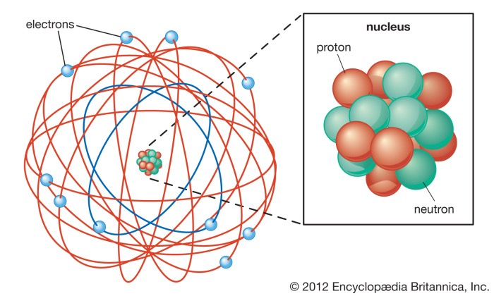
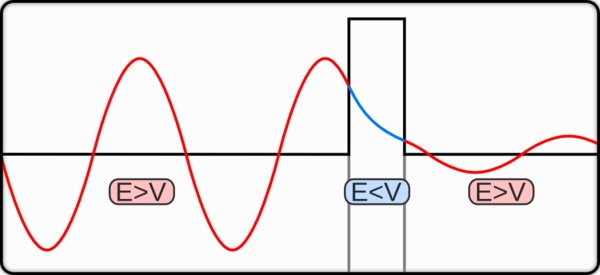
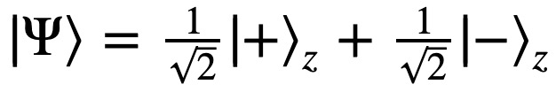

# 量子力学趣味简史

[喵小哥](https://51world.win)（编）&copy; 2020

用最简洁有趣的方式阐述量子力学从发端到现在。

## 序章

现在有谁不是量子力学的爱好者呢？人人都知道量子力学讲究个不确定性，所谓“遇事不决，量子力学”。人们都爱把“量子”放入公司和品牌的名称中，有“量子基金”、“量子波动速读”，乃至于“量子推拿”。

你可能已经听过不同版本的量子力学讲解，有侧重计算的学院版、讲故事的历史版、可爱的卡通版、还有霸道总裁假装学过版。量子力学已经是一个文化，每个人都可以有自己的体验角度。

我要说的，是最本源的角度。

诡秘。

这是一个被我们之中最聪明的头脑探索了一百年的秘密。听说它的冰山一角，你就足以动容；稍微了解，你就会为之痴迷；深入钻研进去，你可能会陷入绝望，乃至于疯狂。

量子力学是关于我们生活的这个世界的本源的秘密。爱因斯坦、玻尔、薛定谔、海森堡、狄拉克、泡利、德布罗意、费曼……物理学里最耀眼的英雄都是因为在量子力学中建功立业而留下姓名。

一开始谁都没想到。物理学家只是问了一些非常基本的问题：世界上的各种东西都是由什么组成的？如果原子是最小的单位，那为什么这个原子和那个原子的化学性质如此不同呢？原子还能再分解成别的东西吗？光，到底是什么？这些问题几千年前就有人问，只不过直到一百年前，我们才有了足够的技术和数学去真正探索它们。

结果这一探索，物理学家发现，微观世界的东西似乎在遵循某些非常怪异的规则。

比如说，如果把你限制在一个各个面都是墙的房间里，你想要出来就必须在墙上打个洞，对吧？那你是否想过，中国有个“崂山道士”的故事，说有一种叫做“穿墙术”的法术，可以让人直接穿墙而过，而既不破坏墙、也不伤害人。

在微观世界里，这个法术是常规操作。把一个电子限制在势能比它自身能量高的区域内，这个电子有一定的几率能穿墙而出。那既然电子可以，质子当然也可以、原子也可以……一直到由原子组成的人，在原则上，其实也可以 —— 只不过你能成功穿墙的几率非常、非常小而已。

这还不算什么。日常世界里的你，在任何一个特定时刻，都只能出现在一个特定的地方，对吧？你此时此刻不能既在北京又在哈尔滨。但是在微观世界里，电子可以同时出现在所有的地方 —— 它不但能既在这里又在那里，而且还能同时沿着好几条不同的路线前进。

日常世界的桌子上不会突然凭空冒出一个苹果和一个橘子来，你想要水果得自己出去买才行。但是在微观世界里，真空之中，就可以突然凭空冒出一个电子和一个正电子来，只不过你几乎不可能抓住它们而已。

微观的世界，充满诡秘。

那你可能说，这帮物理学家为什么非得琢磨这些怪异的东西？难道老老实实地研究我们日常的世界还不够吗？

这些怪异行为可不是物理学家幻想出来的，它们都是实验和逻辑推理的结果。为了解释日常世界的“正常”，你只能接受微观世界的“不正常”。换一个视角，也许应该说微观世界的那些怪异行为才是正常的，而我们在日常生活里的感知，都是大尺度带来的错觉。

哪有什么岁月静好，不过是微观的粒子们替你诡秘前行。

在对微观世界的诡秘进行探索的过程中，物理学操纵日常世界的能力也越来越强。就好像修仙小说的主人公一边更新世界观一边掌握新法术一样，真是认知升级决定了能力升级。

量子力学带给我们的回报，远远超出了所有人的想象。我们终于明白了原子到底是怎么回事儿，我们能精确推演日常世界的所有自然现象。我们揭开了原子核的秘密，制造了原子弹和核电站。我们深入理解了固体物理学，发明了半导体和计算机芯片。我们能精确地测量，甚至能一个一个操纵单个原子。我们能解释远在天边的白矮星是怎么回事儿。量子力学是这个世界的底层逻辑，哺育了几乎所有的现代先进科技。

然而物理学的英雄们仍然没找到量子力学的最终答案。我们可以接受微观世界的各种行为，但是你要说规则就是这样了，那似乎有点不合逻辑。

比如说，一个电子从“同时出现在所有地方”，到“恰好在这里被你找到”，完全是一瞬间的事儿，甚至可以说根本就不需要时间 —— 那这一瞬间到底发生了什么呢？什么样的事情，可以不花费时间就发生改变呢？

再进一步，这个电子最终在*哪里*被你找到，居然是完全随机的。世界上怎么能有完全随机的事儿呢？为什么是在这里而不是在那里，这总得有点原因吧？

有些人 —— 比如爱因斯坦 —— 就怀疑，量子世界种种诡秘的背后，必定还有一个更深的，诡秘之主。

爱因斯坦死不瞑目，可是那时候已经没有多少人愿意听他说话了。

在早期的热闹之后，曾经有三十年之久，绝大多数物理学家都认为，继续探索量子力学的秘密是徒劳的，我们应该专注在计算和应用上，毕竟现有的量子理论已经够用了。在那些年里物理学家上天入地，几乎是把你能想到和想不到的所有自然法则都研究明白了。而量子力学，只是他们的计算工具而已。

量子力学的应用是无处不在，但是人们对量子力学秘密的探索，沉寂了……

好在我们生的晚，还有机会看到这场探索的后续。从上世纪六七十年代开始，又有人提出了新的假说，继续探索那个诡秘之主。新技术允许物理学家做各种巧夺天工的实验。对这个秘密的探索，现在是一个非常活跃的研究领域。

而物理学家走得更远更深之后，诡秘之感不但没有减弱，反而还更严重了。

新的实验首先证明，所谓“量子纠缠”，是真的。互相关联的两个粒子，哪怕距离非常遥远，只要其中一个的量子态发生改变，另一个就会立即随之改变。这意味着它们之间存在某种超光速的、甚至是瞬时的协调。

可惜爱因斯坦没能看到这个实验结果……不过量子纠缠在某种意义上并不违反相对论，因为没有人能利用那个鬼魅般的协调去传递信息。

使用新技术，物理学家有办法只发射一个光子，让它同时沿着两条路径走。实验发现光子就好像在出发之前就已经对两条路径有完全的感知一样，它能根据路上的不同情况，选择要不要自己跟自己发生干涉。特别是如果你在其中一条路上放一颗无比敏感的、只要有一个光子打在上面就会爆炸的炸弹 [1]，光子可以在不走这条路的情况下，感知到那颗炸弹的存在。

那个“感知”到底是什么东西呢？

再进一步，老一辈物理学家有个名词叫“波粒二象性”，说微观世界里的东西都既是波也是粒子，具体观测结果是什么取决于你的视角：你想测量一个波就会得到波，你用测量粒子的方法就会得到一个粒子。那么从“二象”到“一象”，那个变化是发生在什么时候呢？

新一代物理学家可以先假装要测量波，等到光子已经不得不表现出波的样子，但是仍然在飞行之中、还没有最终到达目的地“官宣”的那一刻，突然改变主意，改成要测量粒子，你猜光子会怎么做？

答案是它不但会临时变成粒子，而且还要改写自己之前的行为。这就好比说一个学生在考场上看到试题之后，又重新回到三天前去准备这次考试！

新实验甚至发现连所谓的“客观现实”，都不一定存在。面对同一个实验，两个观察者可以记录不同的结果，那你说他们真的是处在同一个世界之中吗？也许我们每个人都有自己的世界……

怎么解释这些现象？量子力学背后的诡秘到底是什么呢？现在物理学家提出了几个猜想，这些猜想一个比一个离奇。

探索仍然在进行之中，没有人知道最终的答案。但是我们可以肯定，真实世界绝对不是人们平常感知的样子，而你有权知道真相。

现在我站在几代物理学家的肩膀上，向你汇报我们对这个秘密的探索经过和最新理解。

学习量子力学能给你一个脱离平庸生活，体验诡秘的视角。我们不是低幼版也不是简化版，我们不胡乱打比方。我将从最基本的概念讲起，带给你量子力学的纯正趣味。我承诺不使用中学生水平以上的数学，咱们主要用“物理直觉”说话。但是我希望你能在学习过程中积极思考，学一点思辨的技巧。我要讲一个探索的故事，你会看到物理学家是如何一步步刺探未知的，你会学到他们常用的几个心法。

咱们精英日课的专栏主编筱颖说，量子力学再难懂也肯定不会比人心更难懂，我对此表示怀疑。咱们专栏第一季的更新时间曾经是每晚 10:43 —— 是来自 10^-43 秒这个“普朗克时间”。那普朗克长啥样呢？下面这两张照片是物理学家马克斯·普朗克（Max Planck）在钻研量子力学之前和之后的样子……

这是一门能把花样少年变成毁容大叔的学问，因为它颠覆了太多东西。为了安全地学好这个课程，我希望你先忘记有关这个世界的各种想当然的假定。当然也不是所有你知道的东西都会被颠覆 —— 比如说，以下这些事情，我保证，不管发生什么，它们都还是对的：

第一，数学都是对的。你永远都不用质疑数学结论。

第二，我们说到的所有实验，不论多么离奇，都是对的。它们都经过了几代物理学家的反复验证，不但正确而且精确。我们的一切讨论不是要质疑这些实验，而是琢磨如何理解这些实验。

第三，物理学的守恒定律 —— 包括能量守恒、动量守恒和角动量守恒 —— 都仍然成立。这个宇宙不会凭空送给你什么东西，也不会凭空拿走你的东西……或者，至少不会做得太明显。

第四，你的妈妈仍然爱你。

这几条之外，请你做好思想准备。

## 第一章 两朵乌云：经典物理的终结，量子力学的开端

十九世纪末到二十世纪初，世界各国普遍都在闹革命，用李鸿章的话来说叫“三千年未有之大变局”。这句话也适用于物理学的革命。这场革命是经典物理学和现代物理学的分界线。

牛顿和伽利略这些早先的物理学家都做出过非常漂亮的工作，但是他们的手段非常有限，对世界的观察比较被动。他们仰望星空可以，做实验就都很粗糙，无非是弄个滑块啊斜面啊之类，没有什么科技感。

而十九世纪末的欧洲，因为工业革命成功，是一个蒸汽朋克的时代。物理学家有了比较精密的仪器，有了人造光源，特别是可以玩电了，这才像个做实验的样子。当时的数学工具也非常发达，微分方程、统计方法、包括非欧几何都已经很成熟了。

不过这时候的物理学还是牛顿的延续，还是经典物理学 —— 但是是很厉害的经典物理学。当时麦克斯韦的电动力学已经深入人心，人们已经知道分子和原子的存在，连热力学都是明明白白的。物理理论自带一种美感，而且公式和实验结果特别吻合，经典物理学是非常精确的科学。

而物理学家看待世界的情绪，已经不再是好奇和敬畏了，而是统治：世间各种自然现象，现在我们的理论都能解释。

比如说“光”。古人研究光只能靠生活常识和简单的思辨。人们早就知道视觉是因为光进入眼睛，而不是眼睛会发射光。人们知道光走直线，光可以互相交叉，光还能有能量，因为阳光照在身上暖洋洋的。牛顿还知道太阳光不是单纯的白色，可以分解成不同的颜色。可是光到底是什么东西呢？光的颜色是怎么来的呢？

麦克斯韦的电动力学出来以后，物理学家立即就知道了光就是电磁波，不同的颜色其实就是不同的波长和频率 [1]。无线电波、红外线、可见光、紫外线、X射线、γ射线……它们都是同一种东西，唯一的区别就是频率不一样。

（注意光的频率和波长的关系是 波长 x 频率 = 光速，所以我们说颜色就等于说频率，说频率就等于说波长。）

你看你会了这个知识，是不是有一种江山尽在掌握的感觉呢？

我们这一讲的主人公马克斯·普朗克在1875年上大学的时候，他的老师劝他不要学物理 —— 因为物理学已经很成熟了，盛宴已过，没有多少留给你研究的空间了。

科幻小说作家阿西莫夫有句名言，说科学史上最激动人心的话不是什么“尤里卡” —— 也就是“我发现了” —— 而是“这有点怪啊（that’s funny）”。

1900年元旦这天，热力学之父、开尔文男爵威廉·汤姆森在一个演讲中说：“在已经基本建成的物理学大厦中，后辈物理学家只要做一些零碎的修补工作就行了……但是，在物理学晴朗的天空的远处，还有两朵小小的令人不安的乌云”。

也就是，这有点怪。

这两朵乌云都和光有关。一个是光速为什么在各个方向都不变， 我们知道这导致爱因斯坦发现了狭义相对论。另一个，是关于黑体辐射。

中国大学课本总爱把“黑体”描写成特别抽象的东西，其实黑体很简单。所谓黑体，就是它不反射别的光，它发出的都是它自身的光。太阳、烧红的烙铁、黑暗中的人体，这些东西都可以近似为黑体。黑体发出的光是由它的热量导致的，也就是热辐射。

物理学家发现，黑体热辐射的光谱，跟它具体是个什么东西没有关系，完全由温度决定。一块烙铁也好一块砖头也好，你看一眼它发光的颜色就知道他的温度是多少。发红光那就是温度还不算太高，蓝光就意味着温度很高。严格说来黑体辐射不会只发单一颜色的光，你看见是红色只不过是红色光的强度最高。给定一个温度，实验物理学家能够非常精确地告诉你黑体辐射光的颜色 —— 也就是频率 —— 的分布曲线，比如像下面这张图。

")

那请问，曲线为什么是这样的呢？

理论物理学家都是非常自负的，说你这个曲线这么标准，我一定能给你推导出来。当时热力学、统计物理已经非常发达了，物理学家可以精确地描写一堆气体的热运动，而黑体无非就是一块发热的固体呗？物理学家假设，黑体的光是来自其中的电子振动产生的电磁波，那我用统计力学一算便知。

谁也没想到，物理学在这里失败了。没有一个理论能解释黑体的发光曲线，特别是在高频率 —— 也就是紫外线以外 —— 的地方，有的理论认为黑体发出的能量应该是无限大的，这显然不可能，人们把这个理论难题称为“紫外灾难”。

这是经典物理学的终结，也是量子力学的开端。

1900年的某一个下午，普朗克在自己家里和一位实验物理学家讨论了黑体辐射。实验物理学家把这个事儿给他讲明白就走了，晚上普朗克自己继续琢磨。普朗克换了一个思路。

他想，我能不能先不管物理，能不能直接在数学上凑一个公式描写这条曲线呢？当晚普朗克有如神助，竟然真的凑出来了一个公式。他立即写明信片把公式告知了那个实验物理学家，并且在12天后当众宣读了论文。这真的是一个非常完美的公式。

可是从物理上来说，这个公式怎么解释呢？普朗克苦苦思索了几个月，最后发现只要满足一个物理假设，就可以推导出来这个公式。

这个假设是电子振动产生无线电波的能量不能是连续的，而应该是一份一份的，就好像上台阶一样你每次必须走一整步，而不能走半步。普朗克规定每一份辐射能量的最小单位是由光的频率决定的：

其中 f 是频率，h 是一个常数，我们现在称之为“普朗克常数”，h = 6.626×10^(−34) 焦耳·秒。

有了这个假设，高频率辐射光的一份能量就很大了，那么根据热力学，它出现的概率就比较低，所以高能辐射就没有那么多，这就避免了紫外灾难。

普朗克凭借这个假设和那个公式拿到了1918年的诺贝尔物理学奖。但是普朗克并不知道那“一份一份的”能量，意味着什么。

第一个把天机说破的还得是我佛爱因斯坦。这就引出了另一个实验，叫“光电效应”。

物理学家在实验中无意发现，如果你把一束光照射在金属板上，有时候金属板会往外发射电子。表面上看这是容易理解的，光毕竟是电磁波，电磁波的能量转化成电子的动能，电子就跑了。

但奇怪的是，电子如何往外跑，和光的*强度*没有关系，只和光的颜色，也就是频率有关系。这就好比说，红色的光，不管多亮也不能让电子跑出来；你要用绿光，哪怕光线很弱电子也能跑；要是蓝光，电子不但能跑，而且跑出来的速度还很快。

这个现象无法用经典物理学解释。麦克斯韦的理论中电磁波的能量只跟强度有关，和频率没关系。电子为什么不能逐渐地从光波中积累能量，攒够了就跑呢？

1905年是“爱因斯坦奇迹年”，这一年爱因斯坦发表了六篇论文，其中一篇叫《关于光的产生和转变的一个启发性观点》，说的就是光电效应。爱因斯坦说，电子之所以非得遇到高频率的光才能跑，这是因为光是一份一份的。普朗克不是说了吗？光的一份能量 E = hf，频率越高能量越大，所以高频率的光的一份能量才足够大，才能打动电子。

请注意，相对于普朗克的假设来说，爱因斯坦提出了一个思维概念上的跃迁。普朗克说的一份一份是黑体中电子受热振动的能量，而爱因斯坦说这跟光是不是从黑体中来的没关系 —— 只要是光，能量就是一份一份的。

爱因斯坦提出了“光量子”。

爱因斯坦说光不是连续的一片波，而是由一个一个的光子组成的，每个光子的能量就是它的频率乘以普朗克常数。

爱因斯坦用这一个公式解释了光电效应，计算结果非常吻合。这篇论文给爱因斯坦带来了诺贝尔物理奖，这也是他一生之中得到的唯一一个诺贝尔奖。

普朗克和爱因斯坦的解题思路，叫做“量子化”。量子化从此就是现代物理学的一大主题，物理学家们把什么东西都想给量子化，有人认为连引力、甚至连空间都是量子的。

什么是“量子”呢？比如你家有个4K高清电视，离远了看，你觉得电视画面非常柔顺。但是离近了看，你会发现屏幕上其实都是一个一个的光点，画面并不是连续的。量子化，就是分辨率是有限的，是不连续的，是一个一个的，是像整数一样可数的。这个世界有可能完全是量子的。

我们平时为什么感觉不到世界是量子的呢？因为普朗克常数 h 是一个非常、非常小的数字，等于说分辨率太高了。

黑体辐射和光电效应都是经典物理学解释不了的现象，普朗克先用凑数的方法给了个数学模型，爱因斯坦赋予了这个模型物理上的意义，物理学家就算正式发现了光子。我们今天听起来这挺自然，好像是物理学家们是在亲切友好的气氛下达成共识，但当时的情况可并非如此。

爱因斯坦关于光电效应的想法是受到了普朗克的启发，那篇论文的编辑和审稿人又恰好都是普朗克，而且普朗克也让论文发表了，那你说普朗克是不是应该非常赞赏爱因斯坦的说法呢？

并没有。普朗克本人在此后很多年里，都无法接受光子这个概念。光量子不符合经典物理学，麦克斯韦方程解不出一份一份的能量。普朗克在很多年里都在寻找用经典物理学解释电子震动的方法，他失败了。

普朗克有一句名言说，“新科学事实之所以胜出，并不是因为反对者都被说服了，而是因为反对者最终都死了……然后熟悉这个事实的新一代人长大了。”可能你以前就听到过这句话，以为普朗克是那个传播新思想的人 —— 其实他不是。

那么爱因斯坦提出了光子的概念，他肯定是新思想的拥护者吧？其实也不是。爱因斯坦终其一生，都反对量子力学。

什么是革命呢，得是这个思想是如此之离经叛道，以至于连革命者本人都反对它，那才是真革命啊。

不过话说回来，反对光子的人其实很有道理。有太强的证据表明光是一种波了。如果光是粒子，又怎么解释光的波动性呢？咱们后面再说。

> 多年以后的爱因斯坦和普朗克。图片来自 https://www.lindahall.org/max-planck/

## 第二章 物质无限可分？原子中的“幽灵”

咱们先来思考这么一个问题：物质是不是无限可分的？

从数学直觉上来讲，物质应该是无限可分的。既然一个大东西能被分割成小东西，那小东西肯定也能被分割成更小的东西。《庄子》不是有一句话吗？“一尺之棰，日取其半，万世不竭。”你想必也听说过，物质是分子组成的，分子是原子组成的，原子是质子、中子和电子组成的，质子和中子又是由夸克组成的。那么接下来连小学生都会问的问题就是，夸克和电子，又是什么东西组成的呢？

答案是它们不是由别的东西组成的。现代物理学的标准模型认为夸克和电子是“基本粒子”，它们不可再分。我可以非常负责任地告诉你，物质并不是无限可分的。

物理学认为电子和夸克都是一些“数学结构” [1]，不可再分，也不必再分。这个思想其实也容易理解，我给你打个比方。比如一本书，你可以把它分成章节；章节可以分成句子；句子可以分成单词；单词可以分成字母 — 那请问，像a、b、c这样的字母，像“你、我、他”这样的汉字，还可以再分吗？再分就没有意义了。字母和单个汉字已经是最底层的符号单位，它们代表的是抽象的概念，无需再分 [2]。

一直到二十世纪都还有一些哲学家 —— 我就不说是谁了 —— 认为物质是无限可分的。他们想错了。

所以哲学家是靠不住的，真实世界比庄子的直觉更有意思！而物理学家的见识可不是拍脑袋想出来的，他们的探索步步惊心。物质该怎么分，正是量子力学的开端。

十九世纪末的科学家已经明确知道物质是原子组成的了，而且还把原子给分了类。门捷列夫弄好了元素周期表，知道每种原子的化学性质。经典物理学很美好，人们并不急于知道原子还能不能继续往下分。

这时候，大自然主动给了物理学家两个提示。

首先是 1896 年前后，居里夫人等人发现铀原子能自发地往外发射某种射线。居里夫人把这个现象命名为“放射性”，并且正确地推测出，放射性不是因为原子和原子之间的化学反应，而是原子自身的某种活动。科学家据此怀疑，原子内部应该还有结构。

1897年，约瑟夫·汤姆孙（Sir Joseph John Thomson）发现阴极射线中有一种“微粒”，在外加的电磁场中会发生偏转。汤姆孙意识到这种微粒带负电，并且把它命名为“电子”。这是人们第一次明确知道原子之中还有别的东西，汤姆孙因此得到1904年的诺贝尔物理奖。

原子是电中性的。那既然电子带负电，原子中必定还有带正电的物质。汤姆孙设想了一个模型，现在称之为“梅子布丁模型”，也可以叫“葡萄干布丁模型”。想象有一个松软的、球状的大蛋糕，其中点缀着一些葡萄干 ——

> 图片来自 https://askeyphysics.org/2015/01/25/119-12315-con-of-mom/plum-pudding-model-thomson/

那些葡萄干就是带负电的电子，而蛋糕本身带正电，和葡萄干达成平衡。原子一受热，电子们就会在蛋糕上震动起来，形成电磁波，这也就是辐射发光。

这个模型听起来挺合理，但是是错的。

给汤姆孙模型致命一击的，是他的学生欧内斯特·卢瑟福（Ernest Rutherford）。卢瑟福最早也是研究放射性，而且比居里夫人更有洞见。

卢瑟福合理推断出，所谓放射性衰变，其实就是一种原子从自己的内部分裂，变成了另外一种原子。有的人不接受这个理论，说原子怎么还能变呢，那你这不等于是炼金术吗？其实这个指责也没什么，我们知道化学这个学科，最早就是起源于炼金术……结果卢瑟福因此获得了 1908 年的诺贝尔……化学奖。

卢瑟福对此是不以为荣，反以为耻。他有一句名言说“所有的科学可以分为两类，一类是物理学，剩下的都是收集邮票。” [3] 我理解他的意思是物理学研究的是世界最本源的规律，需要灵感、洞见和创造性的理论，对比之下其他学科都只不过是老老实实地记录观测结果而已 —— 我是光荣的物理学家，而你们给我个化学奖?

不过卢瑟福在放射性方面的研究给他提供了一把神兵利器。某些放射性物质衰变时会发射一种高能量的射线，卢瑟福称之为“阿尔法粒子”，并且正确地推测出阿尔法粒子其实就是把氦原子拿掉两个电子后剩下的离子。卢瑟福可以大量制造阿尔法粒子，他能把阿尔法粒子当子弹用。

物理学家要想探测某个东西的内部结构，标准的打法是对它进行轰炸。现在动不动就耗资数百亿美元的、据说能代表一个国家的综合国力的加速器和对撞机，都是干这种事儿的。

卢瑟福在 1911 年做这个实验，只花了英国皇家科学院 70 英镑 [4]。他的做法是让两个学生拿阿尔法粒子轰炸金箔。金箔是薄薄的一层金纸，阿尔法粒子是高能量的子弹，你说子弹打在纸上会有什么样的效果？卢瑟福在实验室周围放了一圈屏幕，记录子弹的反弹情况。

> 图片来自https://www.ck12.org/chemistry/gold-foil-experiment/lesson/Rutherfords-Atomic-Model-MS-PS/

这两个学生中有一个叫盖格，后来因为发明了著名的“盖格计数器”而成了物理学史上的名人。盖格有个长处，他能在黑暗中待上几个小时，一心一意做记录。

实验发现，绝大多数阿尔法粒子直接就从金箔中穿过去了；有少量阿尔法粒子发生了偏转；还有极少量的阿尔法粒子，居然被金箔给反弹回来了。卢瑟福感到很震惊，纸怎么能把子弹反弹回来呢？唯一的可能性，就是这张纸中散布着一些非常硬的东西。

卢瑟福断定那个硬东西是原子核。大部分子弹穿过，少量偏转，极少量反弹，这说明原子内部根本不是什么葡萄干布丁结构，而是一个极其空旷的空间。这个空间的大小是由外层的电子决定的，而原子几乎全部的重量，都集中在中间很小的那个带正电的原子核上。只有碰巧靠近原子核飞过的时候，同样带正电的阿尔法粒子才能被偏转，因为正电和正电互相排斥；只有正好撞向原子核的阿尔法粒子才会被反弹回来。

卢瑟福做了一番计算，认为原子核的尺度大约在10^(-14)米，只占到整个原子万分之一的大小，这些数据在今天看来也算准确。卢瑟福轰炸了很多种物质，发现不同原子的原子核的电荷数和重量都不一样，并且据此发现了质子和中子的存在。

卢瑟福这个原子模型比汤姆孙那个葡萄干布丁模型好多了，但是它有两个问题。

第一个问题是，电子带负电，原子核带正电，而正负电相互吸引，那为什么电子不会掉入到原子核去呢？卢瑟福说这是因为电子在绕着原子核做圆周运动，就好像行星绕着太阳转一样，离心力平衡了吸引力。

但这个解释是错的。电子做圆周运动，等于是不断地改变速度的方向，而麦克斯韦电动力学告诉我们，带电物体的变速运动一定会产生辐射，从而损失能量。计算表明电子应该一边转圈、一边辐射、一边掉落，在10^(-12)秒之内就会掉入原子核！

> 图片来自 https://profmattstrassler.com/articles-and-posts/particle-physics-basics/the-structure-of-matter/atoms-building-blocks-of-molecules/atoms-their-inner-workings/

可真实的原子为啥是稳定的呢？

第二个问题是，原子的确会对外辐射，而且不受干扰也能辐射 —— 但是原子辐射的光谱很独特，不是连续的。比如下面这个是氢原子的辐射光谱，它由一些好像有规律、又好像没规律的线组成 ——

> 图片来自维基百科

当时有个中学老师叫巴尔默，还真找到了氢原子辐射光谱的一个规律。他发现其中一些辐射光的波长 λ 的倒数，正好正比于 (1/4 - 1/n^2)，其中 n=3, 4, 5……，也就是

但这个公式纯粹是凑数凑出来的，没人知道这意味着什么。我们需要一位物理学家来赋予它意义。

1912年，量子力学未来的掌门人，尼尔斯·玻尔（Niels Henrik David Bohr）博士毕业了。他先加入了汤姆孙的研究组，但是因为批评汤姆孙的模型而受到打压，又转投了卢瑟福。在卢瑟福的实验室里，玻尔意识到以自己的动手能力，做实验是真不行，但是做理论可以。

玻尔看着巴尔默凑出来的公式，想起普朗克和爱因斯坦“量子化”这个动作，决定把原子中电子的轨道给来个量子化。玻尔提出四个假设 ——

第一，电子平时按照特定的轨道运动，每个轨道有自己的能级，能级和“轨道量子数” n 的平方成反比。

第二，电子在同一个轨道中运动的时候，并不向外辐射能量。为什么不辐射能量我们暂时不知道。

第三，只有当电子在两个不同能级之间“跃迁”的时候，它才会辐射能量。辐射的能量正好是两个能级的能量差，同时又等于普朗克常数乘以光的频率。

第四，电子轨道有个角动量，角动量也要量子化，怎么理解这一点咱们后面再说。

> 波尔模型的简化示意图，图片来自维基百科

考虑到 λf = c，玻尔这个模型完全解释了巴尔默的谱线公式，而且还能计算所有的谱线 ——

> 图片来自 https://chemistryonline.guru/atomic-structure-numerical-part-2/

这是一个无比成功的模型。光电效应不是说外来一个高能量的光子能把电子打飞吗？需要多大能量呢？正好是那个电子所在能级的能量。玻尔模型还能明明白白地告诉你原子中如果有多个电子，它们应该怎么排列，玻尔等于是解释了整个化学！玻尔据此得到 1922 年诺贝尔物理奖。

咱们再类比一下，玻尔的解题思路和普朗克、爱因斯坦非常相似。都是先有实验结果，再凑数，再来个量子化。那你说爱因斯坦是不是应该非常喜欢玻尔这个理论呢？并没有。

玻尔的论文是1913年发表的，爱因斯坦的评价是你这个思路我真想过，但是我真没敢发表，因为这太怪异了。

为什么轨道只有固定的那么几条？为什么电子在轨道中就不会辐射能量了？玻尔无法回答。还有，跃迁到底是怎么回事？一个高能级的电子，为什么会自动地、突然地跃迁到低能级去？它受到什么刺激了吗？它有自由意志吗？它跃迁的路线又是怎么走的呢？这一切都非常诡异。

物理学家有一种强烈的感觉，量子世界必定有一套自己独特的规则，是经典物理学所不包括的。

到目前为止，都是实验结果“倒逼”物理学改革。物理学家都是不得不接受一个事实，然后手忙脚乱地对付出来一个模型，很被动。

这个局面不会持续太久，理论物理学家马上就要主动出击了。

顺便说一句，卢瑟福总共培养了包括玻尔在内十一个诺贝尔奖得主，其中八个是物理奖，三个是化学奖，可谓是空前绝后的一代宗师……但遗憾的是，他仍然只有一个化学奖。

> 卢瑟福（左）、玻尔和女士们在一起

## 第三章 量子世界的规律初现：波粒二象性

物理学是最革命的科学。别的学科一般都是渐进式的进步，偶尔有出乎意料的思想突破也都比较温和。而在量子力学的发展史中，我们看到的是一些不可思议的、甚至是颠倒乾坤的新思想，让人从感情上都接受不了。有些最厉害的物理学家一生都不接受量子力学，但他们反对的只是观点和思想，而从来都不是事实和逻辑。物理学从来都不会因为个人感情受不了而停止前进。

由此说来，物理学家虽然也是人，但是都是最没有成见的人。现在很多人爱说什么“创新思维”、“think out of the box”、“拥抱不确定性”、什么“认知升级”，听起来都是空洞的口号 —— 把你的大脑拿量子力学淬炼一遍，切身感受到新思想带来的纠结和不安，你的认知才能升级。

以前邓小平谈中国改革有一句话，说“计划经济不等于社会主义，资本主义也有计划，市场经济不等于资本主义，社会主义也有市场”。这就是破除成见。他的头脑中同时存在两种相反的想法还维持正常行事的能力，所以用菲茨杰拉德的标准，邓小平有一流的智力。

我们这一讲的主题恰恰也是这个意思。如果光可以是粒子，那电子为什么不能是波呢？静止质量为 0 的东西也有粒子的一面，静止质量不为 0 的东西也有波的一面。

为啥都想要一流的智力呢？因为更自由。

咱们先来看看为什么物理学家如此相信光是一种波。理论上的原因固然是麦克斯韦方程解出来了电磁波，然后你一看电磁波的速度正好是光速，所以你合理猜测光就是电磁波。但光有这个理论不行，你还需要更直接的证据。而最直接的证据，其实早就有了。

早在1803年，有个英国医生叫托马斯·杨（Thomas Young），就做了一个非常著名的实验，叫“双缝实验”。

杨那时候没有激光，得用蜡烛作为光源。他弄了一块遮挡板，在遮挡板的中间开了两条缝隙，烛光透过两个缝隙之后，打在后面的屏幕上，会形成一片非常漂亮的条纹：明暗相间，循环很多次，非常有规则。

> 图片来自 https://curiosity.com/topics/the-double-slit-experiment-cracked-reality-wide-open-curiosity/

你在家里可不容易重复这个实验，两个缝隙的间隔尺寸必须非常小，以至于能跟可见光的波长相比较才行 — 可以相当于是几个波长，不能是几十个波长那么宽 —— 否则不会有条纹。

> 图片来自 Wikimedia Commons

如果光是像牛顿当年想的那样，只是走直线的粒子，就如同连续发射的子弹，那你无论如何也得不到这种条纹，子弹只会集中打在缝隙的正前方。

但是如果你把光想象成某种“波动”，这个实验结果就很容易理解了。咱们用水波来打个比方，一个水波通过两个孔出来，就在水面上形成了两个水波。水波有波峰和波谷，两个波的波峰*或者*波谷正好叠加在一起就会加强，波峰*和*波谷相遇就正好互相抵消。光波也是这样，屏幕上的条纹，亮的地方是两个波加强了，暗的地方是两个波抵消了 —— 这叫两个波的“干涉”。

> 图片来自 YouTube 视频

任何一种波，都可以有干涉。波峰们在空间出现的相对位置叫做“相位”。下面图中这两个波的形状是完全一样的，如果你把它们的波峰和波谷对整齐了 —— 也就是相位一致 —— 它们叠加起来就一个加强到双倍的波，这叫做“相长干涉”。如果两个波的相位正好错开半个波长，它们就会互相抵消，形成“相消干涉”，可以完全消失！

> 相长干涉（左）和相消干涉（右）。图片来自https://astro-chologist.com/synastry-and-constructive-interference-big-announcement/

你用的那个降噪耳机，其实就是通过声波的相消干涉来达到降噪的效果。怎么让一个声音消失？答案不是屏蔽它，而是制造对立的声音去跟它抵消。

这一切都很完美。根据光的波长和屏幕到双缝的距离，干涉条纹哪里明、哪里暗都是可以精确计算出来的，理论和实验完全吻合。所以光怎么可能不是波呢？可是黑体辐射和光电效应实验明明又说光是粒子！粒子怎么干涉呢？一个东西怎么能既是波、又是粒子呢？

物理学家们还在纠结这个问题的时候，一个年轻人，有个大胆的想法。

路易·德布罗意（Louis Victor de Broglie）是个法国贵族，大学学的是历史，作为通讯兵参加过第一次世界大战，回来之后打算拿一个理论物理的博士学位。

今天物理系的博士生很难了解物理学所有的前沿理论，因为有太多东西要学了。德布罗意赶上了年轻人建功立业的好时候，他读博士期间就学习了相对论，了解了光量子学说，亲手参与了光电效应实验，还知道玻尔原子模型里的电子行为很怪异。

德布罗意的明悟是，电子行为这么怪异，也许是因为电子也有波的一面。

1924 年，德布罗意写好了自己的博士毕业论文。这篇论文只有16页，其中只说了一个思想：所有物质都有波动性。德布罗意提出了一个猜想的公式，说电子也好、质子中子也好，不论是什么物质，都满足 波长 = 普朗克常数/动量。

其中动量 p = mv，是质量乘以速度。注意这个公式自动包括了光子。根据狭义相对论，E = mc^2，光子有个等效质量 m，那么 p = E/c；再考虑到(波长 λ) x (频率 f) = (光速 c)，代入德布罗意的公式正好是 E = hf，跟普朗克和爱因斯坦的公式一样。

所以德布罗意等于是提出了一个统一的物质“波”理论！但问题是你这只是一个猜想啊，博士论文评审委员会的老师们感觉这好像不太靠谱，但又不敢轻易否定，就想找个明白人问问。他们把德布罗意的论文寄给了爱因斯坦。

这个观念突破连爱因斯坦都没想到，但是爱因斯坦没有排斥它。爱因斯坦回信说，德布罗意“可能揭开了大幕的一角”。评审委员会通过了德布罗意的论文，但是在论文答辩过程中，他们问德布罗意，你能不能设想一个实验来验证这个公式呢？

你很难拿电子或者质子中子做杨氏双缝实验。双缝实验要求缝的尺寸必须和波长相当，而一个粒子只要有质量，它的动量就比光子大得多，那么波长就比光子要短得多，当时的实验技术条件根本做不到如此精细的双缝。但是德布罗意想到了一个方法，晶体散射。

当时已经有人做实验发现，把X射线 —— 一种波长非常短的光波 —— 照射到晶体上，也会产生干涉花纹。晶体的原子排列得非常整齐，等于是形成了一个周期性的、有很多条缝的网络，X光经过这个网络，就会发生干涉。

> X射线的晶体干涉图像。来自https://nature.berkeley.edu/classes/eps2/wisc/geo360/Xl3.html

德布罗意说，也许有些晶体的结构尺度非常小，就能跟电子的波长类比。结果 1927 年就有人把实验做成了！下面这张图就是电子打在硅晶体上的干涉图案 ——

> 电子通过晶体硅形成的干涉图像。来自https://courses.lumenlearning.com/physics/chapter/29-6-the-wave-nature-of-matter/

你算一算硅原子之间的距离，算一算电子的波长，丝毫不差。德布罗意用博士毕业论文拿到 1929 年的诺贝尔物理奖，青史留名。

值得一提的是，证明电子波动性的几个实验物理学家得到了1937年的诺贝尔物理奖。其中一个获奖者叫乔治·汤姆孙（Sir George Paget Thomson），用的不是晶体散射，而是另一个方法 —— 他是谁呢？就是我们上一讲说的那个发现电子的约瑟夫·汤姆孙的儿子。这父子俩一个因为证明电子是粒子拿了诺贝尔奖，一个是因为证明电子是波拿了诺贝尔奖。

所以电子真的是波。我们讲《相对论》的时候说过，物理学家最爱干的事儿就是“看破红尘”，搞个统一理论，说明看似完全不同的两个东西其实是一回事。德布罗意做到了这一点，说电子和光子其实是一回事。

其实我们跟电子和光子也是一回事。任何物质都有波的一面。为什么我们在日常生活中感受不到波动性呢？因为我们的质量太大了，而普朗克常数是个非常小的数字。比如有个质量是 3 公斤的保龄球，以每秒 10 米的速度运动，根据德布罗意的公式，它的波长是 10^(-35)米，你完全探测不到这样的波动。

那你说我的体重虽然大，那我一动不动行不行？如果我的速度是 0，我的波长不就变大了吗？我的回答是那是不可能的。量子力学不允许任何东西的速度是 0……咱们后面会讲。

什么东西都既是波又是粒子，这就叫“波粒二象性”。这个词说着容易，但是我们仔细想想，“既是波又是粒子”，这是什么样的行为呢？

如果电子就是一个点，它怎么个“波动”法呢？难道说它是沿着“之”字形路线、扭来扭去地像波一样前进吗？那是不可能的。那样的波动会有很多急转弯，每一次拐弯都是加速运动，都会辐射能量，电子受不了。更何况这种波动的运动速度会超过光速，违反相对论。

那如果电子根本就不是一个点，而是一片“波动的云”，那为什么我们每次都刚好捕捉到一个点呢？从云到点，这个瞬间的变化是如何发生的呢？

更不可思议的还在后面。

1961 年，物理学家终于用电子做成了杨氏双缝实验。

> 图片来自维基百科

物理学家甚至做到了每次只发射一个电子。结果积累的电子多了以后，屏幕上也显示出了干涉条纹！

> 图片来自 Wikimedia Commons

我们前面说了，所谓波的干涉，是从两条缝中出来的两个波，互相叠加的结果。那你一个电子怎么干涉呢？

唯一的可能，是这个电子同时通过了两条缝，自己和自己发生了干涉。至于说一个电子如何能同时通过两条缝，你怎么想都不对。咱们后面还要继续探索这个波到底是什么波，你会发现，“波”这个概念并不能概括量子力学的本质 —— 哪怕没有空间意义上的波动，也能有干涉。

“波粒二象性”其实是个临时性的词。不过我们还是先专注于空间上的波动性，下一讲咱们说一些更怪异的性质。

德布罗意有公爵的爵位，家里本来有钱有势，但他一生钻研学问，未曾结婚，不置资产，只有两名忠心耿耿的随从，深居简出只爱工作。德布罗意不但很早就成名，而且一直活到了 95 岁。他和爱因斯坦一样，至死拒绝接受量子力学的主流解释。

> 德布罗意

## 第四章 物理学的探索边界，量子世界的核心规则：不确定性

二十一世纪的物理学家要想做出诺贝尔奖级别的工作是非常困难的，你可能要到四十岁以后才有机会。你得钻研现成的理论和高深的数学技巧很多年，才能摸到一点门道；要想到游刃有余的水平，乃至于找到别人没想到的重大突破点，又不知要摸索多少年。

而量子力学，却是年轻人的科学。

用现在时髦的话来说，维尔纳·海森堡（Werner Heisenberg）可谓是量子时代的原住民。他出生于1901年，那时候普朗克已经把黑体辐射给量子化了。海森堡二十岁刚出头就跟随玻尔研究最新的量子理论，他发明了矩阵力学来描写量子过程，不但拿到了1932年的诺贝尔物理奖，而且是量子力学主流解释的主要人物。
年轻气盛的海森堡，对物理学的研究方法提出了一个指引。

海森堡说，电子有时候表现得像是粒子，有时候表现得像是波，它到底是什么，我们无法想象，也*没必要*想象。你应该关心的是*可测量*的东西。电子的“轨道”到底是什么样的？它是如何从这里“走到”那里的？那其实是不可测量的。

想要画出电子的路线图，你必须在每一个时刻都同时知道电子的位置和速度（也就是知道动量，p=mv） —— 而海森堡说，这是不可能的！你不可能同时精确知道一个电子的位置和动量。

海森堡是这么论证的。要想知道一个电子在哪里，你就得用光去照一照它。光的分辨率取决于波长，波长越短，分辨率就越高，探测越精确。所以想要精确地测量一个电子的位置，你就得用波长非常短的光。而根据光量子理论，波长越短频率就越高，光子的能量就越高。你的测量实际上是用高能量的光子去打这个电子，你会把电子给打飞！那么你这个高能光子带来的冲击，就会掩盖电子原来的动量。

反过来说，如果想要精确测量电子的动量，你就得用能量比较低的光子去撞击它，而这就意味着那个光子的波长比较长，你就不能准确判断电子的位置。

总而言之，位置的测量误差和动量的测量误差有一个取舍关系，它们不可能都很小。

海森堡的这一番解释当然有道理。今天你仍然会看到有些《量子力学》教科书，有些大学老师用这番解释说明量子力学的不确定性 —— 但是我可以负责任地告诉你，这个解释还不够彻底，还不够革命。

光子频率这个解释是说你“测不准” —— 是因为你要想测量一个东西就不得不干扰这个东西，是测量手段本身的悖论。那你可能会问，如果我是全知全能的上帝，如果我能在不干扰的情况下感知到电子，我就应该可以测准，对吧？

不对。包括海森堡本人后来也承认，量子力学的真正观点不是“测不准”，而是“不确定”。

不是你的能力问题，是电子的本性问题。

电子根本就不能同时拥有确定的位置和动量。不论是什么东西，电子也好、光子也好、宏观物体也好，它的位置不确定性（Δx）和动量不确定性（Δp）都满足下面这个关系 [1] ——

也就是说，位置和动量永远都有一个最小的不确定性，受到普朗克常数的限制。不是你测不准，不是你看不见，而是电子*根本就没有*确定的位置和动量，电子的行为有一种内在的不确定，它永远都是模糊的。

这个原理叫做“海森堡不确定性原理”。

比如我们上一讲说的那个电子双缝实验中，电子最终打在屏幕上的位置很有规律，有暗有亮。那请问，你能精确地预测一个电子会打到屏幕的哪个位置上吗？

在经典物理学中，我们把电子想象成一个小球，只要知道小球通过双缝时刻的位置以及横向和纵向的速度，你就能精确计算它在屏幕上的落点。但是在量子力学中，因为不确定性原理，电子根本就没有精确的位置和速度，这样的预测是不可能的。

事实上，哪怕你无比小心地操作实验，以至于精确地确保对这一个电子和对上一个电子的发射动作完全一样，它们两个的落点也会不一样。电子就好像有自己的个性一样，不接受你的精确控制。

不确定性原理并不仅仅是一个统计规律，而是一个关于量子世界的本质的论断。我们甚至可以说它的优先级高于量子力学的其他所有定律。你可以用不确定性原理解释一些很怪异的现象。

比如说，咱们看一个单缝实验。

在遮挡板上钻一个很小的小孔，然后让一束光穿过小孔，照射在遮光板后的屏幕上 [2]，你猜它会出现什么情况？

这可能会让你想起中学学过的“小孔成像”，你预计屏幕上会出现挡板另一侧的图像，说明光走直线……但是中学生学的那个小孔开得太大了。如果小孔的直径像光的几个波长那么小，你会看到屏幕上出现非常漂亮的环状条纹。中间有个最亮的光盘，周围是一圈暗纹，然后再是一圈亮纹、一圈暗纹，一环套一环逐渐变淡。

这个现象叫做光的衍射，那个条纹是光波从小孔中间的不同位置出发、到达屏幕时互相干涉的结果。

这个实验的有意思之处是小孔的直径和屏幕上衍射条纹的关系。

如果小孔的直径很大，比如说相当于 20 个波长，那么你拿一束激光照射进来，屏幕上基本就是一个光点，没有什么衍射的样子。这就好像没有挡板一样，光老老实实地走直线，简单明了。

小孔的直径越小，衍射条纹就越明显，而且越宽广。比如如果小孔直径是两个波长，你会看到非常大的衍射条纹，光不再走直线了！

> 小孔直径 a 相当于 20 个和 2 个光的波长 λ 时，屏幕上的衍射分布

站在光子的视角来看，这个现象很不寻常。孔越大，对光的约束就越小，光子非常自由，反而老老实实走直线；孔越小，对光的约束越大，光却要往四周扩散。怎么会这样呢？

你的直觉可能会认为是小孔的边缘对光子产生了干扰。也许当光子路过小孔的时候，被边缘给撞了一下，发生了散射。但这个解释是不对的。如果是因为被撞飞了产生的散射，光子在屏幕上的落点应该是完全混乱的！你不会看到那一环一环的漂亮衍射条纹。再者，不仅光子存在衍射现象，用电子、质子都会发生衍射，而光子、电子、质子跟小孔的材料发生电磁相互作用的机制是完全不同的。

单缝实验真正揭示的，是海森堡不确定性原理。

> 图片来自 https://crackingthenutshell.org/heisenbergs-uncertainty-principle/

如上图所示，我们把垂直于光前进的方向设为 y 方向。小孔比较小的时候，光在通过小孔的时候，在 y 方向上的不确定性 Δy 就小；孔比较大的时候，Δy 就大。

而根据不确定性原理，位置不确定性小的时候，动量不确定性就大。在 y 方向上有一个比较大的 Δp ，就意味着光子多了一个垂直方向的速度，也就是它会一边往前飞一边往边上飞，所以它才有可能会飞到屏幕中心以外的地方去，为那里的衍射条纹做出贡献。而如果小孔大，就等于说光子的动量不确定性小，它就没有那个垂直方向的速度，它就会老老实实地往前飞，那么屏幕上也就没有衍射光环了，只在中心处有个光斑。

换句话说，根据不确定性原理，你甚至可以通过控制某一方面的不确定性，去改变另一方面的不确定性。

比如说，根据不确定性原理，世界上没有绝对静止不动的东西。这是因为如果一个粒子的速度是绝对的 0，那它就没有动量的不确定性，那么它的位置的不确定性就必须是无穷大，那么它就必须同时出现在宇宙中所有的地方。事实上，哪怕是在温度是绝对零度的条件下，粒子也会有一些微小的震动。

不确定性原理说明，所谓“电子轨道”，根本就没有意义。老百姓心目中的原子常常是下面这个样子 ——

> 图片来自 http://megaanswers.com/at-what-speed-does-the-electron-move-around-the-nucleus/

中间有个原子核，外面有几个电子沿着固定的轨道旋转，就好像行星绕着太阳转一样。这也是卢瑟福想象的原子，而这个图像是错误的。真实的原子，差不多是像下面这个样子 ——

> 氦原子，图片来自 https://www.universetoday.com/38282/electron-cloud-model/

电子没有确定的位置，它同时出现在原子核之外的各个地方，它呈现出来是一片“云”。其实连中间那个原子核也是云。

那为什么在日常生活中，我们可以精确地知道一个东西的位置和速度呢？那当然是因为普朗克常数是一个很小的数字，那一点不确定性和宏观世界的尺度相比微不足道。

量子力学中，除了位置和动量这一对儿，还有能量和时间这一对儿，也满足同样的不确定性关系。

比如你看氢原子的光谱，你仔细看的话，那些谱线并不是很精确的细线，而是有一定的粗度，有一定的模糊性，这是为啥呢？根本原因就是电子在不同能级之间的跃迁并不是真正瞬时的，有一个时间上的不确定性，而这就对应着辐射光子能量上的不确定性，这也就意味着波长的模糊性。

再比如说，根据相对论，质量和能量是等价的，所以能量上的不确定性就意味着质量的不确定性。现代物理学知道有很多粒子的寿命都是有限的，可能存在很短的时间就会衰变成别的粒子 —— 而这种粒子的存在时间的不确定性，决定了它们的质量也有不确定性，你不可能绝对精确地测定它们的质量。

那为什么我们精确地知道质子和电子的质量呢？因为它们很可能根本就不会衰变！它们的时间不确定性是无穷大。

所以“不确定”是量子世界的本质。海森堡要求我们专注于那些能测量的东西，坦然接受测量结果的不确定性。

但你可能还是忍不住想问，在我们没有测量的那段时间，电子到底经历了什么呢？就好像有一位美丽的女同事，你每次见到她都是在上班的时候。你觉得那不是真正的她，你忍不住猜测她不上班的时候是什么样子，你觉得你还可以进一步了解她。

而我不得不告诉你，这个问题你怎么想都不会想明白 —— 如果真的存在一个关于电子的“客观现实”，那个现实很可能是在我们人类的理解能力之外。事实上，我们一直到今天也只是知道电子的一些*性质*而已，我们并不知道电子*到底*是个什么东西 [3]。

海森堡的理论规定，我们跟电子只有工作关系。

> 维尔纳.海森堡

## 第五章 量子力学开始正规化：波函数

埃尔温·薛定谔（Erwin Schrödinger）可以称得上是个多才多艺的人。他聪明过人，通晓多门语言，阅读广泛，精通文学和哲学，最喜欢的哲学家是叔本华。我们前面说了玻尔动手能力差做不了实验只好做纯理论，薛定谔可不是这样，他做过实验物理研究，而且还精通数学。薛定谔参加了第一次世界大战，回来认为理论物理最有意思，很顺利地就当上了理论物理教授。

薛定谔后来甚至写过一本《生命是什么》。他把这本书设定为可以给外行看的通俗作品，但是他在书中提出了基因遗传机制的大胆猜想，等于是为生物学指引了方向。不过那都是后话。

按当时物理学家的标准来说，薛定谔直到中年都还没有做出什么一流的工作。他身体不太好，患有肺结核，动不动就得疗养。而且薛定谔还绯闻缠身，都知道他有婚外情。

1925年，薛定谔三十七岁这一年，他出场的时机终于来了。当时薛定谔是在瑞士苏黎世大学。他有个同事叫彼得·德拜（Peter Debye），也是一位名字进了教科书的物理学家。传说有一天，德拜对薛定谔说，我看你最近也没什么大事儿，听说德布罗意有篇论文很有意思，连爱因斯坦都惊动了，你能不能去研读一下，下次给我们做个报告。这其实是物理学家的一个好传统，到今天也是这样。所有人去读所有的论文读不过来，常常是指定一个人去读懂一篇论文，然后讲给本单位所有人听。

薛定谔读的正是德布罗意提出“物质波”的那篇论文。薛定谔作了报告，德拜当场发表了一个评论。德拜说，德布罗意这玩意儿纯属儿戏。

德拜说，什么叫物理学？你得有方程才行。德布罗意凭空就说电子是个波，那这个波满足什么方程呢？它的行为由什么决定呢？没有方程，就不是正经的物理学。

其他人都没当回事儿，薛定谔却是心中一动。他心想我可以去弄个方程。

薛定谔用圣诞节假期搞出了第一版方程，紧接着在1926年发表了四篇论文，最终提出了量子力学的波动方程。其中最关键的发现是在去疗养期间做出来的，据说当时他的情人就在身边陪伴，所以薛定谔这个大发现被某些人称为“迟来的情欲大爆发”。

咱们来看一眼薛定谔方程，这可是人类科学史上最重要的几个方程之一 ——

普朗克常数 h 不出意外地出现在方程之中，m 是粒子的质量，V 是势能。这个方程描写了“波函数” Ψ(x,t) 在不同位置和时间的变化。

那你说这个方程是怎么来的呢？不是从天上掉下来的！薛定谔的思路其实非常自然，任何一个动力学过程都得满足能量守恒，这个方程说的其实就是 动能 + 势能 = 总能量。

真正的硬功夫在于如何验证你的猜想。薛定谔把氢原子的电势能带入到方程之中求解……然后奇迹发生了。

我们前面说了，玻尔的原子模型是非常不完善的，有一种山寨感和拼凑感。玻尔无法解释为什么原子的能级必须是一个一个的。而现在薛定谔用这么一个简单的方程解出来，说为啥只有那几个能级呢？为什么电子轨道只有那么几个呢？因为这个二阶偏微分方程正好就有那几个本征值和本征函数！你可以忽略这句话里的数学，简单来说，就是能级和轨道精确地包含在这个方程之中。

到这一步，薛定谔方程肯定是对的了。不过事情中间还有一些波折。海森堡和玻尔当时已经搞了一个“矩阵力学”，一上来就是全量子化的，他们不相信波函数能连续变化。玻尔把薛定谔请到哥本哈根演讲，海森堡几乎是当场翻脸。玻尔不停地劝说薛定谔，说你这个波肯定不对，“薛定谔你必须理解……”一连说了好几天，把薛定谔都给说住院了。玻尔让自己的妻子去给薛定谔送饭，妻子到医院发现玻尔正在病床前说，“薛定谔你必须理解……”

薛定谔得到了 1933 年的诺贝尔物理学奖，跟他一起得奖的是后面即将出场的另一位大牛，保罗·狄拉克。后来正是狄拉克，最终证明了薛定谔的波动方程和海森堡的矩阵力学是相容的。

有了薛定谔方程，我们就可以精确地知道波函数在任何时间任何位置的数值。什么双缝干涉也好、单缝衍射也好、原子的能级也好，都可以用波函数计算出来。德拜说的对，有方程跟没有方程是真不一样啊，现在我们对量子世界真是有了一种掌控感。

但是直到这时候，薛定谔仍然不知道波函数到底是什么东西。

这个感觉简直就是量子力学给物理学家的诅咒。你会算，你会用，但是你不知道它是什么。其实咱们前面说的普朗克和玻尔他们做的事也是这样，先有了数学，然后再去寻找物理意义。

波函数到底是什么呢？薛定谔方程中有个虚数 i，解出来的波函数不是实数，而是一个复数。而复数是无法测量的！我们生活的世界是一个实数的世界！说“这里的波函数的数值是 1+2i”，这算什么意思呢？

后来还是德国物理学家马克斯·玻恩（Max Born）提出了一个解释 ——

「波函数绝对值的平方，等于粒子出现在那个时间和那个地点的概率。」

没有被观测到的粒子就好像是一片云，它可以既在这里又在那里，但是它在各个位置被发现的概率并不是一样大的。现在有了波函数，我们可以说，波函数在一个地方的绝对值越高，粒子在那里被发现的可能性就越大。如果波函数在这里是 0，粒子就绝对不会在这里出现。

这个解释叫做玻恩解释，它完美地符合实验结果。很多人相信，波函数，包含了一个量子系统所有的物理信息。

但是这里面有两个大问题。

第一个大问题是，玻恩解释等于宣布了，量子力学只是关于概率的科学。

薛定谔方程只能告诉你波函数，而波函数只能告诉你概率。你可以用薛定谔方程计算一个电子出现在屏幕上任何一个小区域内的概率是多少。如果你的计算结果说电子出现在这里的概率是0.1%，而你在实验中用了一百万个电子去轰，那么就会有大约一千个电子落在这里 —— 这个概率是绝对精确的。

但是，你能知道的，也只有概率。那你说，我现在只发射一个电子，我想预测这个电子会落在哪里，这行不行呢？不行。量子力学只会算概率。而且根据海森堡不确定性原理，单个电子根本就没有什么“哪里”这种说法。波动方程自动兼容不确定性原理。

对很多物理学家来说，只能算概率可是太难受了。你要知道物理学原本是一个确定性的科学。你给我个台球，只要我精确知道这个台球此时此刻的速度和位置，我精确知道它的周围环境，我就可以精确计算它在未来每时每刻的速度和位置。当然绝对的精确是做不到的 —— 但那只是技术问题 —— 经典物理学在原则上，没有任何不确定性。

可是现在量子力学等于说不确定性是个内在的性质。为什么这个电子在这次实验中打到了屏幕的这个位置，而不是那个位置？是被风吹了一下吗？是什么神秘的“天地气机”影响的吗？反正这总要有个理由吧？电子不可能有自由意志吧？它不能无缘无故地做出这样的选择吧？

用爱因斯坦的话说，就是“上帝不会掷骰子”……吧？

经典世界里任何事情的发生总有前因后果 —— 但是在量子世界里，电子的具体落点这件事，没有任何理由。概率的大小有理由，概率是否落实，没理由。

也许上帝就只会设定概率。玻尔说，“爱因斯坦你不要告诉上帝该怎么做。”

第二个大问题是，波函数是一个十分怪异的存在。

是，波函数可以让你精确计算干涉和衍射之类的现象，你觉得波函数必定是一个真实的东西。但是咱们想想这么一个过程……

比如一个在空中“飞行”的电子，当它还没有打在屏幕上的时候，你知道它在附近是无处不在的，它的波函数在附近各个地点都有一定的取值，波函数很实在。

可是当电子一旦打在屏幕上，它的位置就固定了，波函数瞬间就在周围其他位置都没有存在了，都变成了 0。这叫做“波函数的坍缩”。电子从一个“波”，坍缩成了一个粒子。

那好，请问，在这个坍缩的过程中，波函数发生了什么呢？

本来是全局的，现在突然变成了一个点。这个过程是非定域性的，是突然发生的，是不可逆的，是不连续的。你不觉得这太突兀了吗？世界上有什么东西，会突然间在各个地方消失？一个真实的物理存在怎么能这样做事呢？

物理学家总是认为什么事情都应该是逐渐地、连续地变化的，这种突变太怪了。薛定谔就非常不喜欢像氢原子的电子能级跃迁那样的突然变化，他有一次跟海森堡和玻尔争论的时候说：“如果量子跃迁这种东西还继续存在，我就很后悔自己参与了量子力学！”

回顾这段历史，我们看到像玻尔、海森堡和玻恩这些人很容易就接受了量子力学，他们代表“主流”。因为这一派人物都团结在丹麦哥本哈根大学玻尔的麾下，量子力学的这个主流解释也被称为“哥本哈根解释”。

而像普朗克、爱因斯坦、德布罗意和薛定谔，虽然他们对量子力学做出了决定性的贡献，但是他们并不愿意接受“主流解释”。这是为什么呢？

这可能跟思想保守有关系，但是以我之见，这里面还有一个讲不讲哲学的问题。

如果你是工程师思维，做事只看结果，那么量子力学已经能给你提供足够好的结果了。没有谁需要精确预测单个电子的位置！做实验都是用一大堆粒子，量子力学描写集体行为非常精确。物理学家有句话叫“Shut up and calculate！”意思就是别想那些没用的了，算就完事了。

但是有的人自带一点哲学家思维，他们非得想一想。你这一细想，那个本质的不确定性和突然间的波函数坍缩，就太难让人接受了。所以说哲学有时候也真是害人啊，思考带给你的并不总是快乐，还可能有无尽的痛苦。

不管怎么说，薛定谔方程完全打开了量子力学的大门。物理学家们走进大门，立即发现了各种各样神奇的事情，咱们下一讲再说。

> 薛定谔

## 第六章 波函数中的概率，把不可能变为可能：量子隧穿

有的人说数学是物理学家的工具，是描写大自然的语言，我觉得这么说还不足以体现数学的厉害。你越了解物理，就越觉得数学不仅仅是大自然的语言，而且是大自然的法则。

如果数学禁止一件事发生，这件事就绝对不会发生。那如果数学允许一件事发生，这件事会发生吗？从逻辑上来说它应该可能发生也可能不发生。但是如果你相信一种更强硬的哲学，你也许可以说，只要数学允许一件事发生，这件事就一定会发生。

这一讲我们来见识一下数学的威力。薛定谔方程可以完美地解释氢原子的能级，但是好的理论必须不但解释一些已知的现象，还要能预言未知的现象。最厉害的物理理论甚至会预言一些你绝对想不到的东西。你觉得那有点太离奇了，你不敢相信，但是你一去验证，发现居然是真的。

我们要做一件所有严肃学习量子力学的人，在学了薛定谔方程之后，都必须做的事情。那就是用这个方程来求几个简单的解。我会忽略所有数学细节 [1]，你只要安心体会微观世界的妙处就行。

我们把问题简化，假设空间是一维的，只有 x 这一个方向。

咱们首先考虑一个最简单的情况，自由粒子。没有任何东西会影响这个粒子，所以薛定谔方程中的势能 V = 0。这个方程的解可以拥有任何能量。给定一个能量，波函数的形状是一个所谓“平面波”。下面这张图 [2] 中表现了波函数 Ψ 的实部、虚部和绝对值的平方 ——

> 图片来自 M. Humphrey et al., Idiot’s Guides - Quantum Physics.

你要看波函数本身，它是一个标准的波动。它的波长由粒子的能量决定，再考虑到能量跟动量的关系，这个波正好满足德布罗意那个“物质波”公式。自由的粒子，是一个自由的波。

波函数本身是个波动，可是波函数的绝对值的平方，却是一个常数。它在 x 空间中每一点都是一样的。上一讲我们说了，波函数绝对值的平方代表粒子在这个区域被发现的概率。所以这就意味着，这个自由粒子，出现在空间各个位置的可能性都是一样大的。

这也符合海森堡不确定性原理，因为你给定了能量就给定了动量，而既然动量没有不确定性，位置的不确定性就必须是无穷大。这也就是说，在量子世界里，绝对自由的粒子，同时身处世界所有的地方。它是一片无处不在的云，你在哪里都有可能遇到它。

你体会一下这个意境，什么叫自由。

当然绝对的自由是没有的，人生充满限制。我们再考虑一个绝对限制的情况。势能 V 在一个区域内部仍然是零，但是在区域外部是无穷大，就好像用一个盒子把粒子给装起来了。像下面图中这样 ——

> 图片来自chem.libretexts.org

这时候方程在区域内的解仍然是平面波，在区域外无解，波函数在边界上的取值必须是 0。有意思的是，能级出现了。

数学上要求，虽然只有这么简单的限制，这个粒子的能量就不能是任意的。它只能从一些固定的能级中选取，E1, E2, E3……这样从小到大排列。这就是为什么氢原子是有能级的！特别是，其中最小的能级 E1 ≠ 0。为什么呢？因为不确定性原理！现在粒子位置的不确定性变成有限大了，那么它就必然有一个动量的不确定性 —— 它就不能一动不动。

量子力学不允许受限制的东西一动不动。这就是为什么哪怕是在无比接近绝对零度的情况下，粒子们也会动一动。

现在考虑一个最实际的情况。假设一个原本自由的粒子，被右边的一面墙给挡住了。墙的势能 V 比粒子的能量 E 高，所以墙对粒子形成了限制。

在经典的世界中，粒子永远都不可能穿越这面墙。否则穿墙的时候粒子的 动能 = E - V < 0，这算怎么回事儿呢？

但是在量子世界中，薛定谔方程的解却是下面这个样子的 ——

> 图片来自 Wikiwand

波函数在墙的左边是个正常的平面波，在经过墙的时候是一个快速衰减的波 — 但是它没有衰减到 0！它在墙的右边，仍然有一个绝对值变小了很多的平面波。粒子可以穿墙。

当然，因为右边波的绝对值平方会比左边小很多，你在右边发现粒子的概率肯定比在左边小很多 —— 也就是说穿墙的概率并不是很大……但是！穿墙是可能的。

量子力学允许粒子穿过势能比它自身能量大的墙。这就相当于说，一个东西可以突破比它自己的能力大的限制。

这怎么可以呢？

咱们把以往的经过再捋一遍。薛定谔方程只是薛定谔在“情欲大爆发”期间灵感来了，写下的波函数方程。薛定谔运气好，这个方程恰好能解出氢原子的能级。但是当时连薛定谔本人都不知道波函数是什么东西，后来还是玻恩提出一个猜测，说波函数绝对值的平方代表概率。

你这么看的话，数学只是物理学家用的一个工具，甚至可以说是一个玩具。真实世界没有任何理由必须听从你这个方程的，对吧？

那么现在这个方程得出了一个违背常识的解，你应该怎么办呢？中学老师一定会告诉你舍掉那个解。

1927年，也就是薛定谔的论文刚刚发表不到一年，就有好几个物理学家解薛定谔方程得到了这个穿墙的解。我们可以称之为“量子隧道效应（Quantum tunnelling）”，也叫“量子隧穿”。当时人们并不知道这有什么意义。

1928 年，24岁的美籍俄裔物理学家乔治·伽莫夫（George Gamow），说不应该舍弃这个解。

因为量子隧穿对应的物理现象是真的。

伽莫夫说，这个量子隧穿，能解释为什么原子核会衰变。我们知道原子核是质子和中子紧密结合在一起的一个核，那既然有一种力量让它们结合得这么紧密，为什么有的原子核有时候又能突然分裂呢？质子和中子怎么突然就克服了那个结合的力量呢？

> 一次阿尔法衰变：大原子核通过释放出一个阿尔法粒子（包括两个质子和两个中子），变成一个小一点的原子核。图片来自tasmeemme.com

质子中子的动能比结合力的势能小，但是它们也能跑出来，这不就是量子隧穿吗？伽莫夫的计算结果正好符合衰变概率。马克思·玻恩一听说伽莫夫的工作，立即意识到量子隧穿应该是个普遍现象。

结果物理学家放眼一看，它在自然界简直比比皆是。

比如说核聚变，是两个比较小的原子核聚在一起，合成一个大的原子核，同时释放大量能量。太阳之所以发光发热，就是因为里面在发生核聚变反应。

但是我们知道原子核都是带正电的，正电和正电互相排斥，那这两个原子核要想克服这个排斥的电势能，本来是必须要以非常高的动能发生碰撞才行……正是因为量子隧穿，核聚变才能在温度不算太高、动能不算太强的情况下发生 —— 而按核聚变的标准，太阳的温度就不算太高。

换句话说，我们能享受太阳的光和热，多亏了有量子隧穿。

在生物学中，植物能发生光合作用，细胞能够呼吸，DNA能够自我修复，都和量子隧穿有关。

量子隧穿最著名的一个应用是 1981 年发明的“扫描隧道显微镜”。这种仪器能测量出原子尺度的结构。它的原理是用一根探针去接近一个金属表面，探针和金属表面之间有一个非常非常小的空隙，这个空隙就相当于一个墙。金属表面的电子本来是无法克服空隙和探针接触的，但是由于隧穿效应，电子有时候就到达探针，探针就探测到了电流。

> 扫描隧道显微镜原理，图片来自维基百科

量子隧穿对墙的宽度非常非常敏感，金属表面原子的高低排列哪怕一点点的起伏都能体现在电子穿墙的概率上，而这就意味着扫描隧道显微镜能看到原子的图像 ——

> 扫描隧道显微镜眼中的黄金表面，一排排原子清晰可见。图片来自维基百科

可是我们应该怎么理解量子隧穿呢？

既然 E < V，粒子为什么还能穿墙呢，难道说能量守恒定律在穿墙那一刻失效了吗？

你有两种选择。一个选择是认为量子力学可以违反能量守恒。对物理学家来说这非常别扭，我们非常非常相信能量守恒。

另一个选择是，你还可以换个角度来理解这件事。我们知道能量和时间之间有一个不确定性原理，随着时间的推移，量子世界里系统的能量可以有一个小小的涨落，ΔE。而 E + ΔE，可以大于 V。只要尝试的次数足够多，不确定性总会有一次让能量正好够用，从而穿墙。

你选择哪种理解都可以，要点是量子隧穿是个真实的现象。

说到这里我们可以畅想一下，如果粒子可以穿墙，那人是不是也可以呢？薛定谔方程可没说只适用于微观粒子，人无非就是质量大一点呗？

你把人的质量带入薛定谔方程求解，理论上也有一个不为零的概率，人可以穿墙而过。但是那个概率实在是太小太小了。让一个人不停地试验，每秒钟撞一次墙，他试验到宇宙年龄那么长的时间也不会有一次成功。

不过这个假想的推导带给我们一个启发。也许真实世界中很多所谓的“不可能”，其实都是概率极其小的意思。你要这么看的话，我们其实是生活在一个概率的世界中，每天都在“拥抱不确定性”。在理论上，只要数学允许，这个世界真的就像那句励志口号说的那样，“一切皆有可能” —— 只不过有些可能性实在太小了而已。

> 伽莫夫

伽莫夫在 1956 年加入科罗拉多大学，并且在那里一直工作到 1968 年去世。科罗拉多大学物理系以伽莫夫的名字命名了一个办公楼，我在这个楼里工作过很多年，这也是我和量子英雄最近的距离。

## 第七章 把电动力学、薛定谔方程和狭义相对论统一的“量子电动力学”：狄拉克方程

上世纪二三十年代，物理学的天空可谓是群星璀璨。量子力学刚刚创立，微观世界一下子出了好多地盘等着被人占领，那真是人人争先，都想着建功立业青史留名。

而且过了这个村，可就没这个店了。等到 1940 年代以后，量子力学已经成熟了，再想做出重大发现就越来越难了。所以有个著名的说法叫做当时二流的物理学家能做出一流的工作，后来一流的物理学家只能做二流的工作。

但是以我之见，参与创立量子力学的这些物理学家，可真没有一个是二流。他们是要算力有算力，要灵气有灵气，要思想有思想，要个性有个性的一代人……跟他们相比，今天的科学家真没有多少展现自我的机会，有些人跟木匠和包工头差不多。所以千万不要低估当时的天下英雄。德布罗意和薛定谔刚刚接力完成“量子波”的单点突破，各路英雄就迅速跟上，量子力学全面开花。

这其中最厉害的一位，以我之见，还要数保罗·狄拉克（Paul Adrien Maurice Dirac）。

薛定谔方程一出来，理论物理学家们马上面临两个问题。一个是电动力学现在得改写了。我们前面讲了，麦克斯韦的旧理论里没有光子，还认为电子有一个明确的轨道，那个轨道还会辐射能量，这些明显都不管用了。另一个问题是，薛定谔方程是个低能量方程，它不满足狭义相对论的时空观。

物理学家迫切需要把电动力学、薛定谔方程和狭义相对论统一起来，弄一个“量子电动力学”。

把这件事干成的主力人物，正是保罗·狄拉克。1928 年，也就是薛定谔方程刚刚发表两年之后，26 岁的狄拉克就把量子电动力学的关键理论给做出来了。你想想狄拉克得有多么强悍的数学能力。

融合了相对论的波动方程就叫“狄拉克方程”。那么按照物理学家的常规操作，下一步就是看看这个新方程能不能解出新的物理学来。

狄拉克解出了两个新东西。

一个是 1931 年的时候，狄拉克发现他那个方程的解里面，除了寻常的、带负电的电子之外，还有一种质量和电子一样、但是带正电的东西，可以叫做“正电子”。强势的狄拉克说，既然我这个方程里有正电子，正电子就应该存在。

结果仅仅过了一年，美国的实验物理学家就发现了正电子。正电子也是人类所知道的第一种“反物质”。狄拉克据此拿到 1933 年诺贝尔物理奖。

这个世界为什么会有反物质存在？因为数学要求它们存在。

狄拉克方程解出的另一个新东西，叫做“自旋”。

其实早在1922年，实验物理学家就已经发现了自旋。

这个实验是以发明者的名字命名的，叫“斯特恩-盖拉赫实验”。如下图所示 ——

> 图片来自维基百科

把一束银原子从高温炉中射出，经过一个外加的磁场之后，打在屏幕上，变成了两束。而这很奇怪。

磁场为什么能偏转银原子的飞行路线呢？银原子是电中性的，但是它的最外层有一个“非配对”的电子，你可以把银原子想象成是一个单个电子绕着原子核旋转的东西。根据最简单的电磁学，电子的这个绕行，形成了一个小小的环绕电流，就把银原子变成了一个小小的磁铁。磁铁，当然会被外部的磁场影响。

但如果仅仅是这样，射线应该是被*连续地*偏转，打在屏幕上应该是连续的一条短线才对 —— 为什么现在射线是被正好分成了两束，打在屏幕上是两个亮点呢？

唯一的解释是，电子在绕着原子核的旋转之外，自身还有一个别的什么旋转 —— 而它自身的旋转角动量是*量子化*的，只有“1/2”和“-1/2”两个取值，对应上下两束射线。我们把这个多出来的、电子自身的旋转，叫做“自旋”。

> 图中 L 是电子绕原子核旋转的轨道角动量，S 是电子（向上）的自旋角动量，L+S 是总角动量。图片来自nitt.edu

但是实验物理学家不知道自旋是从哪来的。电子自旋的 ±1/2 是实验凑出来的数。那这一回谁能解释自旋呢？

狄拉克 1926 年的时候在哥本哈根和玻尔、海森堡一起做研究。当时海森堡说，三年之内肯定能有理论解释自旋这种现象。而狄拉克认为用不了三年，三个月就够……他过分乐观了，不过两年之后，狄拉克用自己的方程解出了自旋。

自旋，是狄拉克方程内在的要求。但是我劝你放弃对自旋的形象化理解。如果你把电子想象成一个小球，自旋是这个小球的自转，自旋的正负号是自转的方向，那么电子的自旋是1/2这个事实意味着这个小球必须得两圈，才能回到原来的样子！

> 图片来自simply.science

日常生活里哪有这样的小球。再说根据电子的质量和自旋角动量计算，这个小球自转的表面速度已经超过光速了，这也不合理。

你只需要知道，自旋是电子的一个内在属性，是一个具有角动量特点的性质。当物理定律说“角动量守恒”的时候，是说电子的 总角动量 = 轨道角动量 + 自旋角动量，是守恒的。

有了自旋这个概念，我们就可以更深刻地理解量子力学了。

我们要讲自旋的一个性质，这个性质跟日常生活里的事情非常不一样，以至于我实在不知道该怎么打比方 —— 但是理解这个性质，对你理解“量子态”很有意义。

回到刚才的斯特恩-盖拉赫实验，外加磁场把银原子束一分为二，一半向上一半向下，这说明最外层那个电子的自旋，正好一半是 1/2，一半是 -1/2。我们只考虑正负号，那么电子的状态，就可以写成 ——

我们用了狄拉克发明的“半个括号” （ “| >”） 来表示一个量子态，这个公式说的就是电子的量子态可以写成自旋方向是 + 和 - 的两个量子态之和。其中的“根号 2 分之一”是为了保证每个态的概率都是 1/2：别忘了，概率等于波函数绝对值的平方。

你注意到没有，这个对自旋的描述，跟“波”完全没关系，这里面没有任何波动性。量子态并不一定非得有波！“波函数”、“波粒二象性”，这些名词都是历史路径依赖带来的。更科学的叫法是“态函数（state function）”和“量子叠加态”。

上面那个公式可以这么说：以自旋而论，电子处于 + 和 - 两个自旋的叠加态。实验观测会让它“坍缩（collapse）”到其中一个态上去，而坍缩到每个态的概率都是1/2，所以银原子被分成了两束。

这没问题吧？好，现在我们来考虑一个烧脑的实验过程。这个过程非常精妙，请你仔细体会。

你想过没有，为什么斯特恩-盖拉赫实验中电子的自旋的 + - 取向，正好和外加磁场的方向一致呢？正好是一个向上一个向下。难道说电子在决定自己如何自旋之前，知道外加磁场是什么方向的吗？

那当然不能这么说。我们只能理解为，你任选一个方向，电子自旋都是那个方向上的叠加态。比如假设磁场是空间中的 z 方向，那么我们就可以说 ——

你把磁场换成 x 方向，电子的态函数也可以写成 ——

也就是说，电子的状态本来是“不可说”的！是你非要在一个方向上做实验，逼着电子在这个方向上“表态”，它才不得不表现为两个自旋的叠加态！

是你的观测，给了电子一个自我表达的视角。电子本来没有视角。

理解了这一点，我们再看下一步。

我们设想，银原子经过了一个 z 方向上的斯特恩-盖拉赫磁场之后，你引出了其中代表电子自旋是 +1/2 的那一束。你非常清楚，现在这些电子的态函数是：

现在如果你把这一束

银原子再过一遍 z 方向上的斯特恩-盖拉赫磁场，它就不会变成两束了，会保持一束。它对自己的表态很忠诚。

那好，现在我们把这一束

银原子，在 x 方向上再经过一个斯特恩-盖拉赫磁场，你猜你会得到什么？

你仍然会得到 x 方向上的两束。也就是说这个“z 方向自旋为 +”的态函数，还可以用 x 方向上的两个自旋态叠加 ——

因为 x 方向和 z 方向是完全垂直的，等于是互相没关系，所以两个叠加态的概率仍然是各自 1/2 [1]。

宏观世界里没有这样的事情！比如我们知道地球有个自转，这个自转的方向是固定的。你沿着地轴方向问地球的“自旋”，地球会告诉你是 1；你换一个垂直方向再问地球的自旋，地球只会告诉你，它在那个方向上没有自旋，或者说自旋是 0。但是电子的自旋量子数只有 ±1/2 这两个选项！在 z 方向是 +1/2，换成 x 方向再测，又是 ±1/2。

这就等于说，哪怕电子已经在一个方向上明确表态了，你还可以逼着它在另一个方向上再表态一次。它仍然处在第二个方向上的量子叠加态中。这是自旋的一个非常奇妙的性质。自旋不会死，它可以变。

而自旋之所以不死，也可以理解成是海森堡不确定性的要求：你不能同时确定一个电子在 z 和 x 两个方向上的自旋。一个确定了，另一个马上变得不确定。

我们再来一步。从第二个斯特恩-盖拉赫装置（x 方向）中出来的两束银原子中，我们再选其中代表 x 方向自旋是 + 的一束，也就是

然后再让它过一次 z 方向上的斯特恩-盖拉赫装置，你猜会怎样？

整个实验过程是像下面这样的 ——

答案是银原子又被分成了两束。

你体会一下这个过程。从第一个磁场出来，我们已经选择了 z 方向为正这一束，这些电子已经对 z 方向表过态了。可是在第三个磁场上你又让它们对 z 方向表态，它们再次变成了叠加态。这是为什么呢？因为过第二个磁场在 x 方向上的表态，破坏了前面在 z 方向上的表态，现在它必须重新表态 ——

电子任何时候都有自旋，它的自旋永不停息 —— 但是它的自旋可以完全没有明确的方向：你在哪个方向上让它表态，它总是告诉你它的自旋在这个方向上或者是 +1/2，或者是 -1/2。你换个方向再问，它又是同样完整地表态。

如果让我强行打个比方，电子就相当于是这么一位“老张”。你问老张支持美国哪个党，老张说我是个全职的政治活动家，我一半的时间全力以赴支持共和党，一半的时间全力以赴支持民主党。然后你又问老张是否相信全球变暖学说，老张说我是个全职的气候运动活动家，我一半的时间全力以赴宣传全球变暖学说，一半的时间全力以赴反对全球变暖学说。

你心想，老张能同时拥有两种相反的立场，这已经够神奇的了 —— 可是更神奇的是，他为什么不管干啥都是“全职”呢？他到底全职搞政治还是全职搞气候运动？老张到底是干啥的呢？

电子干啥，完全取决于你怎么问它。理解了这一点，现在我们可以说说到底该如何理解量子力学现象了。

这个很后来才有的、更深刻的理解，叫做“冯·诺依曼投影公设（projection postulate）”。它出自数学家和物理学家、计算机之父、博弈论之父，约翰·冯·诺依曼（John von Neumann）。冯·诺依曼可能是近代最聪明的人 [3]，但是你不要被他的名气所吓倒，我们要说的意思很简单 ——

第一，每个量子态，都可以展开成一系列基本的量子态的叠加 [2] ——

第二，一次实验观测之后，系统就“坍缩”到其中某一个态 e_i。而到底坍缩到哪个态，由系数 c_i 的绝对值的平方决定。

第三，从此之后，系统就一直处于 e_i 这个态。但如果这个 e_i 态还有不确定性，系统就可以再次被观测到别的态，方法仍然是用量子态叠加展开。

根据这个理解，薛定谔的波函数是什么呢？那无非就是量子态在位置和动量这两个视角上的连续叠加展开。为什么电子打在屏幕上就变成粒子了？因为不确定性消失了，没有叠加态了。为什么 z 方向上已经表过态的电子还能在 x 方向上再表一次态？因为不确定性还在，还能继续展开成叠加态。

量子力学是表态的科学，实验是对不确定性的操弄。

有了自旋，我们就可以用量子力学解释世间万物为什么是我们看到的这个样子了，咱们下一讲再说。

> 狄拉克

狄拉克总是追求物理学的数学美。玻尔曾说，“在所有的物理学家中，狄拉克拥有最纯洁的灵魂。”杨振宁说，狄拉克的文章给人“秋水文章不染尘”的感受，没有任何渣滓，直达深处，直达宇宙的奥秘。

## 第八章 量子力学世界的最后一块拼图：泡利不相容

我们在这个系列的开头说了，哪有什么岁月静好，不过是微观的粒子们替你诡秘前行。现在我们的量子力学知识已经差不多可以解释一下，日常世界为什么是这个样子。

如果让你来设计一个电子游戏，在游戏中创造一个虚拟世界，你会怎么做呢？你要画一张大地图，在其中设定各种环境、生物、资源、法术和武器，你要让战斗中的物理和化学过程真实合理，你要精心控制游戏的平衡，你还必须把这个世界弄得非常美观可爱才行。为此你必须聘请很多专业人员，包括程序员、美工、编剧，甚至还要有经济学家和数学家。

但问题是你想过没有，我们生活的这个世界比任何电子游戏都复杂得多，可我们这个世界没有设计师！那我们这个世界是从哪儿来的呢？当然是演化而来的。

现在科学家有充分的证据说，从宇宙大爆炸一启动，这个世界根本不需要任何设计，就慢慢地、自行地演化出了万事万物，包括我们。而很多物理学家相信，只要我们把最根本的那几条规则找到，剩下的所有事情就都能用数学推导出来。

我们上一讲说到的量子电动力学，就是那些规则的一部分。量子电动力学是什么概念呢？我这么跟你说吧。引力，那属于广义相对论的范畴；原子核以内的东西，那涉及到更现代也更高深的物理理论 —— 不考虑引力、在原子核外面所有的万事万物，都归量子电动力学管。

掌握了量子电动力学，你就几乎把这个世界抓在了手中。

那你说怎么从量子电动力学理解整个花花世界呢？关键在于理解原子。

深受粉丝爱戴的物理学家理查德·费曼（Richard Philips Feynman），在《费曼物理学讲义》的一开头说，如果由于某种大灾难，所有的科学知识都丢失了，只有一句话传给下一代，这句话应该是什么呢？是“所有的物体都是用原子构成的”。

我们看看物理学家眼中的原子是什么样的。老百姓经常把原子想象成一个个的小球。你用扫描隧道显微镜观察金属的表面看到的就是排列整理的小球 —— 但是请注意，你看到的并不是真正的原子，你看到的其实是原子中的电子穿越空隙的*概率*。

真实的原子，首先是一个非常、非常空旷的结构。原子核中一个质子的活动范围大约只有10^(-15)米，而原子核外面电子的活动范围大约是原子核的10万倍。如果让你画一个原子，你不管怎么画都会大大夸大原子核的大小。而电子就更小了 —— 你甚至都不能说电子有大小，最好把它想象成一个抽象的“点”，它的踪迹则是一片“云”，它在原子空旷的空间中神出鬼没。

而这就引出了一个关键事实：原子中并没有一个什么“实体”能跟你发生直接的接触。广阔空间中的两个点，怎么可能发生直接的碰撞呢？你永远都摸不到一个质子、中子和电子。

那你说我用拳头砸墙，为什么手会疼呢？我触摸各种物体为什么会有那么鲜明的触感呢？你感受到的一切，都是电磁相互作用。你手上的电子和墙上的电子都带负电，它们一离近了就互相排斥。根据不同的距离和温度，这个排斥力有时候强有时候弱，有时候密集有时候稀疏，而你的全部感觉都来自于这个排斥力。

你在日常生活中看到一根铁棍断裂了、汽车的车身被刮了一下，所有这些变化，以及所有的化学反应，都跟原子核没什么关系。化学家发明了各种理论描写这些现象，比如“化学键”之类，其实说的都是电子跟电子的对话。

用原子解释世界的关键，是理解原子中的电子。

电子在原子中是以什么样的状态存在的呢？我们已经知道，因为不确定性原理，电子并没有明确的轨道，它的踪迹是“电子云”。它如果留在固定的能级上就不会辐射能量，它不会掉落到原子核中去。而薛定谔通过解波动方程，就已经把电子的所有能级和对应的“云”都算出来了，像下面这样 ——

> 氢原子的波函数概率云，图片来自 Wikimedia Commons

我来给你解说一下。请注意电子云是有形状的，形状的深浅代表电子在一个地方被发现的概率大小。我们可以把云的形状理解成电子的“轨道”。描写氢原子电子的一个“轨道”状态，需要三个“量子数”。

第一个是“主量子数” n，代表电子所处的能级。从低能级到高能级，n = 1、2、3…如此排列下去。能级越高，电子出现在那里的概率就越低。

第二个是“角动量量子数” l，代表电子轨道的形状。量子力学没有传统意义上轨道的概念，但是波函数有一定的形状，表现出来就是电子云的形状。薛定谔方程要求电子轨道的角动量是量子化的，也就是只能取有限的几个形状，l = 0，1，2, …，n-1。其中 l=0 对应的电子云是标准的球形，l 值越大电子云越扁。

第三个有时候被称为“磁量子数”，m = -l, -l+1, …, l-1, l，代表电子轨道的方向。

我们看上面图中，一说 (n, l, m) 是多少，电子的能级、轨道形状和方向就都出来了。后来有了自旋的知识之后，我们再把自旋量子数 s = ±1/2 加进去，就是四个量子数完全决定了电子的状态。

氢原子是最简单的原子，它只有一个质子没有中子，然后只有一个电子。那么对于其他的原子，无非就是增加原子核里的质子和中子，原子核外面的电子，数学方法还是一样的，仍然是四个量子数决定每个电子的状态。

那么这就有一个关键问题。

为什么那些有多个电子的原子，它们的电子们都纷纷往外面排，为什么不是所有电子都挤在最低的能级上呢？薛定谔方程不是说越低的能级发生的概率就越大吗？

你要知道，越是大原子核，它的电量越多，它的最低能级的轨道半径就越小。如果所有电子都集中在最低能级的话，越是大原子，电子势力范围就会越小！这跟我们看到的可不一样。更重要的是，电子排列方式单一，会导致所有原子的化学性质都差不多，那就根本不会有什么复杂的化学反应，我们看到的就是一个非常没意思的世界。

那电子们到底为啥不挤在一起呢？

原因正是你在中学学过的那个“泡利不相容原理”。

沃尔夫冈·泡利（Wolfgang Ernst Pauli）泡利出生于1900年，是个少年天才。泡利19岁的时候在慕尼黑大学念研究生，爱因斯坦去做报告，他当场就敢站起来指出爱因斯坦的错误。泡利20岁写了一本《广义相对论》，爱因斯坦一看就说他是把相对论讲得最明白的人。

泡利给马克斯·玻恩当过助手，在哥本哈根跟玻尔和海森堡他们一起工作过一年，算是哥本哈根学派的人物。泡利听说了自旋之后，立即意识到自旋对电子在原子核之外的排布有关键作用。他在1925年提出了“不相容原理”。

泡利不相容原理说，一个原子的任何两个电子的四个量子数，不能完全相同。

正是因为这个原理，电子们才不得不一个一个往外排。比如说对于最低能级 n = 1，因为 l 和 m 只能是 0，电子就只剩下自旋量子数 ±1/2 这两个选择，所以最低能级上只能排列两个电子。以此类推，泡利不相容原理要求电子们一层一层地排，一直排到最外层。正是因为这种排法，大原子的势力范围才能越大，也才能有了常常是由外层电子决定的各种化学性质。

世界如此多姿多彩，多亏了泡利不相容原理。

那你可能又要问了，泡利不相容原理的原理又是什么呢？电子们又不认识泡利，它们为什么非得遵守这个规则呢？

根本原因还是自旋的数学。所有基本粒子可以分为两类。一类叫“玻色子”，它们的自旋是整数。像光子就是玻色子，自旋是1。玻色子是“力” —— 也就是“相互作用” —— 的传播者，像胶子、介子、希格斯粒子和想象中的引力子都是玻色子。另一类叫“费米子”，它们的自旋是半整数，也就是±1/2、±3/2、±5/2这种，费米子是力的感受者。像电子、质子、中子都是费米子。

而在数学上，我们可以证明，由一组玻色子组成的系统，它的波函数一定具有交换对称性。也就是说你把其中两个粒子调换一下位置，波函数不变。而由一组费米子组成的系统，它的波函数具有反对称性，你调换位置会让波函数改变正负号。为啥呢？其中的数学细节我们就不详细讲了，大致来说，交换就相当于旋转，而费米子转一圈转不回来。

因为费米子波函数的这个反对称性，它在对称中心点的取值就必须是 0。中心点是什么点？正是所有量子数都相同的点。因为波函数在这里必须是 0，所以费米子的量子数不能完全相同。

所以泡利不相容原理的本质就是，“两个全同费米子的波函数，一定是交换反对称的”。

简单来说，
之所以有化学，是因为泡利不相容原理；
之所以有泡利不相容原理，是因为费米子波函数是反对称的；
之所以费米子波函数是反对称的，是因为自旋；
之所以有自旋，是因为量子电动力学。
设定了量子电动力学，你就设定了原子核以外的世界。

那如此说来，一个海森堡不确定性原理一个泡利不相容原理，一个薛定谔方程一个狄拉克方程，量子力学至此可以说是已经大功告成啊。原子现在不是问题了！开尔文男爵1900年说的两朵乌云已经都解决了。万事万物再一次各安其位，那物理学家是不是应该都获得了内心的平安呢？

并没有。至少有些人没有。有些人要求，对波函数到底是怎么回事，量子世界的种种怪异行为，必须有一个让人信服的解释才行。

可是你越解释，就越觉得整个量子理论非常诡异。

> 泡利

泡利在物理学家中以爱给人挑错和直言不讳的批评著称，人称是“物理学的良心”。据费曼说，如果你做报告的时候泡利听着听着睡着了，你应该对此感到高兴 —— 这说明你的报告中没什么错误，泡利允许你继续讲下去……

## 第九章 全同粒子的怪异行为：费曼规则

你说在我们日常生活中，有没有两个完全相同的东西呢？应该是没有。

比如说一对双胞胎，哪怕你假设他们的基因完全一样，但他们各自的人生经历、他们的记忆、他们吃的每顿饭都不可能是完全一样的，表现在身体和大脑的神经连接上，这两个人总会存在差异。

再比如说，同一个工厂、同一个批次生产出来的标准化产品，比如说手机，是绝对相同的吗？肯定也不是。如果你用放大镜去看，总能找出零件上的不同磨痕，玻璃上的细微差异。

宏观世界里任何两个东西，哪怕你假设它们真的是看起来完全一样的，我也能找出不一样来。比如说，它们不可能在同一时间占据同一个位置，对吧？你把这两个东西横排摆在我面前，它们总得是一个在左边一个在右边吧？我总可以给它们编上号：左边这个是 1 号，右边这个是 2 号 —— 这就是不一样。

我们精英日课专栏讲过“丑小鸭定理” [1]，说的就是两只天鹅之间的差别，和丑小鸭跟天鹅之间的差别是一样大的，世界上没有完全相同的两个东西。

但是，在微观世界里，两个电子，却是完全相同的。

对物理学家来说电子只是一个点。电子身上没有任何痕迹能让你找到差别的线索。电子没有年龄，你怎么看也看不出来哪个电子更老一些、哪个电子是后出生的。

更神奇的是，你甚至不能给电子编号。

在宏观世界里，比如你给我三个小球，我总能把它们从左到右排列好，在我自己的意念之中给它们编号为A、B、C。只要我一直盯住它们不放，那不管你怎么改变顺序，我也能一直区别谁是谁。所以这三个小球哪怕外表看起来绝对相同，它们在我的眼中也一共有六种排列方式：ABC、ACB、BAC、BCA、CAB、CBA。

但是电子不能这么排。三个电子摆在你面前，只有一种排列方法，AAA。

量子力学中有个概念叫做“全同粒子”，全同的意思是无法区分。电子和电子，质子和质子，一切名称相同的粒子都是全同粒子。全同粒子不仅仅是外观和物理性质一样，而且在根本上、在数学上，都是无法区分的。

这其中就包括，你哪怕在意念之中，也无法给三个电子编号。因为根据不确定性原理，电子没有明确的轨道，你根本就不可能一直盯住它们三个！哪怕是全知全能的上帝也区分不了。

这个知识非常重要。表现在统计物理学上，就是对全同粒子的统计和对普通事物的统计是非常不一样的，有一个宏观的效应。

有了全同粒子的知识，我们就可以欣赏一个精妙实验。

这个实验叫“洪-欧-曼德尔效应（Hong–Ou–Mandel effect）”，是罗切斯特大学的三个物理学家在 1987 做成的 [2]。它对量子计算机很有用，但是我讲这个实验不是因为有用，而是因为有趣。我希望你仔细琢磨一下其中的奥妙，感受感受量子世界。

我们先来介绍一个简单的物理仪器，叫做“分束器（beam splitter）”。它的作用是把一束入射的光分成两束：一束反射，一束透射。只要入射角正好是 45 度，反射和透射就正好各占一半。

> 分束器。图片来自https://www.indiamart.com/proddetail/laser-line-plate-beam-splitters-7112372297.html；本节其余图片都来自维基百科

> 一个真实的分束器

分束器的构造很简单，就是一块厚玻璃的一面镀上银。镀银的这一面就好像镜子一样，只不过是半透明的镜子。如果我们不是用一束光，而是只把一个光子打到分束器上，那可想而知，光子会有50%的可能性反射，50%的可能性透射。

下面是重要的一点：从镀银的这一面反射出来的光子，它会获得一个180°（也就是 π）的相位差，导致它的态函数要改变一次正负号 [3]。但是从分束器另一面反射、或者任何透射的光子，都不会改变相位 [4]。

> 分束器的反射和透射相位变化

这些都是非常基本的性质，所有做光学实验的人都会用到分束器。

好，现在我们的实验是这样的。假设分束器是平放的，下面的一面镀银。有两个光子，一个从分束器的上方45°角入射，另一个从分束器的下方45°角入射。你猜会发生什么？

光子遇到分束器后有两个选择，反射或者透射，可能性各占50%。所以两个光子的行为一共有四种可能性 ——

1）上面的光子反射，下面的光子透射：

2）上下两个光子都透射：

3）上下两个光子都反射：

4）上面的光子透射，下面的光子反射：

没问题吧？

好，现在根据量子力学，这件事儿总的态函数应该写成这四种情况的叠加态。但是考虑到分束器是下面镀银，下面的光子反射的时候会带来一个相位差，也就是一个负号，所以总态函数是

Ψ = 第一种情况 + 第二种情况 - 第三种情况 - 第四种情况

用图形表示，就是 ——

这时候请注意！如果这两个光子是全同的，第二种情况（两个光子都透射）和第三种情况（两个光子都反射）的结局就是不可区分的。对吧？因为你根本无法跟踪这两个光子，你不知道从分束器里跑出来的到底哪个是哪个，两种情况的结局都是两个光子从两侧跑出来。

而又因为第三种情况有个负号，所以第二和第三种情况互相抵消了……抵消了。

“洪-欧-曼德尔效应”的实验结果正是如此！只剩下第一和第四种情况。你看到的或者是两个光子一起从上方跑出来，或者是一起从下方跑出来，而绝不会是各自从不同的方向出来。

我们想想这件事有多怪异。光子是完全自由的。它们各自都有反射和透射两个选项，它们完全没有理由约好了一起走。但是结果却是它们必须一起走。

我再帮你捋一遍。这就好比说十字路口的东边来了一个老张，南边来了一个老李，两人正好在路口相遇。他们都是完全自由的。老张本来打算要么直行往西、要么右转往北；老李本来打算要么直行往北，要么左转往西。在经典世俗的生活中他们既可以一起往北或者往西，也可以一个往北一个往西，是吧？

可是奇怪的事情发生了。实验结果是老张和老李总是选择了同一方向。就好像他俩认识一样，聊了几句就决定必须一起走。

> 在十字路口相遇的老张和老李，总是选择一起走。

是谁给了两个光子这样的协调呢？

这个事儿跟传统光学的干涉现象没关系。传统光学的干涉，是一束光的波峰正好跟另一束光的波谷重叠导致的相消 —— 你需要两束光在一起才能干涉。可是这里被抵消掉的恰恰是两个光子选择不同方向的那两个量子态 [5]。

“洪-欧-曼德尔效应”再次告诉我们，“量子叠加态”，是比波函数更为深刻的表达。在量子叠加态中不但两个波的波峰和波谷能抵消，连两个*事件*都可以互相抵消。

事实上如果你学量子电动力学，你会学到费曼发明的“费曼图”，他的做法就是要把所有可能发生的粒子事件一个一个画出来，让事件之间做加加减减 —— 这个做法被称之为“费曼规则”。

> 一组有关杨-米尔斯理论的费曼规则计算体验。图片来自 E. Dudas, Field theory and the standard model.

“洪-欧-曼德尔效应”还让我们看到了，全同粒子，那是真的不可区分的。

全同粒子的这个不可区分的性质，让物理学家也深感不安。为什么非得是这样的呢？我听到的最离奇的解释，来自费曼的导师，约翰·惠勒（John Archibald Wheeler）。惠勒是一位卓有贡献的理论物理学家，“黑洞”这个词就是他发明的，他的脑洞比较大。

有一天，惠勒突发奇想，给费曼打电话说 ，他知道为什么电子是全同的了。费曼问为什么？惠勒说，因为整个宇宙中只有一个电子！

我想，如果费曼当时用的是微信，一定会缓缓打出一个用手捂脸的表情。只有一个电子，难道说这个电子实现了实体化无处不在，可以制造无数个分身同时让人观测到吗？费曼没当回事，惠勒提了一下也不了了之。

那到底应该如何理解粒子的全同性呢？以我之见，很可能还是因为基本粒子实际上都是数学结构，是抽象的存在。具体的事物，我们总可以找出一些特征来加以区分。抽象的东西，比如数字“1”，你写出多少个来，也只能是全同的。

那为什么日常生活中的各种事物没有全同的呢？因为其中包含的粒子实在太多了。每一个物体都是基本粒子排列组合形成的，它们排列组合的方式实在太多，以至于你无法找到两个完全相同的物体。如果基本粒子是字母，宏观物体就好像长篇小说 —— 字母都是全同的字母，但是小说跟小说没有一样的。另一方面，宏观物体的位置不确定性也变得可以忽略不计，让你可以跟踪了。

但是你要沿着这个思路往深了想，可能会有点胆战心惊。如果这个世界最底层的积木都是抽象的存在，都是数学结构，那这些积木组成的物体就算失去了全同性，不也仍然还是数学结构吗？也许我们身边的一切，包括你和我，都只不过是数学元素的排列组合而已。

那要这么说的话，这个世界还是真实的吗？它跟电子游戏里的虚拟世界又有什么本质区别呢？这个话题有点危险，我们还是先回到量子力学。

> 理查德·费曼

## 第十章 爱因斯坦的最后一战

量子力学最基本的理论，我们已经讲完了。但是对量子力学本性的探索，现在刚刚开始。咱们先总结一下量子力学的主流观点，也就是玻尔、海森堡、泡利、玻恩这些人主张的“哥本哈根解释”。哥本哈根解释并不是一套物理定律，而是一套物理研究的方法论和哲学立场 ——

第一，量子力学只是关于测量结果的科学，它并不研究测量结果背后的“真相”到底是什么。我能测量的东西，我能说。对于无法测量东西，比如电子在无人观察的时候在做什么，电子到底是什么，我不说。我研究的是电子落在测量仪器中的规律。

第二，波函数只是一个描写概率的数学形式，而不是一个物理实在。

第三，既然波函数根本不是物理实在，那也就谈不上“坍缩”。你看到的只不过是测量前和测量后的数学信息变化而已。

第四，波函数就是我们所能知道的全部信息。

第五，为什么日常生活中的东西，没有表现量子力学的这些效应呢？因为宏观现象是众多粒子的集体行为。

总而言之，哥本哈根解释认为搞研究不是为了弄清世界的真相，而是从实用的角度出发，想要抓住一些世界运行的规律而已。根据这个精神，现有的量子力学理论是一个完整的物理理论。你能知道的已经都知道了，其他的你不必想也不必问。

你可以想见，爱因斯坦不喜欢哥本哈根解释。爱因斯坦认为搞研究就是为了了解世界的真相，波函数的怪异行为必须有一个解释！为什么电子的落点是不确定的？也许还有一些“隐藏的变量”在控制电子的行为，只不过我们暂时不知道而已。量子力学必须不是一个完整的理论。

这就引出了爱因斯坦和玻尔之间的一场著名论战，那也是物理学历史上最重要的一个辩论。

1927年，比利时国王赞助召开了第五届索尔维会议，主题正是量子力学。要说追星的话，这大概是一次空前绝后的群英会。物理学最耀眼的明星汇聚一堂，爱因斯坦、玻尔、狄拉克、薛定谔、海森堡、泡利、普朗克、玻恩、德布罗意、德拜、居里夫人这些我们提到过的英雄都来了，会议的集体照至今被人津津乐道 ——

> The Fifth Solvay International Conference, 1927

玻恩、海森堡、薛定谔和德布罗意等人做了大会报告，但所有人都知道，真正的大佬是玻尔和爱因斯坦。爱因斯坦在会议前几天保持了沉默，只听报告而不表态。等到会议的后半部分，进入自由讨论环节，爱因斯坦出招了。

爱因斯坦的招数是他最擅长的思想实验。我们不需要做真实的实验，我给你设想一个局面，咱们推演一下，看看你的理论在这儿有没有矛盾。玻尔积极应战。

就好像下棋一样，爱因斯坦在早上提出一个思想实验，说这个情景证明了量子力学有问题，玻尔在中午召集海森堡和泡利一起研究，然后在下午就破解了爱因斯坦的招数。第二天爱因斯坦再修改他的题，然后玻尔再破解。两人就这样交锋了好几个回合，围观者看得是如痴如醉。

这场辩论接着持续了好几年。我来给你讲讲其中最重要的三道题。

要理解这三道题，请你先回顾一下前面说的“海森堡不确定性原理”。这个原理说位置和动量的不确定性是可以互相取舍的：你缩小其中一个的不确定性，就会放大另一个的不确定性：你不可能同时精确知道一个粒子的动量和位置。同样地，你不能同时精确知道一个系统的能量和时间。不确定性原理并不仅仅是一个实验经验，更是量子力学理论的内在要求。

而爱因斯坦攻击的正是这个不确定性原理。爱因斯坦认为物理学应该是确定性的理论。

第一题，我们可以简化成一个单缝实验。我们在带有单缝的遮光板上面放一个弹簧，这样遮光板可以在垂直方向上运动。当一个电子从缝中穿过的时候，它会在上下方向发生衍射。

> 第一个思想实验的示意图，这张图是玻尔画的。本节所有历史图片出自 Niels Bohr Arkivet.

爱因斯坦说，不管电子怎么衍射，缝总要对此负责吧？假设电子穿过单缝之后往上走，就说明电子获得了往上的动量，那么根据动量守恒，所以遮光板就应该有一个往下的动量，弹簧就应该往下伸展一点点，对吧？反过来，电子往下，弹簧就应该往上。

请注意 动量 = 质量 × 速度，动量的方向就是速度的方向。动量守恒的道理就如同你用一个台球去打另一个台球，碰撞之后这个台球要是往上弹开，那个台球就会往反方向 —— 也就是往下弹开。

爱因斯坦说只要我看看弹簧的收缩情况，我不就能反推电子通过单缝时候的动量了吗？同时我又知道单缝的位置，那我不就同时知道了电子的位置和动量吗？这不就违反了海森堡不确定性原理吗？

玻尔乍一听，确实有点懵。但是经过一番讨论和思索，玻尔提出了解释。

玻尔说如果电子这么小的东西都能让弹簧发生一次震动，那这个遮光板和弹簧就应该也算是量子系统。既然是量子系统，缝上下运动的动量和缝的位置，就也具有不确定性！所以你不能根据缝的位置和动量去精确测量电子的位置和动量。

在这道题里，爱因斯坦混淆了宏观世界和量子世界。他把宏观世界的规则用在了弹簧和遮光板这个量子系统中，这是一个错误。

在1927年这次会议上，玻尔就这样比较轻松地破解了爱因斯坦的批评。爱因斯坦意识到量子力学不是那么容易被推翻的，哥本哈根学派这边则是信心暴增。

第五届索尔维会议，让量子力学完成了成神仪式……

但爱因斯坦没有善罢甘休。1930年的第六届索尔维会议上，爱因斯坦有备而来，一到会场就给玻尔来了出其不意的一击。

我们把这一击当做第二题。我们设想有一个装着光子的盒子，称之为“光盒”。光盒中有个钟表。爱因斯坦说，你在某个约定的时间点，把光盒打开一个小缝，从中释放出一个光子。然后你称一称光盒的重量。

玻尔一听这个实验，当场大惊失色。

光子的“静止质量”是 0，但是光子不会静止，永远在运动。也许光盒的六个面都是镜子，光子在其中跑来跑去。而根据狭义相对论，E = mc^2，光子既然有能量，就有一定的“有效质量”，这一盒光子就会表现为一定的重量。一个光子离开光盒，光盒的重量就会发生一个小小的变化。而我又知道光子离开的精确时间。那我这不就等于同时知道了光盒损失的质量和这件事发生的时间吗？这不就违反了不确定性原理说的那个能量（等价于质量）和时间的不确定性关系吗？

玻尔找不到反驳的理由。第一天会议结束，在大家一起从会场回旅馆的路上，爱因斯坦非常得意，面带微笑大踏步前进。玻尔则是一路小跑，在一旁不停劝爱因斯坦，说你这个实验要是对的，物理学可就完蛋了。

当时这个画面被人抓拍下来了，你看看两人的神色 ——

请注意，在这个实验里，你拿一些技术细节去质疑爱因斯坦，比如说光盒释放光子需不需要时间啊之类，那是不好使的 — 这是思想实验，我们可以假设一切都是精密运行的。你必须拿出原理性的论证才行。玻尔当天连夜琢磨，一直想到凌晨时分终于恍然大悟。爱因斯坦犯了一个巨大的错误。

> 爱因斯坦光盒，这张图是玻尔画的

第二天，玻尔提出了反驳。玻尔说，你要称光盒的重量总得用仪器吧？我总可以设想光盒是放在弹簧上，释放一个光子，弹簧会往上收缩一下，对吧？弹簧的高度代表光盒的重量，是吧？

好，但是弹簧的高度有一个不确定性，而这就代表了光盒重量的不确定性。另一方面，根据你爱因斯坦的广义相对论，重力场里不同高度上的时钟是不一样的，叫“引力红移”！越高的地方时间过得越快 [1]，对吧？所以高度的不确定性也代表的光盒时间的不确定性。所以质量和时间都有不确定性，咱们算一算，正好满足海森堡的理论！

在这道题里，爱因斯坦没有考虑到时钟显示时间的不确定性，他默认了时间是确定的。他的错误在于忘记了自己的广义相对论！

玻尔用爱因斯坦的广义相对论反驳了爱因斯坦，剧情逆转。爱因斯坦承认玻尔这一轮又赢了。其实两人的辩论都是非常友好的，爱因斯坦完全不否认哥本哈根学派的贡献。一年之后，爱因斯坦还特地向诺贝尔奖委员会推荐了海森堡和薛定谔，让他们拿到诺贝尔物理奖。

这两轮辩论之后，欧洲政治局势每况愈下，爱因斯坦在1933年移居美国，加入了普林斯顿高等研究院。他跟欧洲的交流越来越少，逐渐脱离了主流的物理圈，成了一个孤独的抗争者。

但是在1935年，爱因斯坦发起了最后一击。他和两个同事合写了一篇论文，又提出了一个思想实验，也就是我们的第三题。按照三人名字的首字母，人们把这个实验称为“EPR佯谬”。

简单来说 [2]，我们考虑A和B两个全同粒子，它们本来是在一起的，后来可能因为原子核衰变或者其他什么原因，分开了。然后它们沿着直线各自往相反的方向飞。

根据动量守恒，A和B的动量必定互为相反数，而且A走多远，B必然也走多远。

那我测量一下A粒子的位置是 x，不就同时知道了B粒子的位置是 -x 了吗？我再测量一下B的动量是 -p，不就知道A的动量是 p 了吗？我对每个粒子都只测量了一次。海森堡不确定性原理说测量A的位置就会破坏A的动量，但是我没有破坏B的动量！我测B的动量的时候也没有破坏A的位置！可是现在我同时知道了每个粒子的动量和位置，这怎么算呢？

这篇论文立即让玻尔阵营简直乱了阵脚，玻尔写了论文也发表了讲话，但是这一次反驳的效果不是很理想。爱因斯坦说的两次测量好像都是合法的，不确定性原理似乎失效了。

综合而论，波尔阵营最后的反驳意见是这样的 —— A和B两个粒子应该被视为同一个量子系统，用*一个*波函数描写。你测量A的位置，就等于也测量了B的位置 —— 也就等于扩大了B的动量不确定性。你再测B的时候，B的动量已经不是以前的动量了。所以你还是不能同时知道两个粒子的“真实”动量。

但是这一回爱因斯坦不买账了。爱因斯坦说我这两个粒子可以距离几光年远，如果测量A的位置马上能破坏B的动量，这难道不是一种鬼魅般的超距作用（“spooky action at a distance”）吗？

对此玻尔等于是无言以对。

这一局，爱因斯坦没有犯任何错误。爱因斯坦成功地论述了，不确定性原理要想成立，量子系统中就必须包含鬼魅般的超距作用 —— 而这一点是让物理学家难以接受的。玻尔唯一的合理反驳就是量子系统真的存在鬼魅般的超距作用。

鬼魅般的超距作用，从此成了量子力学的命门。

不过这场争论并没有继续下去。不管爱因斯坦承认不承认，量子力学都是非常成功的理论。费曼曾经举过一个例子 [3]，说电子的磁矩，用量子电动力学纯理论计算的结果是 1.00115965246，实验测量的结果是 1.00115965221，两者在小数点后第十位才开始不一样 —— 这个精度有多高呢？相当于计算洛杉矶到纽约的距离，误差只有一根头发丝那么细。

此后三十年间，尽管不理解那个“鬼魅般的超距作用”，基本粒子物理学照样突飞猛进。谁还会关心爱因斯坦的质疑呢？

1955年，爱因斯坦孤独地去世了。

但玻尔并没有忘记那些辩论。玻尔在1962年去世。在玻尔去世前一天用过的黑板上，人们发现一个图形。

那正是爱因斯坦光盒。

> 玻尔去世前一天的黑板

《量子力学》专题先讲到这里。我们专栏下周讲一本新书来换换脑子，然后再回来讲三十年后的新进展，讲那个“鬼魅般的超距作用”。

> 玻尔和爱因斯坦

## 番外篇 物理学家的冷笑话

现在是量子力学学习的中场休息时间，咱们讲点轻松的东西，说几个量子物理学家的趣闻典故 [1]。

物理学家整天思考抽象和怪异的事物，能进行冷酷无情的计算，发明匪夷所思的理论，但是他们并不是另一种生物。他们也有喜怒哀乐，也有傲慢与偏见，只不过思路跟一般人可能有点不一样……

了解了物理学家的行为规律，也许你会更同情他们。

### 1.生活中的物理学思维

物理学家喜欢把各种事物都量化分析。在哥本哈根的一次聚会上，狄拉克提出一个关于美女的理论。他说欣赏女性，一定存在一个最佳的距离 d。距离太远什么都看不清，所以 d ≠ ∞；距离太近了就会看到脸上的皱纹和瑕疵，所以 d 也不能太小 —— 那么 d 必定是无穷远到 0 之间的一个数值。

当时伽莫夫正好在场，他问狄拉克，你观察过女性的最近距离是多少？狄拉克用手比量了大约两英寸的一个距离，说“大概这么近”。

*

另有一次，狄拉克和一个朋友散步。朋友身上带着一个药瓶，一边走一边发出药在里面碰撞的声音，朋友对此表示歉意。狄拉克想了想说：“我认为药瓶半满的时候发出的声音最大。”有物理学家对此分析说，狄拉克的思路跟美女理论是一样的：空瓶显然没有声音，太满了也没什么声音……

*

狄拉克除了物理学之外几乎不关心其他任何东西，也没什么娱乐，但是玻尔爱好看电影，尤其是好莱坞西部片。不过玻尔有时候会质疑剧情的真实性。

有一次玻尔说，一个姑娘独自在野外行走，失足跌下悬崖，她立即抓住一块石头……在这个危机关头正好有个牛仔路过，救下了姑娘……这种事情发生的概率应该很小，但我也能理解 —— 可是从概率角度，怎么能那么巧，就在同一时刻，旁边正好有个摄影师，把这一切记录下来呢？

还有一次，玻尔的一个学生说，电影中总是坏人先拔枪、英雄后拔枪，但是英雄却是先开枪，这不合理。对此玻尔认为，因为英雄没有罪恶感，所以拔枪速度更快。

*

玻尔研究所的学生们除了给原子轨道分类，也给哥本哈根的姑娘们分了类，总共分五类 ——

1. 你完全忍不住要看；
2. 你很想看，但是可以做到不看；
3. 你看不看都无所谓；
4. 你看了会感到不如不看；
5. 你想看都看不下去

同样的标准也适用于电影。如果认定是第五类电影，他们就会离开电影院。

### 2.专注

如果说物理学家相对于普通人有什么超能力的话，我认为其中一项必定是专注。

而专注的表现是心不在焉。

有一次玻尔参加一个人家里的聚会，每个人都有一杯酒，但是别人忘了给玻尔的酒杯里倒酒。玻尔一边跟人谈论自己的原子理论，一边拿起空杯来喝酒。他喝了三次之后，旁边一个朋友再也看不下去了，说“你在喝什么啊？”

玻尔这才看了看酒杯，说“我也奇怪呢，这酒怎么一点味道都没有。”

*

狄拉克也是一个经常心不在焉的人，不过他认为自己的症状并不是最严重的。在七十岁生日宴会上，狄拉克分享了数学家希尔伯特的一个故事。

有一天希尔伯特散步的时候遇到了实验物理学家詹姆斯·弗兰克，就说“你妻子也像我妻子一样卑鄙吗？”弗兰克不知道如何回答是好，就问“你妻子做什么了？”

希尔伯特说：“我今天早上才十分偶然地发现，她给我的早点，居然是不加鸡蛋的 —— 天知道这种事情已经发生了多少次了。”

### 3.“泡利效应”

传说中，理论物理学家都“克”实验仪器。他们要是出现在实验室，就会有仪器莫名其妙地坏掉。而这个理论物理学家的水平越高，克仪器的效应就越明显。杨振宁就曾经被人说“哪里有杨振宁，哪里就有爆炸”。因为这样的事最经常发生在泡利身上，人们称之为“泡利效应（Pauli effect）” [2]。

人说泡利走进哪个实验室，哪个实验室就会出事。发现电子自旋的那个“斯特恩-盖拉赫”实验里的实验物理学家斯特恩，因为十分迷信泡利效应，正式禁止了泡利进入自己的实验室。

*

1948年，苏黎世的荣格学院搞开幕典礼，邀请泡利参加。泡利一进门，桌子上一个装满水的瓷器花瓶就无缘无故地掉到地上摔碎了。1950 年泡利访问普林斯顿大学，人们在他到来之前就有点担心泡利效应。结果泡利刚到，普林斯顿的回旋加速器装置就着火了 [3]。

*

还有一次，前文说过的那位实验物理学家弗兰克，在哥廷根大学做实验。在没有任何迹象的情况下，他的一个复杂装置突然坏了。弗兰克很懊恼，不过他写信给泡利说，这次至少不是你的原因。结果没过几天泡利回信，说他那天坐火车从苏黎世去哥本哈根，火车在哥廷根车站停了一会儿，好像正好是实验装置坏掉那个时刻。

*

人人都知道了泡利效应，有几个年轻物理学家就想恶搞一下泡利。在一次学术会议上，几个人设计了一个装置，在会议室的门上安装了导线，只要一推开门，就能发出爆炸的声音。他们精心安排好，泡利果然到来，推门而入……但是什么也没发生。原来那几个人测试了好多遍的装置，居然坏了！泡利效应再次得到印证。

### 4.傲慢

很多物理学家有强烈的自豪感，泡利大概是最自信的一个。

泡利的前妻是一个舞蹈演员，跟泡利离婚之后嫁给了一个化学家。泡利听说之后感到很惊讶，对一位朋友说：“她要是嫁给一个斗牛士，我还能理解。嫁给化学家？”

*

泡利总是给人直言不讳的批评。有人曾经听到他在讨论中如此对玻尔说话：“别说了！别犯傻了！”玻尔保持了温和和克制，说：“但是，泡利你听我说，……”泡利说：“不，我不听！这是胡说，我不想再多听一个字。”

有一次朗道 —— 这位可是苏联最厉害的物理学家，是天才人物 —— 在会议上发言，也被泡利打断。朗道想要解释，泡利说：“朗道，不用了！你出去想想吧！”

大家都对此表示容忍，并且把泡利视为“物理学的良心”。

*

但是人们也会编排泡利几句。泡利晚年很想知道为什么一个叫做“精细结构常数”的物理参数是 1/137，他没有找到答案。他最后在苏黎世住院的病房号码正好是 137。人们据此在泡利逝世后编了一个笑话。

泡利见到上帝，上帝问他有什么要求。泡利请求上帝解释一下精细结构常数为什么是 1/137。上帝就把证明写在纸上给他看。泡利看完之后说：“这是错误的！”

### 5.谦逊

不过大多数物理学家都是非常谦逊的，他们只是有时候很反感庸常的琐事，不愿意被人当成什么模范。

1954年，有感于社会对科学家骚扰过多，爱因斯坦给一个杂志写信说：“如果我能再次年轻，在当前环境下，为了保持一定的独立性，我宁可去当个水管工……”后来芝加哥市水管工协会给了爱因斯坦一个会员资格。

还有一次，一个诗人采访爱因斯坦，说你是怎么工作的？爱因斯坦说我每天早上散步……诗人说，那你是不是随身带着一个小本本，随时记录思想？爱因斯坦说：“不，我不这样。你不知道，产生思想的时候很稀少。”

*

狄拉克得知自己得了诺贝尔奖之后，因为不愿意变成公众人物，一度打算拒绝领奖。卢瑟福告诉他，如果你拒绝诺贝尔奖，你会引起公众更多的关注，狄拉克才同意领奖。

*

玻尔研究所的讨论气氛非常民主。有一次玻尔去苏联朗道的研究所访问，有人问他，建设世界一流的研究所，有什么经验能告诉我们吗？玻尔说：“也许是我不惧怕在学生面前显露我的愚蠢。”

但是苏联翻译把这句话翻译错了，说成了“我惧怕在学生面前显露愚蠢”……对此有人评价说，这恰恰是两个研究所的差别啊。

*

费曼曾经在洛斯阿拉莫斯国家实验室工作过，参与设计原子弹。当时玻尔也在，玻尔是物理学家中的大人物，被视为神一样的存在，费曼只是一个小字辈。玻尔开讨论会的时候，费曼只能坐在后排角落里，完全不引人注意。

但是有一天，玻尔的儿子打电话给费曼，说玻尔要单独跟他聊。费曼说你是不是搞错了，我只是费曼。玻尔儿子说没错就是你。

费曼见到玻尔，玻尔立即说：“关于增加爆炸威力，我有个想法是这样的，你看行不行……”

费曼说：“这不行，你看……”

玻尔又说：“那这样行不行？比如说……”

费曼说：“这个好一些，但是也不太行……”

两人就这样讨论了两个小时，期间各种争论，费曼毫不畏惧。讨论到最后总算有了点眉目，玻尔说：“现在我们可以把大头头们叫来讨论了。”

事后玻尔的儿子告诉费曼，玻尔之所以点名要跟费曼单独聊，是因为他注意到，费曼是讨论会上唯一一个不怕他的人。

*

费曼的故事能写两本书，而我们的篇幅只够再说一个。费曼得了诺贝尔奖之后感到为盛名所累，干什么都不自由。他做物理学报告会有很多外行来听，人们只是想见见诺贝尔奖得主，费曼不知道怎么讲才能让这帮人满意。

有一次，学生组织的物理俱乐部又请费曼作报告，费曼想了个办法。他让学生们编造一个不知名的教授名字和一个不太吸引人的题目。

报告的海报是：“华盛顿大学的亨利·沃伦教授将于 5 月 17 日 3 点在D102教室做关于质子结构的报告。”

当天下午，费曼出现在讲台上。费曼说：“沃伦教授临时有事来不了，他打电话问我能不能替他讲。我正好也做了一点这方面的工作……”

*

有的人把物理学家当成不近人情的人，有的人把物理学家当成充满悲情的殉道者，我觉得那些形象太可怕了。物理学家只是一些探索者，也许比普通人更纯粹一些。

## 番外篇 量子力学小结

。

## 番外篇 量子力学大事纪时间轴

https://knowledgetimeline.github.io/QuantumHistory/
