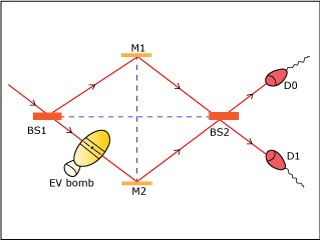
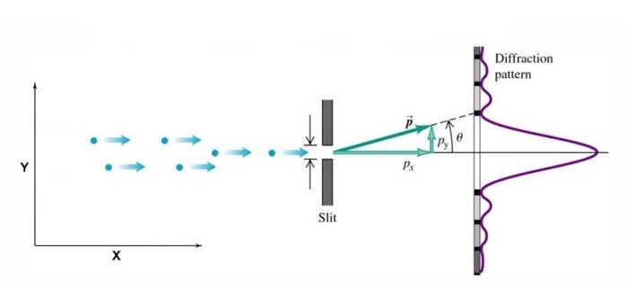

# 量子力学趣味简史

[喵小哥](https://51world.win)（编）&copy; 2020

用最简洁有趣的方式阐述量子力学从发端到现在。

## 序章

现在有谁不是量子力学的爱好者呢？人人都知道量子力学讲究个不确定性，所谓“遇事不决，量子力学”。人们都爱把“量子”放入公司和品牌的名称中，有“量子基金”、“量子波动速读”，乃至于“量子推拿”。

你可能已经听过不同版本的量子力学讲解，有侧重计算的学院版、讲故事的历史版、可爱的卡通版、还有霸道总裁假装学过版。量子力学已经是一个文化，每个人都可以有自己的体验角度。

我要说的，是最本源的角度。

诡秘。

这是一个被我们之中最聪明的头脑探索了一百年的秘密。听说它的冰山一角，你就足以动容；稍微了解，你就会为之痴迷；深入钻研进去，你可能会陷入绝望，乃至于疯狂。

量子力学是关于我们生活的这个世界的本源的秘密。爱因斯坦、玻尔、薛定谔、海森堡、狄拉克、泡利、德布罗意、费曼……物理学里最耀眼的英雄都是因为在量子力学中建功立业而留下姓名。

一开始谁都没想到。物理学家只是问了一些非常基本的问题：世界上的各种东西都是由什么组成的？如果原子是最小的单位，那为什么这个原子和那个原子的化学性质如此不同呢？原子还能再分解成别的东西吗？光，到底是什么？这些问题几千年前就有人问，只不过直到一百年前，我们才有了足够的技术和数学去真正探索它们。

结果这一探索，物理学家发现，微观世界的东西似乎在遵循某些非常怪异的规则。

比如说，如果把你限制在一个各个面都是墙的房间里，你想要出来就必须在墙上打个洞，对吧？那你是否想过，中国有个“崂山道士”的故事，说有一种叫做“穿墙术”的法术，可以让人直接穿墙而过，而既不破坏墙、也不伤害人。

在微观世界里，这个法术是常规操作。把一个电子限制在势能比它自身能量高的区域内，这个电子有一定的几率能穿墙而出。那既然电子可以，质子当然也可以、原子也可以……一直到由原子组成的人，在原则上，其实也可以 —— 只不过你能成功穿墙的几率非常、非常小而已。

这还不算什么。日常世界里的你，在任何一个特定时刻，都只能出现在一个特定的地方，对吧？你此时此刻不能既在北京又在哈尔滨。但是在微观世界里，电子可以同时出现在所有的地方 —— 它不但能既在这里又在那里，而且还能同时沿着好几条不同的路线前进。

日常世界的桌子上不会突然凭空冒出一个苹果和一个橘子来，你想要水果得自己出去买才行。但是在微观世界里，真空之中，就可以突然凭空冒出一个电子和一个正电子来，只不过你几乎不可能抓住它们而已。

微观的世界，充满诡秘。

那你可能说，这帮物理学家为什么非得琢磨这些怪异的东西？难道老老实实地研究我们日常的世界还不够吗？

这些怪异行为可不是物理学家幻想出来的，它们都是实验和逻辑推理的结果。为了解释日常世界的“正常”，你只能接受微观世界的“不正常”。换一个视角，也许应该说微观世界的那些怪异行为才是正常的，而我们在日常生活里的感知，都是大尺度带来的错觉。

哪有什么岁月静好，不过是微观的粒子们替你诡秘前行。

在对微观世界的诡秘进行探索的过程中，物理学操纵日常世界的能力也越来越强。就好像修仙小说的主人公一边更新世界观一边掌握新法术一样，真是认知升级决定了能力升级。

量子力学带给我们的回报，远远超出了所有人的想象。我们终于明白了原子到底是怎么回事儿，我们能精确推演日常世界的所有自然现象。我们揭开了原子核的秘密，制造了原子弹和核电站。我们深入理解了固体物理学，发明了半导体和计算机芯片。我们能精确地测量，甚至能一个一个操纵单个原子。我们能解释远在天边的白矮星是怎么回事儿。量子力学是这个世界的底层逻辑，哺育了几乎所有的现代先进科技。

然而物理学的英雄们仍然没找到量子力学的最终答案。我们可以接受微观世界的各种行为，但是你要说规则就是这样了，那似乎有点不合逻辑。

比如说，一个电子从“同时出现在所有地方”，到“恰好在这里被你找到”，完全是一瞬间的事儿，甚至可以说根本就不需要时间 —— 那这一瞬间到底发生了什么呢？什么样的事情，可以不花费时间就发生改变呢？

再进一步，这个电子最终在*哪里*被你找到，居然是完全随机的。世界上怎么能有完全随机的事儿呢？为什么是在这里而不是在那里，这总得有点原因吧？

有些人 —— 比如爱因斯坦 —— 就怀疑，量子世界种种诡秘的背后，必定还有一个更深的，诡秘之主。

爱因斯坦死不瞑目，可是那时候已经没有多少人愿意听他说话了。

在早期的热闹之后，曾经有三十年之久，绝大多数物理学家都认为，继续探索量子力学的秘密是徒劳的，我们应该专注在计算和应用上，毕竟现有的量子理论已经够用了。在那些年里物理学家上天入地，几乎是把你能想到和想不到的所有自然法则都研究明白了。而量子力学，只是他们的计算工具而已。

量子力学的应用是无处不在，但是人们对量子力学秘密的探索，沉寂了……

好在我们生的晚，还有机会看到这场探索的后续。从上世纪六七十年代开始，又有人提出了新的假说，继续探索那个诡秘之主。新技术允许物理学家做各种巧夺天工的实验。对这个秘密的探索，现在是一个非常活跃的研究领域。

而物理学家走得更远更深之后，诡秘之感不但没有减弱，反而还更严重了。

新的实验首先证明，所谓“量子纠缠”，是真的。互相关联的两个粒子，哪怕距离非常遥远，只要其中一个的量子态发生改变，另一个就会立即随之改变。这意味着它们之间存在某种超光速的、甚至是瞬时的协调。

可惜爱因斯坦没能看到这个实验结果……不过量子纠缠在某种意义上并不违反相对论，因为没有人能利用那个鬼魅般的协调去传递信息。

使用新技术，物理学家有办法只发射一个光子，让它同时沿着两条路径走。实验发现光子就好像在出发之前就已经对两条路径有完全的感知一样，它能根据路上的不同情况，选择要不要自己跟自己发生干涉。特别是如果你在其中一条路上放一颗无比敏感的、只要有一个光子打在上面就会爆炸的炸弹 [1]，光子可以在不走这条路的情况下，感知到那颗炸弹的存在。

那个“感知”到底是什么东西呢？

再进一步，老一辈物理学家有个名词叫“波粒二象性”，说微观世界里的东西都既是波也是粒子，具体观测结果是什么取决于你的视角：你想测量一个波就会得到波，你用测量粒子的方法就会得到一个粒子。那么从“二象”到“一象”，那个变化是发生在什么时候呢？

新一代物理学家可以先假装要测量波，等到光子已经不得不表现出波的样子，但是仍然在飞行之中、还没有最终到达目的地“官宣”的那一刻，突然改变主意，改成要测量粒子，你猜光子会怎么做？

答案是它不但会临时变成粒子，而且还要改写自己之前的行为。这就好比说一个学生在考场上看到试题之后，又重新回到三天前去准备这次考试！

新实验甚至发现连所谓的“客观现实”，都不一定存在。面对同一个实验，两个观察者可以记录不同的结果，那你说他们真的是处在同一个世界之中吗？也许我们每个人都有自己的世界……

怎么解释这些现象？量子力学背后的诡秘到底是什么呢？现在物理学家提出了几个猜想，这些猜想一个比一个离奇。

探索仍然在进行之中，没有人知道最终的答案。但是我们可以肯定，真实世界绝对不是人们平常感知的样子，而你有权知道真相。

现在我站在几代物理学家的肩膀上，向你汇报我们对这个秘密的探索经过和最新理解。

学习量子力学能给你一个脱离平庸生活，体验诡秘的视角。我们不是低幼版也不是简化版，我们不胡乱打比方。我将从最基本的概念讲起，带给你量子力学的纯正趣味。我承诺不使用中学生水平以上的数学，咱们主要用“物理直觉”说话。但是我希望你能在学习过程中积极思考，学一点思辨的技巧。我要讲一个探索的故事，你会看到物理学家是如何一步步刺探未知的，你会学到他们常用的几个心法。

咱们精英日课的专栏主编筱颖说，量子力学再难懂也肯定不会比人心更难懂，我对此表示怀疑。咱们专栏第一季的更新时间曾经是每晚 10:43 —— 是来自 10^-43 秒这个“普朗克时间”。那普朗克长啥样呢？下面这两张照片是物理学家马克斯·普朗克（Max Planck）在钻研量子力学之前和之后的样子……

这是一门能把花样少年变成毁容大叔的学问，因为它颠覆了太多东西。为了安全地学好这个课程，我希望你先忘记有关这个世界的各种想当然的假定。当然也不是所有你知道的东西都会被颠覆 —— 比如说，以下这些事情，我保证，不管发生什么，它们都还是对的：

第一，数学都是对的。你永远都不用质疑数学结论。

第二，我们说到的所有实验，不论多么离奇，都是对的。它们都经过了几代物理学家的反复验证，不但正确而且精确。我们的一切讨论不是要质疑这些实验，而是琢磨如何理解这些实验。

第三，物理学的守恒定律 —— 包括能量守恒、动量守恒和角动量守恒 —— 都仍然成立。这个宇宙不会凭空送给你什么东西，也不会凭空拿走你的东西……或者，至少不会做得太明显。

第四，你的妈妈仍然爱你。

这几条之外，请你做好思想准备。

## 第一章 两朵乌云：经典物理的终结，量子力学的开端

十九世纪末到二十世纪初，世界各国普遍都在闹革命，用李鸿章的话来说叫“三千年未有之大变局”。这句话也适用于物理学的革命。这场革命是经典物理学和现代物理学的分界线。

牛顿和伽利略这些早先的物理学家都做出过非常漂亮的工作，但是他们的手段非常有限，对世界的观察比较被动。他们仰望星空可以，做实验就都很粗糙，无非是弄个滑块啊斜面啊之类，没有什么科技感。

而十九世纪末的欧洲，因为工业革命成功，是一个蒸汽朋克的时代。物理学家有了比较精密的仪器，有了人造光源，特别是可以玩电了，这才像个做实验的样子。当时的数学工具也非常发达，微分方程、统计方法、包括非欧几何都已经很成熟了。

不过这时候的物理学还是牛顿的延续，还是经典物理学 —— 但是是很厉害的经典物理学。当时麦克斯韦的电动力学已经深入人心，人们已经知道分子和原子的存在，连热力学都是明明白白的。物理理论自带一种美感，而且公式和实验结果特别吻合，经典物理学是非常精确的科学。

而物理学家看待世界的情绪，已经不再是好奇和敬畏了，而是统治：世间各种自然现象，现在我们的理论都能解释。

比如说“光”。古人研究光只能靠生活常识和简单的思辨。人们早就知道视觉是因为光进入眼睛，而不是眼睛会发射光。人们知道光走直线，光可以互相交叉，光还能有能量，因为阳光照在身上暖洋洋的。牛顿还知道太阳光不是单纯的白色，可以分解成不同的颜色。可是光到底是什么东西呢？光的颜色是怎么来的呢？

麦克斯韦的电动力学出来以后，物理学家立即就知道了光就是电磁波，不同的颜色其实就是不同的波长和频率 [1]。无线电波、红外线、可见光、紫外线、X射线、γ射线……它们都是同一种东西，唯一的区别就是频率不一样。

（注意光的频率和波长的关系是 波长 x 频率 = 光速，所以我们说颜色就等于说频率，说频率就等于说波长。）

你看你会了这个知识，是不是有一种江山尽在掌握的感觉呢？

我们这一讲的主人公马克斯·普朗克在1875年上大学的时候，他的老师劝他不要学物理 —— 因为物理学已经很成熟了，盛宴已过，没有多少留给你研究的空间了。

科幻小说作家阿西莫夫有句名言，说科学史上最激动人心的话不是什么“尤里卡” —— 也就是“我发现了” —— 而是“这有点怪啊（that’s funny）”。

1900年元旦这天，热力学之父、开尔文男爵威廉·汤姆森在一个演讲中说：“在已经基本建成的物理学大厦中，后辈物理学家只要做一些零碎的修补工作就行了……但是，在物理学晴朗的天空的远处，还有两朵小小的令人不安的乌云”。

也就是，这有点怪。

这两朵乌云都和光有关。一个是光速为什么在各个方向都不变， 我们知道这导致爱因斯坦发现了狭义相对论。另一个，是关于黑体辐射。

中国大学课本总爱把“黑体”描写成特别抽象的东西，其实黑体很简单。所谓黑体，就是它不反射别的光，它发出的都是它自身的光。太阳、烧红的烙铁、黑暗中的人体，这些东西都可以近似为黑体。黑体发出的光是由它的热量导致的，也就是热辐射。

物理学家发现，黑体热辐射的光谱，跟它具体是个什么东西没有关系，完全由温度决定。一块烙铁也好一块砖头也好，你看一眼它发光的颜色就知道他的温度是多少。发红光那就是温度还不算太高，蓝光就意味着温度很高。严格说来黑体辐射不会只发单一颜色的光，你看见是红色只不过是红色光的强度最高。给定一个温度，实验物理学家能够非常精确地告诉你黑体辐射光的颜色 —— 也就是频率 —— 的分布曲线，比如像下面这张图。

")

那请问，曲线为什么是这样的呢？

理论物理学家都是非常自负的，说你这个曲线这么标准，我一定能给你推导出来。当时热力学、统计物理已经非常发达了，物理学家可以精确地描写一堆气体的热运动，而黑体无非就是一块发热的固体呗？物理学家假设，黑体的光是来自其中的电子振动产生的电磁波，那我用统计力学一算便知。

谁也没想到，物理学在这里失败了。没有一个理论能解释黑体的发光曲线，特别是在高频率 —— 也就是紫外线以外 —— 的地方，有的理论认为黑体发出的能量应该是无限大的，这显然不可能，人们把这个理论难题称为“紫外灾难”。

这是经典物理学的终结，也是量子力学的开端。

1900年的某一个下午，普朗克在自己家里和一位实验物理学家讨论了黑体辐射。实验物理学家把这个事儿给他讲明白就走了，晚上普朗克自己继续琢磨。普朗克换了一个思路。

他想，我能不能先不管物理，能不能直接在数学上凑一个公式描写这条曲线呢？当晚普朗克有如神助，竟然真的凑出来了一个公式。他立即写明信片把公式告知了那个实验物理学家，并且在12天后当众宣读了论文。这真的是一个非常完美的公式。

可是从物理上来说，这个公式怎么解释呢？普朗克苦苦思索了几个月，最后发现只要满足一个物理假设，就可以推导出来这个公式。

这个假设是电子振动产生无线电波的能量不能是连续的，而应该是一份一份的，就好像上台阶一样你每次必须走一整步，而不能走半步。普朗克规定每一份辐射能量的最小单位是由光的频率决定的：

其中 f 是频率，h 是一个常数，我们现在称之为“普朗克常数”，h = 6.626×10^(−34) 焦耳·秒。

有了这个假设，高频率辐射光的一份能量就很大了，那么根据热力学，它出现的概率就比较低，所以高能辐射就没有那么多，这就避免了紫外灾难。

普朗克凭借这个假设和那个公式拿到了1918年的诺贝尔物理学奖。但是普朗克并不知道那“一份一份的”能量，意味着什么。

第一个把天机说破的还得是我佛爱因斯坦。这就引出了另一个实验，叫“光电效应”。

物理学家在实验中无意发现，如果你把一束光照射在金属板上，有时候金属板会往外发射电子。表面上看这是容易理解的，光毕竟是电磁波，电磁波的能量转化成电子的动能，电子就跑了。

但奇怪的是，电子如何往外跑，和光的*强度*没有关系，只和光的颜色，也就是频率有关系。这就好比说，红色的光，不管多亮也不能让电子跑出来；你要用绿光，哪怕光线很弱电子也能跑；要是蓝光，电子不但能跑，而且跑出来的速度还很快。

这个现象无法用经典物理学解释。麦克斯韦的理论中电磁波的能量只跟强度有关，和频率没关系。电子为什么不能逐渐地从光波中积累能量，攒够了就跑呢？

1905年是“爱因斯坦奇迹年”，这一年爱因斯坦发表了六篇论文，其中一篇叫《关于光的产生和转变的一个启发性观点》，说的就是光电效应。爱因斯坦说，电子之所以非得遇到高频率的光才能跑，这是因为光是一份一份的。普朗克不是说了吗？光的一份能量 E = hf，频率越高能量越大，所以高频率的光的一份能量才足够大，才能打动电子。

请注意，相对于普朗克的假设来说，爱因斯坦提出了一个思维概念上的跃迁。普朗克说的一份一份是黑体中电子受热振动的能量，而爱因斯坦说这跟光是不是从黑体中来的没关系 —— 只要是光，能量就是一份一份的。

爱因斯坦提出了“光量子”。

爱因斯坦说光不是连续的一片波，而是由一个一个的光子组成的，每个光子的能量就是它的频率乘以普朗克常数。

爱因斯坦用这一个公式解释了光电效应，计算结果非常吻合。这篇论文给爱因斯坦带来了诺贝尔物理奖，这也是他一生之中得到的唯一一个诺贝尔奖。

普朗克和爱因斯坦的解题思路，叫做“量子化”。量子化从此就是现代物理学的一大主题，物理学家们把什么东西都想给量子化，有人认为连引力、甚至连空间都是量子的。

什么是“量子”呢？比如你家有个4K高清电视，离远了看，你觉得电视画面非常柔顺。但是离近了看，你会发现屏幕上其实都是一个一个的光点，画面并不是连续的。量子化，就是分辨率是有限的，是不连续的，是一个一个的，是像整数一样可数的。这个世界有可能完全是量子的。

我们平时为什么感觉不到世界是量子的呢？因为普朗克常数 h 是一个非常、非常小的数字，等于说分辨率太高了。

黑体辐射和光电效应都是经典物理学解释不了的现象，普朗克先用凑数的方法给了个数学模型，爱因斯坦赋予了这个模型物理上的意义，物理学家就算正式发现了光子。我们今天听起来这挺自然，好像是物理学家们是在亲切友好的气氛下达成共识，但当时的情况可并非如此。

爱因斯坦关于光电效应的想法是受到了普朗克的启发，那篇论文的编辑和审稿人又恰好都是普朗克，而且普朗克也让论文发表了，那你说普朗克是不是应该非常赞赏爱因斯坦的说法呢？

并没有。普朗克本人在此后很多年里，都无法接受光子这个概念。光量子不符合经典物理学，麦克斯韦方程解不出一份一份的能量。普朗克在很多年里都在寻找用经典物理学解释电子震动的方法，他失败了。

普朗克有一句名言说，“新科学事实之所以胜出，并不是因为反对者都被说服了，而是因为反对者最终都死了……然后熟悉这个事实的新一代人长大了。”可能你以前就听到过这句话，以为普朗克是那个传播新思想的人 —— 其实他不是。

那么爱因斯坦提出了光子的概念，他肯定是新思想的拥护者吧？其实也不是。爱因斯坦终其一生，都反对量子力学。

什么是革命呢，得是这个思想是如此之离经叛道，以至于连革命者本人都反对它，那才是真革命啊。

不过话说回来，反对光子的人其实很有道理。有太强的证据表明光是一种波了。如果光是粒子，又怎么解释光的波动性呢？咱们后面再说。

> 多年以后的爱因斯坦和普朗克。图片来自 https://www.lindahall.org/max-planck/

## 第二章 物质无限可分？原子中的“幽灵”

咱们先来思考这么一个问题：物质是不是无限可分的？

从数学直觉上来讲，物质应该是无限可分的。既然一个大东西能被分割成小东西，那小东西肯定也能被分割成更小的东西。《庄子》不是有一句话吗？“一尺之棰，日取其半，万世不竭。”你想必也听说过，物质是分子组成的，分子是原子组成的，原子是质子、中子和电子组成的，质子和中子又是由夸克组成的。那么接下来连小学生都会问的问题就是，夸克和电子，又是什么东西组成的呢？

答案是它们不是由别的东西组成的。现代物理学的标准模型认为夸克和电子是“基本粒子”，它们不可再分。我可以非常负责任地告诉你，物质并不是无限可分的。

物理学认为电子和夸克都是一些“数学结构” [1]，不可再分，也不必再分。这个思想其实也容易理解，我给你打个比方。比如一本书，你可以把它分成章节；章节可以分成句子；句子可以分成单词；单词可以分成字母 — 那请问，像a、b、c这样的字母，像“你、我、他”这样的汉字，还可以再分吗？再分就没有意义了。字母和单个汉字已经是最底层的符号单位，它们代表的是抽象的概念，无需再分 [2]。

一直到二十世纪都还有一些哲学家 —— 我就不说是谁了 —— 认为物质是无限可分的。他们想错了。

所以哲学家是靠不住的，真实世界比庄子的直觉更有意思！而物理学家的见识可不是拍脑袋想出来的，他们的探索步步惊心。物质该怎么分，正是量子力学的开端。

十九世纪末的科学家已经明确知道物质是原子组成的了，而且还把原子给分了类。门捷列夫弄好了元素周期表，知道每种原子的化学性质。经典物理学很美好，人们并不急于知道原子还能不能继续往下分。

这时候，大自然主动给了物理学家两个提示。

首先是 1896 年前后，居里夫人等人发现铀原子能自发地往外发射某种射线。居里夫人把这个现象命名为“放射性”，并且正确地推测出，放射性不是因为原子和原子之间的化学反应，而是原子自身的某种活动。科学家据此怀疑，原子内部应该还有结构。

1897年，约瑟夫·汤姆孙（Sir Joseph John Thomson）发现阴极射线中有一种“微粒”，在外加的电磁场中会发生偏转。汤姆孙意识到这种微粒带负电，并且把它命名为“电子”。这是人们第一次明确知道原子之中还有别的东西，汤姆孙因此得到1904年的诺贝尔物理奖。

原子是电中性的。那既然电子带负电，原子中必定还有带正电的物质。汤姆孙设想了一个模型，现在称之为“梅子布丁模型”，也可以叫“葡萄干布丁模型”。想象有一个松软的、球状的大蛋糕，其中点缀着一些葡萄干 ——

> 图片来自 https://askeyphysics.org/2015/01/25/119-12315-con-of-mom/plum-pudding-model-thomson/

那些葡萄干就是带负电的电子，而蛋糕本身带正电，和葡萄干达成平衡。原子一受热，电子们就会在蛋糕上震动起来，形成电磁波，这也就是辐射发光。

这个模型听起来挺合理，但是是错的。

给汤姆孙模型致命一击的，是他的学生欧内斯特·卢瑟福（Ernest Rutherford）。卢瑟福最早也是研究放射性，而且比居里夫人更有洞见。

卢瑟福合理推断出，所谓放射性衰变，其实就是一种原子从自己的内部分裂，变成了另外一种原子。有的人不接受这个理论，说原子怎么还能变呢，那你这不等于是炼金术吗？其实这个指责也没什么，我们知道化学这个学科，最早就是起源于炼金术……结果卢瑟福因此获得了 1908 年的诺贝尔……化学奖。

卢瑟福对此是不以为荣，反以为耻。他有一句名言说“所有的科学可以分为两类，一类是物理学，剩下的都是收集邮票。” [3] 我理解他的意思是物理学研究的是世界最本源的规律，需要灵感、洞见和创造性的理论，对比之下其他学科都只不过是老老实实地记录观测结果而已 —— 我是光荣的物理学家，而你们给我个化学奖?

不过卢瑟福在放射性方面的研究给他提供了一把神兵利器。某些放射性物质衰变时会发射一种高能量的射线，卢瑟福称之为“阿尔法粒子”，并且正确地推测出阿尔法粒子其实就是把氦原子拿掉两个电子后剩下的离子。卢瑟福可以大量制造阿尔法粒子，他能把阿尔法粒子当子弹用。

物理学家要想探测某个东西的内部结构，标准的打法是对它进行轰炸。现在动不动就耗资数百亿美元的、据说能代表一个国家的综合国力的加速器和对撞机，都是干这种事儿的。

卢瑟福在 1911 年做这个实验，只花了英国皇家科学院 70 英镑 [4]。他的做法是让两个学生拿阿尔法粒子轰炸金箔。金箔是薄薄的一层金纸，阿尔法粒子是高能量的子弹，你说子弹打在纸上会有什么样的效果？卢瑟福在实验室周围放了一圈屏幕，记录子弹的反弹情况。

> 图片来自https://www.ck12.org/chemistry/gold-foil-experiment/lesson/Rutherfords-Atomic-Model-MS-PS/

这两个学生中有一个叫盖格，后来因为发明了著名的“盖格计数器”而成了物理学史上的名人。盖格有个长处，他能在黑暗中待上几个小时，一心一意做记录。

实验发现，绝大多数阿尔法粒子直接就从金箔中穿过去了；有少量阿尔法粒子发生了偏转；还有极少量的阿尔法粒子，居然被金箔给反弹回来了。卢瑟福感到很震惊，纸怎么能把子弹反弹回来呢？唯一的可能性，就是这张纸中散布着一些非常硬的东西。

卢瑟福断定那个硬东西是原子核。大部分子弹穿过，少量偏转，极少量反弹，这说明原子内部根本不是什么葡萄干布丁结构，而是一个极其空旷的空间。这个空间的大小是由外层的电子决定的，而原子几乎全部的重量，都集中在中间很小的那个带正电的原子核上。只有碰巧靠近原子核飞过的时候，同样带正电的阿尔法粒子才能被偏转，因为正电和正电互相排斥；只有正好撞向原子核的阿尔法粒子才会被反弹回来。

卢瑟福做了一番计算，认为原子核的尺度大约在10^(-14)米，只占到整个原子万分之一的大小，这些数据在今天看来也算准确。卢瑟福轰炸了很多种物质，发现不同原子的原子核的电荷数和重量都不一样，并且据此发现了质子和中子的存在。

卢瑟福这个原子模型比汤姆孙那个葡萄干布丁模型好多了，但是它有两个问题。

第一个问题是，电子带负电，原子核带正电，而正负电相互吸引，那为什么电子不会掉入到原子核去呢？卢瑟福说这是因为电子在绕着原子核做圆周运动，就好像行星绕着太阳转一样，离心力平衡了吸引力。

但这个解释是错的。电子做圆周运动，等于是不断地改变速度的方向，而麦克斯韦电动力学告诉我们，带电物体的变速运动一定会产生辐射，从而损失能量。计算表明电子应该一边转圈、一边辐射、一边掉落，在10^(-12)秒之内就会掉入原子核！

> 图片来自 https://profmattstrassler.com/articles-and-posts/particle-physics-basics/the-structure-of-matter/atoms-building-blocks-of-molecules/atoms-their-inner-workings/

可真实的原子为啥是稳定的呢？

第二个问题是，原子的确会对外辐射，而且不受干扰也能辐射 —— 但是原子辐射的光谱很独特，不是连续的。比如下面这个是氢原子的辐射光谱，它由一些好像有规律、又好像没规律的线组成 ——

> 图片来自维基百科

当时有个中学老师叫巴尔默，还真找到了氢原子辐射光谱的一个规律。他发现其中一些辐射光的波长 λ 的倒数，正好正比于 (1/4 - 1/n^2)，其中 n=3, 4, 5……，也就是

但这个公式纯粹是凑数凑出来的，没人知道这意味着什么。我们需要一位物理学家来赋予它意义。

1912年，量子力学未来的掌门人，尼尔斯·玻尔（Niels Henrik David Bohr）博士毕业了。他先加入了汤姆孙的研究组，但是因为批评汤姆孙的模型而受到打压，又转投了卢瑟福。在卢瑟福的实验室里，玻尔意识到以自己的动手能力，做实验是真不行，但是做理论可以。

玻尔看着巴尔默凑出来的公式，想起普朗克和爱因斯坦“量子化”这个动作，决定把原子中电子的轨道给来个量子化。玻尔提出四个假设 ——

第一，电子平时按照特定的轨道运动，每个轨道有自己的能级，能级和“轨道量子数” n 的平方成反比。

第二，电子在同一个轨道中运动的时候，并不向外辐射能量。为什么不辐射能量我们暂时不知道。

第三，只有当电子在两个不同能级之间“跃迁”的时候，它才会辐射能量。辐射的能量正好是两个能级的能量差，同时又等于普朗克常数乘以光的频率。

第四，电子轨道有个角动量，角动量也要量子化，怎么理解这一点咱们后面再说。

> 波尔模型的简化示意图，图片来自维基百科

考虑到 λf = c，玻尔这个模型完全解释了巴尔默的谱线公式，而且还能计算所有的谱线 ——

> 图片来自 https://chemistryonline.guru/atomic-structure-numerical-part-2/

这是一个无比成功的模型。光电效应不是说外来一个高能量的光子能把电子打飞吗？需要多大能量呢？正好是那个电子所在能级的能量。玻尔模型还能明明白白地告诉你原子中如果有多个电子，它们应该怎么排列，玻尔等于是解释了整个化学！玻尔据此得到 1922 年诺贝尔物理奖。

咱们再类比一下，玻尔的解题思路和普朗克、爱因斯坦非常相似。都是先有实验结果，再凑数，再来个量子化。那你说爱因斯坦是不是应该非常喜欢玻尔这个理论呢？并没有。

玻尔的论文是1913年发表的，爱因斯坦的评价是你这个思路我真想过，但是我真没敢发表，因为这太怪异了。

为什么轨道只有固定的那么几条？为什么电子在轨道中就不会辐射能量了？玻尔无法回答。还有，跃迁到底是怎么回事？一个高能级的电子，为什么会自动地、突然地跃迁到低能级去？它受到什么刺激了吗？它有自由意志吗？它跃迁的路线又是怎么走的呢？这一切都非常诡异。

物理学家有一种强烈的感觉，量子世界必定有一套自己独特的规则，是经典物理学所不包括的。

到目前为止，都是实验结果“倒逼”物理学改革。物理学家都是不得不接受一个事实，然后手忙脚乱地对付出来一个模型，很被动。

这个局面不会持续太久，理论物理学家马上就要主动出击了。

顺便说一句，卢瑟福总共培养了包括玻尔在内十一个诺贝尔奖得主，其中八个是物理奖，三个是化学奖，可谓是空前绝后的一代宗师……但遗憾的是，他仍然只有一个化学奖。

> 卢瑟福（左）、玻尔和女士们在一起

## 第三章 量子世界的规律初现：波粒二象性

物理学是最革命的科学。别的学科一般都是渐进式的进步，偶尔有出乎意料的思想突破也都比较温和。而在量子力学的发展史中，我们看到的是一些不可思议的、甚至是颠倒乾坤的新思想，让人从感情上都接受不了。有些最厉害的物理学家一生都不接受量子力学，但他们反对的只是观点和思想，而从来都不是事实和逻辑。物理学从来都不会因为个人感情受不了而停止前进。

由此说来，物理学家虽然也是人，但是都是最没有成见的人。现在很多人爱说什么“创新思维”、“think out of the box”、“拥抱不确定性”、什么“认知升级”，听起来都是空洞的口号 —— 把你的大脑拿量子力学淬炼一遍，切身感受到新思想带来的纠结和不安，你的认知才能升级。

以前邓小平谈中国改革有一句话，说“计划经济不等于社会主义，资本主义也有计划，市场经济不等于资本主义，社会主义也有市场”。这就是破除成见。他的头脑中同时存在两种相反的想法还维持正常行事的能力，所以用菲茨杰拉德的标准，邓小平有一流的智力。

我们这一讲的主题恰恰也是这个意思。如果光可以是粒子，那电子为什么不能是波呢？静止质量为 0 的东西也有粒子的一面，静止质量不为 0 的东西也有波的一面。

为啥都想要一流的智力呢？因为更自由。

咱们先来看看为什么物理学家如此相信光是一种波。理论上的原因固然是麦克斯韦方程解出来了电磁波，然后你一看电磁波的速度正好是光速，所以你合理猜测光就是电磁波。但光有这个理论不行，你还需要更直接的证据。而最直接的证据，其实早就有了。

早在1803年，有个英国医生叫托马斯·杨（Thomas Young），就做了一个非常著名的实验，叫“双缝实验”。

杨那时候没有激光，得用蜡烛作为光源。他弄了一块遮挡板，在遮挡板的中间开了两条缝隙，烛光透过两个缝隙之后，打在后面的屏幕上，会形成一片非常漂亮的条纹：明暗相间，循环很多次，非常有规则。

> 图片来自 https://curiosity.com/topics/the-double-slit-experiment-cracked-reality-wide-open-curiosity/

你在家里可不容易重复这个实验，两个缝隙的间隔尺寸必须非常小，以至于能跟可见光的波长相比较才行 — 可以相当于是几个波长，不能是几十个波长那么宽 —— 否则不会有条纹。

> 图片来自 Wikimedia Commons

如果光是像牛顿当年想的那样，只是走直线的粒子，就如同连续发射的子弹，那你无论如何也得不到这种条纹，子弹只会集中打在缝隙的正前方。

但是如果你把光想象成某种“波动”，这个实验结果就很容易理解了。咱们用水波来打个比方，一个水波通过两个孔出来，就在水面上形成了两个水波。水波有波峰和波谷，两个波的波峰*或者*波谷正好叠加在一起就会加强，波峰*和*波谷相遇就正好互相抵消。光波也是这样，屏幕上的条纹，亮的地方是两个波加强了，暗的地方是两个波抵消了 —— 这叫两个波的“干涉”。

> 图片来自 YouTube 视频

任何一种波，都可以有干涉。波峰们在空间出现的相对位置叫做“相位”。下面图中这两个波的形状是完全一样的，如果你把它们的波峰和波谷对整齐了 —— 也就是相位一致 —— 它们叠加起来就一个加强到双倍的波，这叫做“相长干涉”。如果两个波的相位正好错开半个波长，它们就会互相抵消，形成“相消干涉”，可以完全消失！

> 相长干涉（左）和相消干涉（右）。图片来自https://astro-chologist.com/synastry-and-constructive-interference-big-announcement/

你用的那个降噪耳机，其实就是通过声波的相消干涉来达到降噪的效果。怎么让一个声音消失？答案不是屏蔽它，而是制造对立的声音去跟它抵消。

这一切都很完美。根据光的波长和屏幕到双缝的距离，干涉条纹哪里明、哪里暗都是可以精确计算出来的，理论和实验完全吻合。所以光怎么可能不是波呢？可是黑体辐射和光电效应实验明明又说光是粒子！粒子怎么干涉呢？一个东西怎么能既是波、又是粒子呢？

物理学家们还在纠结这个问题的时候，一个年轻人，有个大胆的想法。

路易·德布罗意（Louis Victor de Broglie）是个法国贵族，大学学的是历史，作为通讯兵参加过第一次世界大战，回来之后打算拿一个理论物理的博士学位。

今天物理系的博士生很难了解物理学所有的前沿理论，因为有太多东西要学了。德布罗意赶上了年轻人建功立业的好时候，他读博士期间就学习了相对论，了解了光量子学说，亲手参与了光电效应实验，还知道玻尔原子模型里的电子行为很怪异。

德布罗意的明悟是，电子行为这么怪异，也许是因为电子也有波的一面。

1924 年，德布罗意写好了自己的博士毕业论文。这篇论文只有16页，其中只说了一个思想：所有物质都有波动性。德布罗意提出了一个猜想的公式，说电子也好、质子中子也好，不论是什么物质，都满足 波长 = 普朗克常数/动量。

其中动量 p = mv，是质量乘以速度。注意这个公式自动包括了光子。根据狭义相对论，E = mc^2，光子有个等效质量 m，那么 p = E/c；再考虑到(波长 λ) x (频率 f) = (光速 c)，代入德布罗意的公式正好是 E = hf，跟普朗克和爱因斯坦的公式一样。

所以德布罗意等于是提出了一个统一的物质“波”理论！但问题是你这只是一个猜想啊，博士论文评审委员会的老师们感觉这好像不太靠谱，但又不敢轻易否定，就想找个明白人问问。他们把德布罗意的论文寄给了爱因斯坦。

这个观念突破连爱因斯坦都没想到，但是爱因斯坦没有排斥它。爱因斯坦回信说，德布罗意“可能揭开了大幕的一角”。评审委员会通过了德布罗意的论文，但是在论文答辩过程中，他们问德布罗意，你能不能设想一个实验来验证这个公式呢？

你很难拿电子或者质子中子做杨氏双缝实验。双缝实验要求缝的尺寸必须和波长相当，而一个粒子只要有质量，它的动量就比光子大得多，那么波长就比光子要短得多，当时的实验技术条件根本做不到如此精细的双缝。但是德布罗意想到了一个方法，晶体散射。

当时已经有人做实验发现，把X射线 —— 一种波长非常短的光波 —— 照射到晶体上，也会产生干涉花纹。晶体的原子排列得非常整齐，等于是形成了一个周期性的、有很多条缝的网络，X光经过这个网络，就会发生干涉。

> X射线的晶体干涉图像。来自https://nature.berkeley.edu/classes/eps2/wisc/geo360/Xl3.html

德布罗意说，也许有些晶体的结构尺度非常小，就能跟电子的波长类比。结果 1927 年就有人把实验做成了！下面这张图就是电子打在硅晶体上的干涉图案 ——

> 电子通过晶体硅形成的干涉图像。来自https://courses.lumenlearning.com/physics/chapter/29-6-the-wave-nature-of-matter/

你算一算硅原子之间的距离，算一算电子的波长，丝毫不差。德布罗意用博士毕业论文拿到 1929 年的诺贝尔物理奖，青史留名。

值得一提的是，证明电子波动性的几个实验物理学家得到了1937年的诺贝尔物理奖。其中一个获奖者叫乔治·汤姆孙（Sir George Paget Thomson），用的不是晶体散射，而是另一个方法 —— 他是谁呢？就是我们上一讲说的那个发现电子的约瑟夫·汤姆孙的儿子。这父子俩一个因为证明电子是粒子拿了诺贝尔奖，一个是因为证明电子是波拿了诺贝尔奖。

所以电子真的是波。我们讲《相对论》的时候说过，物理学家最爱干的事儿就是“看破红尘”，搞个统一理论，说明看似完全不同的两个东西其实是一回事。德布罗意做到了这一点，说电子和光子其实是一回事。

其实我们跟电子和光子也是一回事。任何物质都有波的一面。为什么我们在日常生活中感受不到波动性呢？因为我们的质量太大了，而普朗克常数是个非常小的数字。比如有个质量是 3 公斤的保龄球，以每秒 10 米的速度运动，根据德布罗意的公式，它的波长是 10^(-35)米，你完全探测不到这样的波动。

那你说我的体重虽然大，那我一动不动行不行？如果我的速度是 0，我的波长不就变大了吗？我的回答是那是不可能的。量子力学不允许任何东西的速度是 0……咱们后面会讲。

什么东西都既是波又是粒子，这就叫“波粒二象性”。这个词说着容易，但是我们仔细想想，“既是波又是粒子”，这是什么样的行为呢？

如果电子就是一个点，它怎么个“波动”法呢？难道说它是沿着“之”字形路线、扭来扭去地像波一样前进吗？那是不可能的。那样的波动会有很多急转弯，每一次拐弯都是加速运动，都会辐射能量，电子受不了。更何况这种波动的运动速度会超过光速，违反相对论。

那如果电子根本就不是一个点，而是一片“波动的云”，那为什么我们每次都刚好捕捉到一个点呢？从云到点，这个瞬间的变化是如何发生的呢？

更不可思议的还在后面。

1961 年，物理学家终于用电子做成了杨氏双缝实验。

> 图片来自维基百科

物理学家甚至做到了每次只发射一个电子。结果积累的电子多了以后，屏幕上也显示出了干涉条纹！

> 图片来自 Wikimedia Commons

我们前面说了，所谓波的干涉，是从两条缝中出来的两个波，互相叠加的结果。那你一个电子怎么干涉呢？

唯一的可能，是这个电子同时通过了两条缝，自己和自己发生了干涉。至于说一个电子如何能同时通过两条缝，你怎么想都不对。咱们后面还要继续探索这个波到底是什么波，你会发现，“波”这个概念并不能概括量子力学的本质 —— 哪怕没有空间意义上的波动，也能有干涉。

“波粒二象性”其实是个临时性的词。不过我们还是先专注于空间上的波动性，下一讲咱们说一些更怪异的性质。

德布罗意有公爵的爵位，家里本来有钱有势，但他一生钻研学问，未曾结婚，不置资产，只有两名忠心耿耿的随从，深居简出只爱工作。德布罗意不但很早就成名，而且一直活到了 95 岁。他和爱因斯坦一样，至死拒绝接受量子力学的主流解释。

> 德布罗意

## 第四章 物理学的探索边界，量子世界的核心规则：不确定性

二十一世纪的物理学家要想做出诺贝尔奖级别的工作是非常困难的，你可能要到四十岁以后才有机会。你得钻研现成的理论和高深的数学技巧很多年，才能摸到一点门道；要想到游刃有余的水平，乃至于找到别人没想到的重大突破点，又不知要摸索多少年。

而量子力学，却是年轻人的科学。

用现在时髦的话来说，维尔纳·海森堡（Werner Heisenberg）可谓是量子时代的原住民。他出生于1901年，那时候普朗克已经把黑体辐射给量子化了。海森堡二十岁刚出头就跟随玻尔研究最新的量子理论，他发明了矩阵力学来描写量子过程，不但拿到了1932年的诺贝尔物理奖，而且是量子力学主流解释的主要人物。
年轻气盛的海森堡，对物理学的研究方法提出了一个指引。

海森堡说，电子有时候表现得像是粒子，有时候表现得像是波，它到底是什么，我们无法想象，也*没必要*想象。你应该关心的是*可测量*的东西。电子的“轨道”到底是什么样的？它是如何从这里“走到”那里的？那其实是不可测量的。

想要画出电子的路线图，你必须在每一个时刻都同时知道电子的位置和速度（也就是知道动量，p=mv） —— 而海森堡说，这是不可能的！你不可能同时精确知道一个电子的位置和动量。

海森堡是这么论证的。要想知道一个电子在哪里，你就得用光去照一照它。光的分辨率取决于波长，波长越短，分辨率就越高，探测越精确。所以想要精确地测量一个电子的位置，你就得用波长非常短的光。而根据光量子理论，波长越短频率就越高，光子的能量就越高。你的测量实际上是用高能量的光子去打这个电子，你会把电子给打飞！那么你这个高能光子带来的冲击，就会掩盖电子原来的动量。

反过来说，如果想要精确测量电子的动量，你就得用能量比较低的光子去撞击它，而这就意味着那个光子的波长比较长，你就不能准确判断电子的位置。

总而言之，位置的测量误差和动量的测量误差有一个取舍关系，它们不可能都很小。

海森堡的这一番解释当然有道理。今天你仍然会看到有些《量子力学》教科书，有些大学老师用这番解释说明量子力学的不确定性 —— 但是我可以负责任地告诉你，这个解释还不够彻底，还不够革命。

光子频率这个解释是说你“测不准” —— 是因为你要想测量一个东西就不得不干扰这个东西，是测量手段本身的悖论。那你可能会问，如果我是全知全能的上帝，如果我能在不干扰的情况下感知到电子，我就应该可以测准，对吧？

不对。包括海森堡本人后来也承认，量子力学的真正观点不是“测不准”，而是“不确定”。

不是你的能力问题，是电子的本性问题。

电子根本就不能同时拥有确定的位置和动量。不论是什么东西，电子也好、光子也好、宏观物体也好，它的位置不确定性（Δx）和动量不确定性（Δp）都满足下面这个关系 [1] ——

也就是说，位置和动量永远都有一个最小的不确定性，受到普朗克常数的限制。不是你测不准，不是你看不见，而是电子*根本就没有*确定的位置和动量，电子的行为有一种内在的不确定，它永远都是模糊的。

这个原理叫做“海森堡不确定性原理”。

比如我们上一讲说的那个电子双缝实验中，电子最终打在屏幕上的位置很有规律，有暗有亮。那请问，你能精确地预测一个电子会打到屏幕的哪个位置上吗？

在经典物理学中，我们把电子想象成一个小球，只要知道小球通过双缝时刻的位置以及横向和纵向的速度，你就能精确计算它在屏幕上的落点。但是在量子力学中，因为不确定性原理，电子根本就没有精确的位置和速度，这样的预测是不可能的。

事实上，哪怕你无比小心地操作实验，以至于精确地确保对这一个电子和对上一个电子的发射动作完全一样，它们两个的落点也会不一样。电子就好像有自己的个性一样，不接受你的精确控制。

不确定性原理并不仅仅是一个统计规律，而是一个关于量子世界的本质的论断。我们甚至可以说它的优先级高于量子力学的其他所有定律。你可以用不确定性原理解释一些很怪异的现象。

比如说，咱们看一个单缝实验。

在遮挡板上钻一个很小的小孔，然后让一束光穿过小孔，照射在遮光板后的屏幕上 [2]，你猜它会出现什么情况？

这可能会让你想起中学学过的“小孔成像”，你预计屏幕上会出现挡板另一侧的图像，说明光走直线……但是中学生学的那个小孔开得太大了。如果小孔的直径像光的几个波长那么小，你会看到屏幕上出现非常漂亮的环状条纹。中间有个最亮的光盘，周围是一圈暗纹，然后再是一圈亮纹、一圈暗纹，一环套一环逐渐变淡。

这个现象叫做光的衍射，那个条纹是光波从小孔中间的不同位置出发、到达屏幕时互相干涉的结果。

这个实验的有意思之处是小孔的直径和屏幕上衍射条纹的关系。

如果小孔的直径很大，比如说相当于 20 个波长，那么你拿一束激光照射进来，屏幕上基本就是一个光点，没有什么衍射的样子。这就好像没有挡板一样，光老老实实地走直线，简单明了。

小孔的直径越小，衍射条纹就越明显，而且越宽广。比如如果小孔直径是两个波长，你会看到非常大的衍射条纹，光不再走直线了！

> 小孔直径 a 相当于 20 个和 2 个光的波长 λ 时，屏幕上的衍射分布

站在光子的视角来看，这个现象很不寻常。孔越大，对光的约束就越小，光子非常自由，反而老老实实走直线；孔越小，对光的约束越大，光却要往四周扩散。怎么会这样呢？

你的直觉可能会认为是小孔的边缘对光子产生了干扰。也许当光子路过小孔的时候，被边缘给撞了一下，发生了散射。但这个解释是不对的。如果是因为被撞飞了产生的散射，光子在屏幕上的落点应该是完全混乱的！你不会看到那一环一环的漂亮衍射条纹。再者，不仅光子存在衍射现象，用电子、质子都会发生衍射，而光子、电子、质子跟小孔的材料发生电磁相互作用的机制是完全不同的。

单缝实验真正揭示的，是海森堡不确定性原理。

> 图片来自 https://crackingthenutshell.org/heisenbergs-uncertainty-principle/

如上图所示，我们把垂直于光前进的方向设为 y 方向。小孔比较小的时候，光在通过小孔的时候，在 y 方向上的不确定性 Δy 就小；孔比较大的时候，Δy 就大。

而根据不确定性原理，位置不确定性小的时候，动量不确定性就大。在 y 方向上有一个比较大的 Δp ，就意味着光子多了一个垂直方向的速度，也就是它会一边往前飞一边往边上飞，所以它才有可能会飞到屏幕中心以外的地方去，为那里的衍射条纹做出贡献。而如果小孔大，就等于说光子的动量不确定性小，它就没有那个垂直方向的速度，它就会老老实实地往前飞，那么屏幕上也就没有衍射光环了，只在中心处有个光斑。

换句话说，根据不确定性原理，你甚至可以通过控制某一方面的不确定性，去改变另一方面的不确定性。

比如说，根据不确定性原理，世界上没有绝对静止不动的东西。这是因为如果一个粒子的速度是绝对的 0，那它就没有动量的不确定性，那么它的位置的不确定性就必须是无穷大，那么它就必须同时出现在宇宙中所有的地方。事实上，哪怕是在温度是绝对零度的条件下，粒子也会有一些微小的震动。

不确定性原理说明，所谓“电子轨道”，根本就没有意义。老百姓心目中的原子常常是下面这个样子 ——

> 图片来自 http://megaanswers.com/at-what-speed-does-the-electron-move-around-the-nucleus/

中间有个原子核，外面有几个电子沿着固定的轨道旋转，就好像行星绕着太阳转一样。这也是卢瑟福想象的原子，而这个图像是错误的。真实的原子，差不多是像下面这个样子 ——

> 氦原子，图片来自 https://www.universetoday.com/38282/electron-cloud-model/

电子没有确定的位置，它同时出现在原子核之外的各个地方，它呈现出来是一片“云”。其实连中间那个原子核也是云。

那为什么在日常生活中，我们可以精确地知道一个东西的位置和速度呢？那当然是因为普朗克常数是一个很小的数字，那一点不确定性和宏观世界的尺度相比微不足道。

量子力学中，除了位置和动量这一对儿，还有能量和时间这一对儿，也满足同样的不确定性关系。

比如你看氢原子的光谱，你仔细看的话，那些谱线并不是很精确的细线，而是有一定的粗度，有一定的模糊性，这是为啥呢？根本原因就是电子在不同能级之间的跃迁并不是真正瞬时的，有一个时间上的不确定性，而这就对应着辐射光子能量上的不确定性，这也就意味着波长的模糊性。

再比如说，根据相对论，质量和能量是等价的，所以能量上的不确定性就意味着质量的不确定性。现代物理学知道有很多粒子的寿命都是有限的，可能存在很短的时间就会衰变成别的粒子 —— 而这种粒子的存在时间的不确定性，决定了它们的质量也有不确定性，你不可能绝对精确地测定它们的质量。

那为什么我们精确地知道质子和电子的质量呢？因为它们很可能根本就不会衰变！它们的时间不确定性是无穷大。

所以“不确定”是量子世界的本质。海森堡要求我们专注于那些能测量的东西，坦然接受测量结果的不确定性。

但你可能还是忍不住想问，在我们没有测量的那段时间，电子到底经历了什么呢？就好像有一位美丽的女同事，你每次见到她都是在上班的时候。你觉得那不是真正的她，你忍不住猜测她不上班的时候是什么样子，你觉得你还可以进一步了解她。

而我不得不告诉你，这个问题你怎么想都不会想明白 —— 如果真的存在一个关于电子的“客观现实”，那个现实很可能是在我们人类的理解能力之外。事实上，我们一直到今天也只是知道电子的一些*性质*而已，我们并不知道电子*到底*是个什么东西 [3]。

海森堡的理论规定，我们跟电子只有工作关系。

> 维尔纳.海森堡

## 第五章 量子力学开始正规化：波函数

埃尔温·薛定谔（Erwin Schrödinger）可以称得上是个多才多艺的人。他聪明过人，通晓多门语言，阅读广泛，精通文学和哲学，最喜欢的哲学家是叔本华。我们前面说了玻尔动手能力差做不了实验只好做纯理论，薛定谔可不是这样，他做过实验物理研究，而且还精通数学。薛定谔参加了第一次世界大战，回来认为理论物理最有意思，很顺利地就当上了理论物理教授。

薛定谔后来甚至写过一本《生命是什么》。他把这本书设定为可以给外行看的通俗作品，但是他在书中提出了基因遗传机制的大胆猜想，等于是为生物学指引了方向。不过那都是后话。

按当时物理学家的标准来说，薛定谔直到中年都还没有做出什么一流的工作。他身体不太好，患有肺结核，动不动就得疗养。而且薛定谔还绯闻缠身，都知道他有婚外情。

1925年，薛定谔三十七岁这一年，他出场的时机终于来了。当时薛定谔是在瑞士苏黎世大学。他有个同事叫彼得·德拜（Peter Debye），也是一位名字进了教科书的物理学家。传说有一天，德拜对薛定谔说，我看你最近也没什么大事儿，听说德布罗意有篇论文很有意思，连爱因斯坦都惊动了，你能不能去研读一下，下次给我们做个报告。这其实是物理学家的一个好传统，到今天也是这样。所有人去读所有的论文读不过来，常常是指定一个人去读懂一篇论文，然后讲给本单位所有人听。

薛定谔读的正是德布罗意提出“物质波”的那篇论文。薛定谔作了报告，德拜当场发表了一个评论。德拜说，德布罗意这玩意儿纯属儿戏。

德拜说，什么叫物理学？你得有方程才行。德布罗意凭空就说电子是个波，那这个波满足什么方程呢？它的行为由什么决定呢？没有方程，就不是正经的物理学。

其他人都没当回事儿，薛定谔却是心中一动。他心想我可以去弄个方程。

薛定谔用圣诞节假期搞出了第一版方程，紧接着在1926年发表了四篇论文，最终提出了量子力学的波动方程。其中最关键的发现是在去疗养期间做出来的，据说当时他的情人就在身边陪伴，所以薛定谔这个大发现被某些人称为“迟来的情欲大爆发”。

咱们来看一眼薛定谔方程，这可是人类科学史上最重要的几个方程之一 ——

普朗克常数 h 不出意外地出现在方程之中，m 是粒子的质量，V 是势能。这个方程描写了“波函数” Ψ(x,t) 在不同位置和时间的变化。

那你说这个方程是怎么来的呢？不是从天上掉下来的！薛定谔的思路其实非常自然，任何一个动力学过程都得满足能量守恒，这个方程说的其实就是 动能 + 势能 = 总能量。

真正的硬功夫在于如何验证你的猜想。薛定谔把氢原子的电势能带入到方程之中求解……然后奇迹发生了。

我们前面说了，玻尔的原子模型是非常不完善的，有一种山寨感和拼凑感。玻尔无法解释为什么原子的能级必须是一个一个的。而现在薛定谔用这么一个简单的方程解出来，说为啥只有那几个能级呢？为什么电子轨道只有那么几个呢？因为这个二阶偏微分方程正好就有那几个本征值和本征函数！你可以忽略这句话里的数学，简单来说，就是能级和轨道精确地包含在这个方程之中。

到这一步，薛定谔方程肯定是对的了。不过事情中间还有一些波折。海森堡和玻尔当时已经搞了一个“矩阵力学”，一上来就是全量子化的，他们不相信波函数能连续变化。玻尔把薛定谔请到哥本哈根演讲，海森堡几乎是当场翻脸。玻尔不停地劝说薛定谔，说你这个波肯定不对，“薛定谔你必须理解……”一连说了好几天，把薛定谔都给说住院了。玻尔让自己的妻子去给薛定谔送饭，妻子到医院发现玻尔正在病床前说，“薛定谔你必须理解……”

薛定谔得到了 1933 年的诺贝尔物理学奖，跟他一起得奖的是后面即将出场的另一位大牛，保罗·狄拉克。后来正是狄拉克，最终证明了薛定谔的波动方程和海森堡的矩阵力学是相容的。

有了薛定谔方程，我们就可以精确地知道波函数在任何时间任何位置的数值。什么双缝干涉也好、单缝衍射也好、原子的能级也好，都可以用波函数计算出来。德拜说的对，有方程跟没有方程是真不一样啊，现在我们对量子世界真是有了一种掌控感。

但是直到这时候，薛定谔仍然不知道波函数到底是什么东西。

这个感觉简直就是量子力学给物理学家的诅咒。你会算，你会用，但是你不知道它是什么。其实咱们前面说的普朗克和玻尔他们做的事也是这样，先有了数学，然后再去寻找物理意义。

波函数到底是什么呢？薛定谔方程中有个虚数 i，解出来的波函数不是实数，而是一个复数。而复数是无法测量的！我们生活的世界是一个实数的世界！说“这里的波函数的数值是 1+2i”，这算什么意思呢？

后来还是德国物理学家马克斯·玻恩（Max Born）提出了一个解释 ——

「波函数绝对值的平方，等于粒子出现在那个时间和那个地点的概率。」

没有被观测到的粒子就好像是一片云，它可以既在这里又在那里，但是它在各个位置被发现的概率并不是一样大的。现在有了波函数，我们可以说，波函数在一个地方的绝对值越高，粒子在那里被发现的可能性就越大。如果波函数在这里是 0，粒子就绝对不会在这里出现。

这个解释叫做玻恩解释，它完美地符合实验结果。很多人相信，波函数，包含了一个量子系统所有的物理信息。

但是这里面有两个大问题。

第一个大问题是，玻恩解释等于宣布了，量子力学只是关于概率的科学。

薛定谔方程只能告诉你波函数，而波函数只能告诉你概率。你可以用薛定谔方程计算一个电子出现在屏幕上任何一个小区域内的概率是多少。如果你的计算结果说电子出现在这里的概率是0.1%，而你在实验中用了一百万个电子去轰，那么就会有大约一千个电子落在这里 —— 这个概率是绝对精确的。

但是，你能知道的，也只有概率。那你说，我现在只发射一个电子，我想预测这个电子会落在哪里，这行不行呢？不行。量子力学只会算概率。而且根据海森堡不确定性原理，单个电子根本就没有什么“哪里”这种说法。波动方程自动兼容不确定性原理。

对很多物理学家来说，只能算概率可是太难受了。你要知道物理学原本是一个确定性的科学。你给我个台球，只要我精确知道这个台球此时此刻的速度和位置，我精确知道它的周围环境，我就可以精确计算它在未来每时每刻的速度和位置。当然绝对的精确是做不到的 —— 但那只是技术问题 —— 经典物理学在原则上，没有任何不确定性。

可是现在量子力学等于说不确定性是个内在的性质。为什么这个电子在这次实验中打到了屏幕的这个位置，而不是那个位置？是被风吹了一下吗？是什么神秘的“天地气机”影响的吗？反正这总要有个理由吧？电子不可能有自由意志吧？它不能无缘无故地做出这样的选择吧？

用爱因斯坦的话说，就是“上帝不会掷骰子”……吧？

经典世界里任何事情的发生总有前因后果 —— 但是在量子世界里，电子的具体落点这件事，没有任何理由。概率的大小有理由，概率是否落实，没理由。

也许上帝就只会设定概率。玻尔说，“爱因斯坦你不要告诉上帝该怎么做。”

第二个大问题是，波函数是一个十分怪异的存在。

是，波函数可以让你精确计算干涉和衍射之类的现象，你觉得波函数必定是一个真实的东西。但是咱们想想这么一个过程……

比如一个在空中“飞行”的电子，当它还没有打在屏幕上的时候，你知道它在附近是无处不在的，它的波函数在附近各个地点都有一定的取值，波函数很实在。

可是当电子一旦打在屏幕上，它的位置就固定了，波函数瞬间就在周围其他位置都没有存在了，都变成了 0。这叫做“波函数的坍缩”。电子从一个“波”，坍缩成了一个粒子。

那好，请问，在这个坍缩的过程中，波函数发生了什么呢？

本来是全局的，现在突然变成了一个点。这个过程是非定域性的，是突然发生的，是不可逆的，是不连续的。你不觉得这太突兀了吗？世界上有什么东西，会突然间在各个地方消失？一个真实的物理存在怎么能这样做事呢？

物理学家总是认为什么事情都应该是逐渐地、连续地变化的，这种突变太怪了。薛定谔就非常不喜欢像氢原子的电子能级跃迁那样的突然变化，他有一次跟海森堡和玻尔争论的时候说：“如果量子跃迁这种东西还继续存在，我就很后悔自己参与了量子力学！”

回顾这段历史，我们看到像玻尔、海森堡和玻恩这些人很容易就接受了量子力学，他们代表“主流”。因为这一派人物都团结在丹麦哥本哈根大学玻尔的麾下，量子力学的这个主流解释也被称为“哥本哈根解释”。

而像普朗克、爱因斯坦、德布罗意和薛定谔，虽然他们对量子力学做出了决定性的贡献，但是他们并不愿意接受“主流解释”。这是为什么呢？

这可能跟思想保守有关系，但是以我之见，这里面还有一个讲不讲哲学的问题。

如果你是工程师思维，做事只看结果，那么量子力学已经能给你提供足够好的结果了。没有谁需要精确预测单个电子的位置！做实验都是用一大堆粒子，量子力学描写集体行为非常精确。物理学家有句话叫“Shut up and calculate！”意思就是别想那些没用的了，算就完事了。

但是有的人自带一点哲学家思维，他们非得想一想。你这一细想，那个本质的不确定性和突然间的波函数坍缩，就太难让人接受了。所以说哲学有时候也真是害人啊，思考带给你的并不总是快乐，还可能有无尽的痛苦。

不管怎么说，薛定谔方程完全打开了量子力学的大门。物理学家们走进大门，立即发现了各种各样神奇的事情，咱们下一讲再说。

> 薛定谔

## 第六章 波函数中的概率，把不可能变为可能：量子隧穿

> 德布罗意

你选择哪种理解都可以，要点是量子隧穿是个真实的现象。

你把人的质量带入薛定谔方程求解，理论上也有一个不为零的概率，人可以穿墙而过。但是那个概率实在是太小太小了。让一个人不停地试验，每秒钟撞一次墙，他试验到宇宙年龄那么长的时间也不会有一次成功。

## 第七章 把电动力学、薛定谔方程和狭义相对论统一的“量子电动力学”：狄拉克方程

那么按照物理学家的常规操作，下一步就是看看这个新方程能不能解出新的物理学来。

- 正电子
- 自旋

## 第八章 量子力学世界的最后一块拼图：泡利不相容

哪有什么岁月静好，不过是微观的粒子们替你诡秘前行。现在我们的量子力学知识已经差不多可以解释一下，日常世界为什么是这个样子。

泡利不相容原理的本质就是，“两个全同费米子的波函数，一定是交换反对称的”。
简单来说，
之所以有化学，是因为泡利不相容原理；
之所以有泡利不相容原理，是因为费米子波函数是反对称的；
之所以费米子波函数是反对称的，是因为自旋；
之所以有自旋，是因为量子电动力学。
设定了量子电动力学，你就设定了原子核以外的世界。

## 第九章 全同粒子的怪异行为：费曼规则

在微观世界里，两个电子，却是完全相同。

全同粒子不仅仅是外观和物理性质一样，而且在根本上、在数学上，都是无法区分的。

## 第十章 爱因斯坦的最后一战

此后三十年间，尽管不理解那个“鬼魅般的超距作用”，基本粒子物理学照样突飞猛进。谁还会关心爱因斯坦的质疑呢？
1955年，爱因斯坦孤独地去世了。
但玻尔并没有忘记那些辩论。玻尔在1962年去世。在玻尔去世前一天用过的黑板上，人们发现一个图形。
那正是爱因斯坦光盒。
